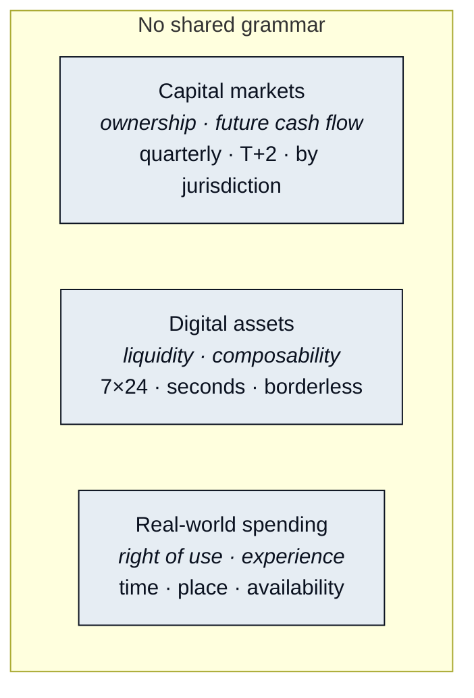

# Three Value Languages

The previous section made a claim: the three markets are short of a language, not of pipes. This section puts the three languages side by side, and then follows one ordinary request through all of them, the way it has to travel today.

## Three markets, three grammars

| Market | Its language of value | Rhythm | Boundary |
|---|---|---|---|
| Capital markets (equities) | Ownership and future cash flow | Quarterly cadence; T+2 settlement; limited trading hours | Bounded by jurisdiction |
| Digital assets | Liquidity and composability | 7×24; finality in seconds | Borderless, but with almost no executable interface to real-world assets |
| Real-world spending (travel / hotels / retail) | Right of use and experience | Measured in "a given time, a given place, usable" | Bounded by supplier and inventory |

The settlement cycle, the unit of account, the definition of a boundary and the degree of composability all differ across the three. They are not short of connection. What they are short of is a common language.



Value here is a claim: on a share of ownership, and on the cash that ownership is expected to produce. The claim is real and durable, and it is slow. Prices update by the second, but positions settle on a lag, markets close overnight and at weekends, and the claim itself is enforceable only inside the jurisdiction that recognizes it. Nothing in this grammar has a word for "usable tonight."



Value here is liquidity: how quickly and how cheaply one position can become another, and how freely it can be combined with others. The grammar is fast and borderless, and it is closed. Every verb it has acts on other digital assets. It can say "swap" and "transfer" in a thousand ways, and has almost no way to say "book," "deliver" or "own a share of."



Value here is the right to use something: a room on the night you arrive, a table at eight, a parcel at your door. It is measured in time, place and availability, and it lives in a supplier's inventory system, the only place it can be confirmed. This grammar has no word for a position or a token. It recognizes money already turned into money it accepts, and a person who has proved who they are.



Read the three tabs again and notice that none of them is describing the same thing. A claim, a rate of exchange and a right of use are not three prices for one object. They are three objects, each of which the other two grammars cannot even name.

## One position, one hotel room

You hold a position in an equities account and want to turn part of what it earned into a hotel in Tokyo in October. Today, the request travels like this.



### Sell
T+2 settlement. The position becomes cash — cash you cannot yet touch.



### Withdraw to a bank
1–3 business days, longer cross-border. A second system, a second identity check.



### Convert the currency
Spread + fees. A third system, a third set of credentials.



### Book on a travel site
The fourth identity check. Only here does the value finally become a room.



Four systems, four sets of credentials, four identity checks, five to seven business days. If any link in the chain fails, a human steps in and starts over.

Sell. Wait for settlement. Wire it out. Convert the currency. Then start over on a travel site. Nothing here is technically hard. It's just that at every single step, a human is translating.

And what is actually consumed on this path is not the fees. It is you — at every step, you are the one manually translating one language of value into another. This is not a technical problem. It is a translation problem.

> Turning a position into a hotel room still takes four systems, four identity checks and a week. Every step is a human manually translating one language into another. That was tolerable when software could only move value. It stopped being tolerable the moment software could understand it.

The next section looks at the solutions that already exist along this path and asks, of each one, which part of the translation it actually performed.


**Scope of this section.** Commits to: the three markets differ in what they mean by value, in rhythm and in boundary, and that turning a position into a room today costs four systems, four identity checks and roughly a week of human translation. Does not commit to: any mechanism for closing that gap; this section states the problem only. Open items: none ([Open Parameters](../open-parameters/README.md) begins with Part III).


*Spine: [The Translator](../02-the-translator/README.md) · Next: [Why Bridges Failed](why-bridges-failed.md)*
