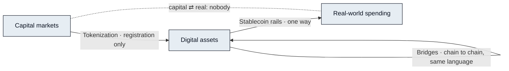

# Why Bridges Failed

> Every one of these is a pipe. And a pipe doesn't understand what passes through it.

Three families of solutions have grown up along the path in the previous section. Each attacks a real part of the problem. None is named here, because the point is not that any of them was built badly. The point is what every one of them leaves out.

| Existing solution | What it solved | What it did not solve |
|---|---|---|
| Cross-chain bridges | Carrying one language between its dialects (a stablecoin on chain A → the same stablecoin on chain B) | It never handles a cross-language problem such as ownership → right of use. And bridges are the most heavily attacked class of infrastructure in the history of crypto |
| Stablecoin payments | The last mile — turning on-chain value into money that can be spent | Covers only one direction among the three markets (digital → spending), and only one way. It does not ask where the money came from, and it does not come back |
| RWA / asset tokenization | The registration problem of bringing a real-world asset on-chain | Tokenizing a share does not let you book a hotel with it. It brought the asset up; it did not translate the language |



A bridge carries an asset from one chain to another. Useful, and the narrowest possible form of connection: what arrives is what left, in a new dialect of the same language. Ownership does not become a right of use on the way across, because nothing on the way across knows what those words mean. A bridge is also the one place where value is briefly held by neither ledger, which is why bridges have been attacked more than any other class of infrastructure in the field.



A stablecoin rail solves the last mile: on-chain value becomes money a merchant will take. It is the only one of the three that touches real-world spending, and it does so in exactly one direction, from digital assets outward. It does not ask where the value came from, cannot reach back into a capital-market position, and does not return. Of the three edges between the three markets, it covers half of one.



Tokenizing a real-world asset solves a registration problem: a claim that lived in one system now has a representation in another. The asset has been brought on-chain; its language has not been translated. A tokenized share is still a claim on ownership and future cash flow, subject to the jurisdiction that issued it — a new address, not a new grammar. Tokenizing a share does not let you book a hotel with it.



## Where the edges are

Lay the three on the map and the pattern is hard to miss. Bridges run along one market, not between markets. Stablecoin rails cover one direction of one edge. Tokenization registers a capital-market claim inside digital assets and stops. The edge the request in the last section actually needed — capital markets to real-world spending, and back — is served by nobody.

## The common flaw

The three share one flaw, and it is not a flaw of execution. They are all pipes. A pipe carries; it does not understand. What goes in is what comes out, and anything that has to change kind along the way — a claim into cash, cash into a room — is done outside the pipe, by a person, at each end. That semantic conversion is the actual work, and to this day it is still done by hand.

Why pipes can't be fixed by adding more pipes

A pipe's contract is fidelity: what arrives must equal what was sent. Translation's contract is the opposite: what arrives must be a different thing that means the same. No number of fidelity-preserving steps composes into a meaning-preserving one, so adding pipes multiplies routes without adding the step that changes what a thing is. It also adds joints, and every joint is a place where a human must re-supply the meaning and an attacker can stand.

That is the diagnosis Part I set out to reach. The three markets are joined by carriers and by nothing that reads. Whatever closes the split will have to do the reading itself, across all three languages, at the speed of the fastest of them. The next Part is about what can.

**Bridges move value. Agents understand it.**


**Scope of this section.** Commits to: bridges, stablecoin rails and tokenization each solve one carrying problem; none performs the semantic conversion between the three markets, which remains manual. Does not commit to: any judgment of a specific project, or any replacement design. Open items: none ([Open Parameters](../open-parameters/README.md) begins with Part III).


*Spine: [The Translator](../02-the-translator/README.md) · Next: [The Translator](../02-the-translator/README.md)*
