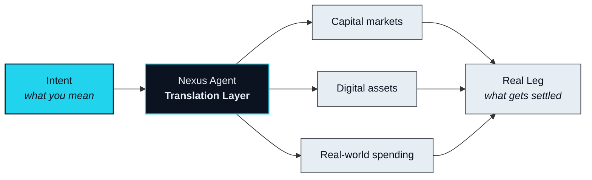

# The Translator

> Bridges move. Agents translate.

Part I ended on a diagnosis. Capital markets, digital assets and real-world spending are not short of pipes between them. They are short of anything that understands what passes through. A bridge can carry a token from one chain to another. It cannot turn ownership into access, or a position into a booking. Every solution built so far moves value and leaves the meaning of that value for a human to handle by hand.

That handling is the actual job. This chapter is about who does it.

## Why a human cannot do this job

> Translating between three markets in real time asks for five things at once: read the intent, find a route, execute across four systems, watch every leg by the millisecond, and unwind cleanly if any of it fails.

Take them one at a time and none is exotic. Traders route orders. Payment systems settle legs. Risk desks watch slippage. What no person does is all five simultaneously, on a single request, in the time it takes for a quote to expire. The moment one leg lands and the next has not, a human is already too slow to protect the whole. The result is what Part I described: a week of manual translation, four identity checks, and a route that falls apart the instant any step needs attention.

No human does that well. An agent does.

That is not a claim about intelligence. It is a claim about shape. The task is parallel, continuous and unforgiving of latency, and an agent is built for exactly that shape. It can hold the whole route in view, watch every leg at once, and act before a price moves. The bottleneck was never the pipes. It was the translator.

## What NEXON is

NEXON's connection does not run on bridges. It runs on agents.

NEXON is a **Translation Layer**: an application-layer protocol that sits above chains, venues and suppliers, and gives an agent the standing to act across all three markets on your behalf. It does not issue a chain. It does not replace the places where assets already live. It reads what you mean, finds a path through the three markets, and settles each part of that path where that part belongs — a digital asset on the chain that holds it, a capital-market position through a licensed venue, a hotel room in the supplier's own system.

That last point matters enough to state as a design principle. NEXON is chain-agnostic. A Route is a sequence of legs, and each leg settles where its asset is native. The protocol's own contracts — the ones that record what has been bonded and what sits in escrow — are deployed on BNB Smart Chain (BSC), but nothing about the translation depends on that choice. The agent's job is to move meaning between markets, not to move every asset onto one ledger.

The agent that does this work is the **Nexus Agent**. It is not an assistant bolted onto a wallet, and it is not a script with a spending limit. It is the component that makes the connection exist at all.

## Five steps between meaning and settlement

Every Intent on NEXON passes through the same five steps. Their names are fixed and are used throughout this paper.

1. **Parse** — turn a sentence into a structured Intent.
2. **Route** — find a path across the three markets.
3. **Bond Check** — confirm the agent has the standing to execute it.
4. **Execute** — run the legs one by one, with the whole route in view.
5. **Land the Real Leg** — finish in the real world: a booking, a card limit, something delivered.

The two sections that follow walk these steps through a single worked example, and then draw the line between this design and the "AI + payments" products that share its vocabulary but not its job.

<table data-view="cards"><thead><tr><th></th><th></th><th data-hidden data-card-target data-type="content-ref"></th></tr></thead><tbody><tr><td><strong>Intent, Not Operation</strong></td><td>One sentence, five steps, one real-world outcome — followed end to end.</td><td><a href="intent-over-operation.md">intent-over-operation.md</a></td></tr><tr><td><strong>Why This Is Not "AI + Payments"</strong></td><td>A caged agent is still a hand. Where the line is, and why it matters.</td><td><a href="not-ai-plus-payments.md">not-ai-plus-payments.md</a></td></tr></tbody></table>


**How to use this chapter.** Every later section of this paper — architecture, products, economics — expands one of the five steps above. When a section seems to introduce something new, it is almost always answering a single question: which step does this serve, and what does it need in order to do its part?


Connection first. The two assets that make the network run — what is bonded so that an agent may act, and what is spent when it does — are the subject of Part V. They are not needed to understand the thesis, and the thesis is what everything else rests on.


**Scope of this section.** Commits to: NEXON is an application-layer Translation Layer whose connection is performed by agents, not bridges, in five named steps. Does not commit to: any venue, supplier or execution partner. Open items: [OP-15](../open-parameters/README.md).


*Next: [Intent, Not Operation](intent-over-operation.md)*

*Turning what you mean into what gets settled.*
