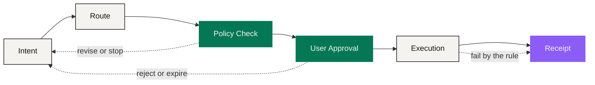

# The Value Translator

> A connection is working when the user can state the outcome, read the route, and still hold the switch.

Part I ended on a diagnosis: the three markets are short of a language, not of pipes. Capital markets speak in ownership. Digital finance speaks in balances and programmable settlement. Consumer markets speak in inventory, delivery and rights of use. NEXON's thesis is not that these should collapse into one asset. It is that the **conversion** between them can itself become a product — explicit, reviewable, and handed to software one step at a time.

That is the value translator. A user starts from an outcome: keep this reserve intact, put this to work, book this trip. The system turns it into candidate routes, and every leg says which asset it uses, who executes it, what condition must hold, what permission it needs and what receipt comes back.

## The six-stage route

The same request that takes four systems and a week today travels six stages here.



### Intent

Record the outcome, the amount, the deadline, the hard constraints and the approval mode. Nothing has moved, and no authority has been granted.



### Route

Lay out candidate legs across eligible products, venues and suppliers, with costs, quote expiry and dependencies. **Still nothing moves.**



### Policy Check

Identity and jurisdiction, balances, limits, liquidity, product terms, the user's own restrictions — each tested. This layer is deterministic; a model's confidence cannot stand in for it.



### User Approval

Show every leg's cost, quote, expiry, permission, responsible executor and irreversible step. The user approves a **bounded** instruction.



### Execution

Send only the approved instruction, and only to the system that actually settles, custodies, exchanges or delivers. The translator does not become the exchange, the custodian or the merchant.



### Receipt

Record what completed, what failed and what is still open, with the party responsible for each — and keep "the money settled" and "the thing arrived" as two separate facts.



The order exists to prevent three very common confusions:

* **A good route is not permission.** Finding the best path does not mean the system is allowed to walk it.
* **Permission is not settlement.** An instruction sent is not an order filled.
* **Settlement is not delivery.** Money reaching a merchant does not mean the room is booked.

A user can authorize an EXON spot order without authorizing a hotel purchase. A digital payment can settle while the merchant never fulfills. Keeping those three apart in the record is the most practical thing this structure buys.

## Connection without erasure

The translator coordinates responsibility. It does not absorb it.

| Domain | What the translation layer can do | What stays with the original system |
|---|---|---|
| Capital markets | Show how many steps sit between a position, available funds and a later use | Trading hours, settlement cycles, broker controls, securities rules |
| Digital finance | Compare routes, prepare transactions, surface on-chain and venue evidence | Liquidity, finality, oracles, asset price |
| Real consumption | Match an approved budget to eligible inventory | The inventory itself, merchant identity, fulfillment |
| NEXON economics | Explain 72/28, eligibility, rewards and redemption choices | The approved formulas themselves |

The exchange owns its leg. The Staking Platform applies its published staking and redemption rules. A wallet holds or delegates keys according to its own design. Issuers, merchants and travel suppliers each own their regulated or physical leg. The route's job is to **put those borders on the surface** — not hide them behind a chat window.

## Where today's mechanism sits inside this

The economics already running are specific: one account system connecting NEX Main Exchange / CEX and the Staking Platform. The first carries EXON spot, IEO and release display; the second carries XO principal, term-weighted rewards and redemption. That is the **current mechanism**. "XO as Value Anchor, EXON as Circulation Engine" is the long-term position laid over it.

The relationship between the two is architectural, not permissional. An agent does not need a staking position to read intent. Holding XO grants an agent no execution authority. EXON is not a general route fee. The application layer helps a user understand and navigate; the economic layer keeps running on its own published parameters.

Why not just build one app that does everything

Because an interface cannot absorb responsibility. An app can merge four screens into one; it cannot merge four legal obligations into one. When a hotel booking fails, the party that can fix it is still the hotel. When an on-chain transfer is irreversible, no interface can call it back.

A unified experience and unified responsibility are different things, and a product that conflates them drops the user into an accountability gap the first time something fails. That is why NEXON describes a connection network rather than an omnipotent app: **the experience can be one; responsibility stays where it is, and says whose it is.**

*Previous: [Why Bridges Failed](../01-the-split/why-bridges-failed.md) · Next: [Express Intent, Not Operations](intent-over-operation.md)*
