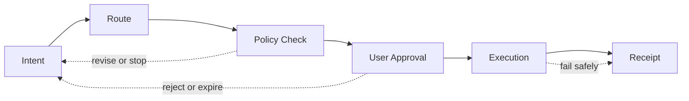

# The Value Translator

> A connection becomes useful when the user can state the outcome, inspect the route and retain control of execution.

Part I described three markets with different languages of value. Capital markets speak in ownership and claims. Digital finance speaks in balances, liquidity and programmable settlement. Consumer markets speak in inventory, delivery and rights of use. NEXON's thesis is not that these meanings should collapse into one universal asset. It is that the transitions among them can become explicit, reviewable and progressively automatable.

This is the role of the **value translator**. A user starts with an objective—allocate funds, preserve a reserve, complete a purchase or coordinate several steps. The system turns that objective into a proposed route. Each leg identifies the asset involved, the venue or supplier responsible, the condition that must be satisfied, the permission requested and the evidence expected after execution.

The long-term product direction is an **AI-native financial-social ecosystem**. AI-Native PayFi is the secondary focus within that direction because it is where language, money and real-world intent meet most directly. PayFi can make a complex route understandable; it cannot make an ineligible transaction eligible, guarantee a supplier's performance or convert an economic illustration into a return promise. The PayFi application and the other ecosystem products described in this paper are Roadmap.

## The six-stage route

The control model follows a visible sequence:

1. **Intent.** Record the desired outcome, amount, deadline, constraints and preferred approval mode.
2. **Route.** Produce one or more candidate paths across eligible products, venues and suppliers. No asset moves at this stage.
3. **Policy Check.** Evaluate identity and jurisdiction requirements, balances, limits, liquidity, product terms and user-defined restrictions.
4. **User Approval.** Display the route, quotes, costs, expiry, permissions and accountable executor for every leg. The user approves a bounded instruction, not an unlimited mandate.
5. **Execution.** Send only the approved instructions to the systems responsible for settlement, custody, exchange or delivery.
6. **Receipt.** Record what completed, what failed and what remains pending. A receipt should distinguish financial settlement from real-world fulfillment.

This sequence prevents three common category errors. A good route is not the same as permission. Permission is not the same as settlement. Settlement is not always the same as delivery. A user can authorize an EXON spot order without authorizing a hotel purchase; a digital payment can settle while a merchant order remains unfulfilled; an AI recommendation can be well reasoned while the product it recommends remains unavailable in the user's jurisdiction.

## Translation without erasure

A responsible connection preserves the boundaries of every domain it touches.

| Domain | What translation can do | What translation cannot do |
|---|---|---|
| Capital markets | Clarify the steps between a position, available funds and a later use | Bypass trading hours, settlement, broker controls or securities rules |
| Digital finance | Compare routes, prepare transactions and surface on-chain evidence | Guarantee liquidity, finality, oracle accuracy or asset value |
| Real consumption | Match an approved budget and preference to eligible inventory | Create inventory, replace a merchant or guarantee fulfillment |
| NEXON economics | Explain the 72/28 order structure, eligibility and redemption choices | Change the approved formula or promise a realized return |

The translator therefore coordinates responsibilities; it does not absorb them all. The exchange remains responsible for exchange-side functions. The Staking Platform applies its approved staking and redemption rules. A wallet safeguards or delegates keys according to its design. A card issuer, merchant or travel supplier remains responsible for its own regulated or physical leg. The route should make those boundaries easier to see, not conceal them behind a conversational interface.

## Where the current mechanism fits

NEXON's approved economics already provide a precise, limited foundation. One unified account can expose two operating layers: NEX Main Exchange/CEX for EXON spot activity, IEO and release display, and the Staking Platform for XO principal, term-weighted rewards and redemption. These roles are current mechanics. They should not be confused with the broader Roadmap claim that XO can become the ecosystem's Value Anchor and EXON its Circulation Engine.

Likewise, an agent does not need a staking position to interpret intent. XO does not grant execution authority. EXON is not currently a universal route fee. The relationship is architectural: the application layer may help a user understand and navigate available choices, while the economic layer continues to operate under its own published rules.

The next two sections describe the intent object in detail and explain why this model is materially different from attaching a chat interface to a payment rail.


**Roadmap status.** The AI-Native PayFi application, wallet, marketplace, Stablecoin Card and decentralized Social App are planned product directions. This chapter is an architecture thesis, not evidence that these products, integrations or automated routes are live.


*Previous: [Why Bridges Failed](../01-the-split/why-bridges-failed.md) · Next: [Express Intent, Not Operations](intent-over-operation.md)*
