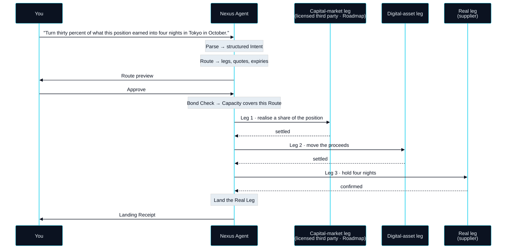

# Intent, Not Operation

> So on NEXON, you stop operating products. You state an intent.

Part I followed one request across four systems and a week. This section follows the same request across NEXON, step by step, so that the five names introduced in the previous section become concrete before the rest of the paper builds on them.

The request is deliberately ordinary. Nothing about it is exotic. It is hard only because three markets are involved.

> "Turn thirty percent of what this position earned into four nights in Tokyo in October."

Said today, that sentence is a to-do list. On NEXON it is an **Intent** — a single input that the Nexus Agent takes responsibility for from the moment it is stated to the moment the last leg lands.


**What is illustrated, and what is live.** The walk-through below shows the target behaviour of a complete Route. The digital-asset leg and the real leg are `In development`. The capital-market leg is a `Roadmap` capability that will be executed by a licensed third party — NEXON does not broker securities at any point. Travel redemption is likewise `Roadmap`. Nothing in this section should be read as shipped.


## Five steps



## Parse

The agent turns the sentence into a structured Intent. "Thirty percent of what this position earned" becomes a quantity with a source. "Four nights in Tokyo in October" becomes a real-world outcome with a place, a duration and a time window. Where the sentence is ambiguous — which position, which nights — the agent asks one clarifying question rather than guessing. Parsing ends with an Intent the agent can be held to.



## Route

The agent plans a path across the three markets: how much of the position to realise and through which licensed venue, which liquidity to move the proceeds through, at what rate, and which supplier can hold four nights on those dates. A Route is a sequence of legs, each with a quote and an expiry. It is shown to you in full before anything moves.



## Bond Check

Before a Route can execute, the network checks that the agent has the standing to run it. That standing comes from what you have bonded: the XO held in the Bond ledger sets a **Capacity**, the ceiling on what your agent may execute on your behalf. A Route beyond that ceiling is not refused at the end — it cannot be proposed at all. This is the only place in Parts I and II where an asset is named, and Part V explains why it is this one.



## Execute

The agent runs the legs one at a time, with the whole Route in view. Each leg is priced and settled in the network's settlement unit, and each is watched against its quote and its expiry. If a leg fails or a quote lapses, execution stops and everything already done is unwound along the path it came — a **Rollback**. You are not asked to intervene mid-route. You were asked before it began.



## Land the Real Leg

The last leg is the one that touches the world outside the ledger: a confirmed booking, a card limit, a delivered good. It closes with a **Landing Receipt**, a verifiable record that the outcome you stated has actually happened. Until that receipt exists the Intent is not settled, whatever the earlier legs say.



## What changed, and what did not


{% column width="50%" %}
**Today**

- Four systems: a broker, a bank, a currency desk, a travel site.
- Four identity checks, one per system.
- Four manual translations, each performed by you.
- One person holding the whole sequence in their head, with no way to unwind it if a step fails.



**On NEXON**

- One Intent, one agent, one Route shown in full before anything moves.
- One approval, given by you, before execution.
- No manual translation — the agent carries meaning from leg to leg.
- A Rollback path defined before the first leg runs.



It is worth being precise about what did not change, because that is where most of the honesty in this design lives. The venues are the same. The position is still realised through a licensed venue; the proceeds still move through real liquidity; the room is still held by the supplier in the supplier's own system. NEXON did not replace any of them and does not intend to. What it replaced is the part of the process that was never a system at all — the person standing between systems, translating.

That is also why the comparison above gives no duration for the NEXON side. The route is only as fast as its slowest leg, and some legs are governed by markets and suppliers that NEXON does not control. What the design removes is not the clock. It is the four hand-offs, the four re-authentications and the four opportunities for the sequence to stall while a human works out what to do next.

The agent does not take the risk for you. It translates for you.


**Scope of this section.** Commits to: an Intent is processed in five named steps — Parse, Route, Bond Check, Execute, Land the Real Leg — with the full Route visible and approvable before execution and a defined Rollback path. Does not commit to: any execution time, any specific venue or supplier, or the capital-market leg being available before its `Roadmap` status is confirmed. Open items: [OP-15 · OP-24](../open-parameters/README.md).


*Spine: [The Translator](README.md) · Next: [Why This Is Not "AI + Payments"](not-ai-plus-payments.md)*
