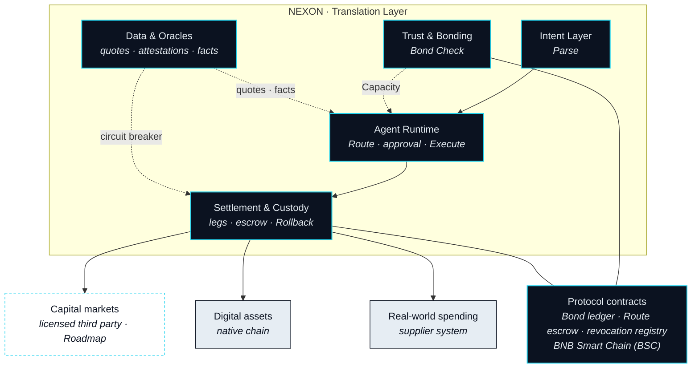

# Protocol Architecture

> Translating between three markets in real time asks for five things at once: read the intent, find a route, execute across four systems, watch every leg by the millisecond, and unwind cleanly if any of it fails.

Part II made the case that the connection between the three markets is performed by an agent, not by a bridge. This Part shows what that agent stands on. Everything in it is proposed design: each capability carries a status badge, nothing is described as live, and every parameter still being decided is listed in [Open Parameters](../open-parameters/README.md) rather than guessed at here.

## An application-layer protocol

NEXON is not a chain. It is an application-layer protocol that sits above the chains, venues and suppliers where value already lives, and it is chain-agnostic by construction. A Route is a sequence of legs, and each leg settles where its asset is native: a digital asset on the chain that holds it, a capital-market position on the books of a licensed third party, a hotel room in the supplier's own system. The protocol translates between those places. It does not ask any of them to relocate.

The protocol does keep records of its own. One ledger records which XO has been bonded and what Capacity that confers. One escrow holds the EXON a still-open Route will spend on its legs. One registry records which delegations have been revoked. Those contracts are deployed on BNB Smart Chain (BSC). The choice determines where the protocol's own ledger is written and nothing else: no leg is required to settle there, and no part of the translation depends on it.


**Chain-agnostic by design.** "Which chain is NEXON on?" has two answers. The protocol's own records live on one chain — BNB Smart Chain (BSC). The value a Route moves lives wherever it already lived. Nothing in this Part asks you to bridge an asset onto a single ledger before an agent can act on it.


## Five subsystems

The architecture is organised as five subsystems, ordered the way an Intent travels: from what you said to what got settled. Each has its own section.

<table data-view="cards"><thead><tr><th></th><th></th><th data-hidden data-card-target data-type="content-ref"></th></tr></thead><tbody><tr><td><strong>Intent Layer</strong></td><td>A sentence becomes an Intent: capture, Parse in three moves, one clarifying question, a fixed schema.</td><td><a href="intent-layer.md">intent-layer.md</a></td></tr><tr><td><strong>Agent Runtime</strong></td><td>Where the Nexus Agent runs, and the three rings that bound what it may do.</td><td><a href="agent-runtime.md">agent-runtime.md</a></td></tr><tr><td><strong>Settlement &amp; Custody</strong></td><td>Every leg settles where its asset lives. Who holds what, and how Rollback unwinds.</td><td><a href="settlement-and-custody.md">settlement-and-custody.md</a></td></tr><tr><td><strong>Trust &amp; Bonding</strong></td><td>Why an agent may act at all: Bond into Capacity, Depth and a Seat.</td><td><a href="trust-and-bonding.md">trust-and-bonding.md</a></td></tr><tr><td><strong>Data &amp; Oracles</strong></td><td>What the agent reads before it acts, and what a Route does when a reading goes bad.</td><td><a href="data-and-oracles.md">data-and-oracles.md</a></td></tr></tbody></table>

| Subsystem | Serves | Status |
|---|---|---|
| Intent Layer | Parse | `In development` |
| Agent Runtime | Route · approval · Execute | `In development` |
| Settlement &amp; Custody | Execute · Land the Real Leg · Rollback | `In development` · capital-market legs `Roadmap` |
| Trust &amp; Bonding | Bond Check | `In development` |
| Data &amp; Oracles | every step that needs a quote, an attestation or a fact | `In development` · Foresight signal `Roadmap` |

## One Route, end to end

The five subsystems are easiest to see by following one Route through them.

**Agents parse it. Route it. Check it against what you've bonded. Execute it leg by leg. And land the last one in the real world — a booking, a card limit, something delivered.**

It starts as a sentence, said in a Circle or typed into the wallet. The **Intent Layer** parses it: extracts the goal, asks one question if the sentence is ambiguous, and writes the result into a structured Intent with its constraints attached. Nothing has moved yet.

The **Agent Runtime** takes the Ready Intent and proposes a Route: which legs, in which order, through which Leg Executors — the venue, licensed party or supplier that carries out one leg — at which quotes, expiring when. Before it can propose anything it performs Bond Check, and for that it reads **Trust & Bonding**: the Capacity your bonded XO confers is the ceiling, and a Route that exceeds it is never composed. You see the Route and approve or refuse it. Approval places a Capacity Reservation and grants the runtime a scoped delegation for the first leg — not for the Route as a whole, and never a key.

Every quote in that proposal, and every fact the legs will depend on, came from **Data & Oracles**: prices from more than one source, identity as a reference to a licensed attestation, inventory and confirmations from supplier systems. The same subsystem keeps watching while the Route runs, and it is what pauses a Route when a reading goes stale or two sources disagree.

**Settlement & Custody** executes the legs, one at a time, each on the ledger or system its asset is native to. The EXON the Route will spend waits in escrow and pays each leg as it lands. The last leg is the Real Leg, and it closes with a Landing Receipt — proof that the booking, the card limit or the delivery happened. If any leg fails, the same subsystem runs Rollback and returns everything along the path it came.

## Organs and nerves

Part IV describes the products — the Circle where an Intent is born, the app where you approve, the wallet that thinks, the Storefront where value lands — and each is an organ: the place where you meet the protocol. This Part is the nervous system running between them. A product can be redrawn without changing a subsystem; a subsystem cannot be removed without the products losing a step. Read the five sections that follow with the Route above in mind. Each answers a single question about it: what does this step need in order to do its part?


**Scope of this section.** Commits to: NEXON is an application-layer, chain-agnostic protocol organised as five subsystems, with its own records on BNB Smart Chain (BSC) and every leg settling where its asset is native. Does not commit to: any venue, supplier or execution partner, or any capability being live. Open items: [OP-15](../open-parameters/README.md).


*Spine: [The Translator](../02-the-translator/README.md) · Next: [Intent Layer](intent-layer.md)*

*Turning what you mean into what gets settled.*
