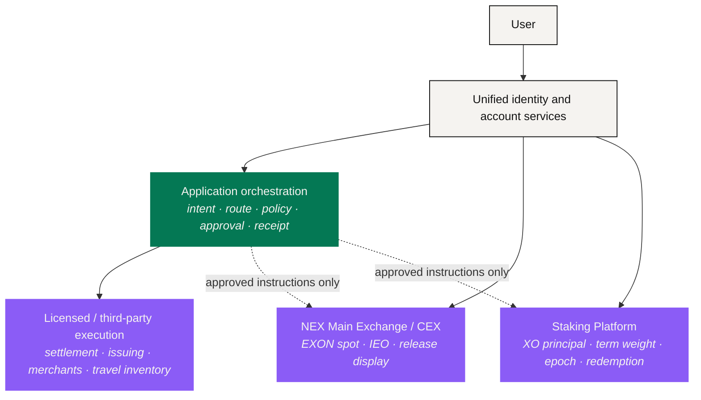

# Protocol Architecture

> One experience does not require one system to own every asset, every decision and every obligation.

NEXON is designed as a **coordination layer** above the chains, venues, account systems and suppliers where value already lives. It aims at a coherent experience while preserving the native controls of every execution leg. That is essential to the connection thesis: a route earns trust because responsibility is visible, not because an interface hid it.

## Five responsibility domains

| Domain | Owns | Where its edge is |
|---|---|---|
| Unified identity and account services | Session, account view, eligibility references, permissions, user policy | A unified view does not merge custody or legal obligation |
| NEX Main Exchange / CEX | EXON spot activity, IEO, release display | Does not distribute the staking rewards described here |
| Staking Platform | XO staking principal, order validation, term weighting, epoch rewards, redemption | Its rules never become universal PayFi or marketplace rules |
| Application orchestration | Intent capture, route construction, policy checks, approval, receipts | It proposes and coordinates; it does not acquire custody or authority by doing so |
| Licensed or third-party execution | Regulated settlement, card issuance, merchant supply, travel inventory | Each operator answers under its own terms and jurisdiction |

One account makes these five easier to navigate. It does not fuse them into one balance sheet. A user should be able to see, at any moment, **which domain holds an asset**, **which rules govern it** and **who can resolve a failure**.

## Five subsystems

The application layer is divided by **responsibility**, not by screen.

| Subsystem | Owns | Evidence it leaves |
|---|---|---|
| [Intent Layer](intent-layer.md) | Turning an objective and its constraints into a structured, versioned request | Intent record |
| [Agent Runtime](agent-runtime.md) | Proposing routes, applying policy, requesting approval, coordinating bounded execution | Route and authorization log |
| [Settlement & Custody](settlement-and-custody.md) | Reconciling native execution without pretending all assets share one custodian | Venue, chain or supplier receipt |
| [Staking & Reward Layer](trust-and-bonding.md) | Applying the approved XO/EXON order, epoch and redemption rules | Order and reward ledger |
| [Data & Oracles](data-and-oracles.md) | Supplying prices, eligibility signals, inventory and failure thresholds | Timestamped source record |

They map one-to-one onto the six-stage path: **Intent → Route → Policy Check → User Approval → Execution → Receipt.** The Intent Layer owns the first structured object. The runtime owns route construction, checks and authorization. Native executors own settlement or delivery. Reconciliation owns the receipt.

## The economic boundary that exists now

The economic architecture is narrower and more settled than the product roadmap. NEX Main Exchange / CEX carries EXON spot trading, IEO and release display. The Staking Platform carries single-token staking, term weighting, dynamic rewards and redemption. They may share identity, account visibility and capital operations; their ledgers, permissions and disclosures stay distinct.

A Staking Platform order runs 72/28: 72% establishes the XO staking/PV base, 28% buys EXON into Treasury Liquidity, and a matching 28% of EXON is checked in the user's account and stays there. **That is this product's own rule** — not a general architectural pattern, and not a fee model for future applications.

## One route across the boundaries

A future route can touch several domains without handing responsibility to the agent.



### Discover in Social

The social product supplies context. It cannot spend, order or approve for the user.



### Check state in the Wallet

The wallet exposes balances, protected reserves, open positions and permissions already granted.



### Build the route in PayFi

PayFi organizes the proposal and the approval: legs, costs, executors, irreversible steps.



### Execute at venue and supplier

The venue settles the conversion. The supplier confirms delivery. These are booked as two facts.



If the supplier fails after payment, the route is **not** marked successful. If the venue settled while delivery is still pending, the receipt shows both states. If a policy check goes invalid mid-route, later legs stop. The craft of architecture is keeping every one of those distinctions intact while the user experiences one connected flow.

## Six controls that do not bend

<table><thead><tr><th width="200">Control</th><th>What it means</th></tr></thead><tbody><tr><td><strong>Least authority</strong></td><td>Every approval covers only the assets, destinations, amounts, actions and time it names</td></tr><tr><td><strong>No token-derived permission</strong></td><td>Holding XO or EXON authorizes no agent and widens no account access</td></tr><tr><td><strong>Versioned rules</strong></td><td>Every economic calculation and policy decision cites the rule version in force at the time</td></tr><tr><td><strong>Separable custody</strong></td><td>An orchestration interface names the real custodian or executor for every leg</td></tr><tr><td><strong>Failure is first-class</strong></td><td>Partial completion, pending delivery, dispute and reversal are states the interface can show</td></tr><tr><td><strong>No flattering states</strong></td><td>Submitted is not settled; an unreconciled state stays "unknown" until it genuinely reconciles</td></tr></tbody></table>

The result is not one monolithic protocol. It is a **controlled connection among distinct systems**, organized around a shared route model and a shared evidence model.

*Previous: [Not "AI Plus Payments"](../02-the-translator/not-ai-plus-payments.md) · Next: [Intent Layer](intent-layer.md)*
