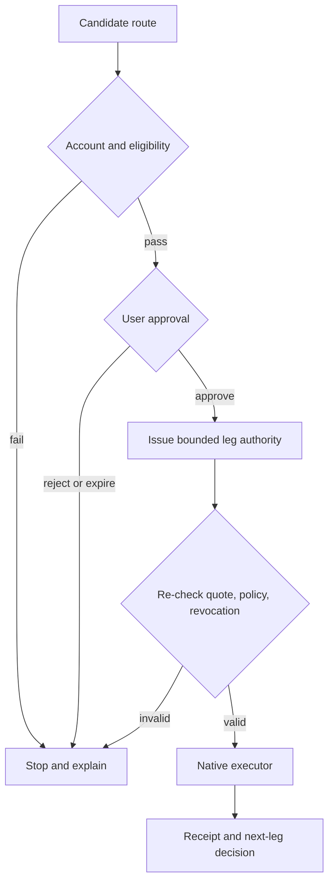

# Agent Runtime

The Agent Runtime is the Roadmap coordination engine between a structured intent and native executors. It may interpret, compare, simulate and prepare. It may execute only within a valid, bounded authorization. It is not a custodian, exchange, compliance authority, card issuer, merchant or source of return.

This definition narrows the role of AI on purpose. A powerful model can produce useful routes and still be wrong about a price, product rule, destination or user's meaning. The runtime must therefore treat model output as a proposal that deterministic controls can reject.

## Route construction

A route is a directed sequence of legs. Every leg declares:

- the input and expected output;
- the responsible executor and destination;
- the quote source, amount, cost and expiry;
- the eligibility and policy checks required;
- whether the leg is reversible, refundable or irreversible;
- its dependency on earlier legs;
- the receipt expected if it completes;
- the failure action if it does not.

The runtime compares routes using the user's constraints, not an undisclosed platform objective. A cheaper route that uses a prohibited venue is ineligible. A faster route that breaks a reserve floor is ineligible. If no route satisfies the intent, “no eligible route” is a valid and necessary answer.

## Three nested controls

Authority is constrained at three levels.

### Account and eligibility

The runtime first confirms that the user, account and jurisdiction may access each product. An AI explanation cannot override a failed check. Eligibility references should come from the responsible provider and reveal no more identity data than the executor requires.

### Route approval

The preview presents the complete economic and operational consequence: legs, maximum amount, estimated costs, timing, executors, permissions, irreversible steps and failure behavior. The user approves this version of the route. A material change in amount, destination, source asset or executor invalidates that approval.

### Leg authority

Each executor receives the narrow instruction it needs. A payment leg cannot read or move unrelated assets. A supplier leg cannot authorize a market order. Permission expires after use or at the stated deadline. Before every dependent leg, the runtime checks revocation and whether upstream assumptions still hold.

## Deterministic checks around probabilistic output

The runtime should not ask the same component to propose and police its own action. Models may parse language and rank eligible options. Deterministic services enforce hard amounts, allowlists, reserve floors, expiry, nonce and signature rules. Native contracts and venue APIs enforce product mechanics. Independent telemetry records the result.

For an approved Staking Platform order, the runtime validates the published fields rather than improvising them. It verifies the 72% XO staking/PV base, the 28% EXON buy into Treasury Liquidity and the matching `F = 0.28 × P` EXON balance. The fuel amount stays in the user's account. A failed balance check stops the order; it does not authorize another asset to be sold automatically.

## Revocation and recovery

Revocation must operate at the same granularity as authorization. The user can cancel a route that has not begun, revoke unused later legs or disable a recurring rule. Revocation cannot undo an already settled irreversible leg. The interface should distinguish authority removed from consequence reversed.

If execution fails, the runtime follows the disclosed response:

| Condition | Runtime behavior |
|---|---|
| Quote or inventory expired | Stop, re-route and request fresh approval |
| Policy or eligibility changed | Stop the affected leg; retain the reason code |
| Executor unavailable | Retry only within disclosed limits; otherwise expire or escalate |
| Receipt missing | Mark unknown/pending; do not infer success from request submission |
| First leg settled, later leg failed | Preserve partial state and invoke the product's refund, offset or dispute path |
| Model proposes unsupported action | Reject before authorization |

## Audit and explanation

Every event should identify the responsible actor, input state, rule and model version, policy result, approval object, native transaction or supplier reference and final status. The explanation shown to a user need not expose proprietary model reasoning. It must explain the decision in operational terms: why a route was eligible, what changed, which rule blocked it and who controls the next step.

The audit trail also separates advice from execution. Social content, market forecasts and model recommendations are inputs. The authorization and native receipts prove what the system was allowed to do and what it actually did.

## Runtime invariants

- XO or EXON ownership never substitutes for account permission.
- The runtime cannot widen an amount, destination, asset scope or deadline after approval.
- A later leg cannot execute if its required earlier receipt is absent or invalid.
- A model cannot modify economic parameters fixed by the approved Tokenomics mechanism.
- A route is never marked complete solely because an instruction was submitted.
- Unknown states remain visible until reconciled; they are not converted to success for interface convenience.


**Roadmap status.** The Agent Runtime, delegation model and cross-product automation described here are planned architecture. Supported executors, authorization standards, limits, model stack and recovery service levels remain Open.


*Previous: [Intent Layer](intent-layer.md) · Next: [Settlement & Custody](settlement-and-custody.md)*
