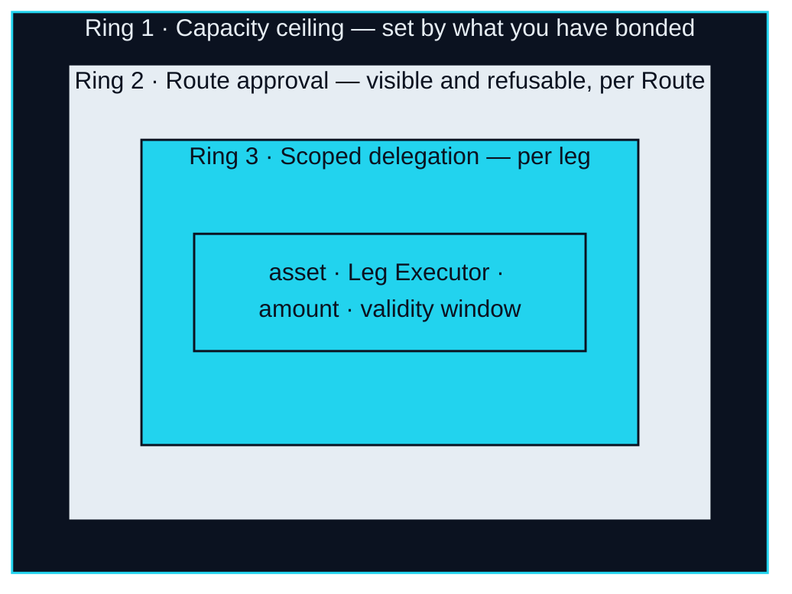
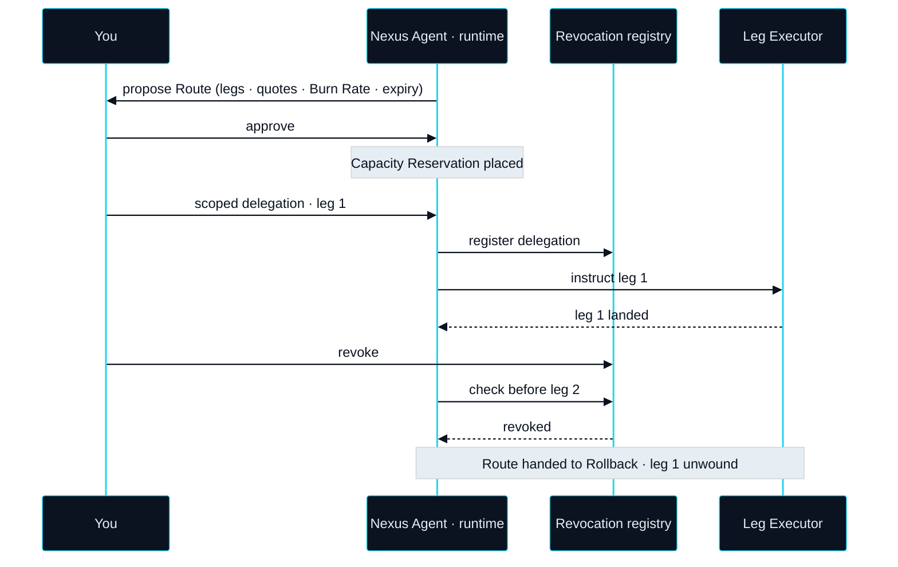

# Agent Runtime

> Agents parse it. Route it. Check it against what you've bonded. Execute it leg by leg. And land the last one in the real world — a booking, a card limit, something delivered.

The Agent Runtime is where the Nexus Agent lives while it does that work. It is the subsystem that turns a Ready Intent into a Route, shows you the Route, and — once you have approved it — drives each leg through Settlement & Custody. **Routing across three markets — one path spanning equities, digital assets and real spending.** That is the runtime's job description, and every mechanism below exists so that it can do that job without ever holding what it moves.

## Where the agent runs

### An off-chain runtime, bound to your account

**Status** · `In development`

The runtime is off-chain. It is bound to one account — yours — and it reads that account's Bond, Capacity, Intents and history; it cannot act for anyone else. It holds no assets and no keys. What it holds is authority: a bounded, time-limited permission to instruct specific legs on your behalf, granted per Route and recorded where it can be revoked. Off-chain is a deliberate choice. Routing needs quotes, conversation and judgment at the speed of a conversation, none of which belongs on a ledger. What belongs on a ledger is the record of what the runtime was allowed to do and what it did.


**The agent never holds your keys.** Your assets stay in your own custody. The runtime receives a scoped delegation for each leg of an approved Route — an asset, a Leg Executor, an amount, a validity window — and nothing broader. A delegation that has not been granted cannot be used, and one that has been revoked cannot be used again.


## Three rings of authority

Authority in the runtime is nested. Each ring sits inside the one before it, and nothing can be done in an inner ring that the outer ring does not already permit.

### Ring one · The Capacity ceiling

**Status** · `In development`

The outermost ring is not set by the runtime at all. It is set by what you have bonded. **① An agent's execution ceiling is set by the XO you have bonded — its Capacity; a route beyond that ceiling cannot even be proposed.** The runtime reads Capacity from Trust & Bonding at Bond Check and refuses to compose any Route whose total exceeds it. There is no override in the runtime. Raising the ceiling means bonding more, and that happens in another subsystem.

### Ring two · Route approval

**Status** · `In development`

Inside the ceiling, every Route is a proposal until you say otherwise. **② Every Route is visible and refusable before it executes — you are the approver, not a bystander.** The proposal shows each leg, its Leg Executor, its quote, the EXON the Route will consume as Burn Rate, and the moment its quotes expire. Refusing costs nothing. Approving does two things at once: it authorises the Route, and it places a Capacity Reservation.

### Ring three · Scoped delegation

**Status** · `In development`

Inside an approved Route, each leg gets its own delegation and nothing more: which asset, which Leg Executor, up to what amount, valid until when. A delegation for the digital-asset leg cannot be used on the Real Leg; one that has expired cannot be used late; one for a smaller amount cannot be stretched. The runtime requests these delegations from your wallet one leg at a time, so that what is outstanding at any moment is at most the leg in flight.

## Two approval modes

### Approve each Route

**Status** · `In development`

The default, and the only mode in the v1 design. Each Route is approved individually, at proposal time, with all of its legs visible. A Route whose quotes expire before you answer is proposed again, not executed on the old quotes.

### Pre-approved envelope

**Status** · `Roadmap`

A later mode lets you set an envelope in advance — a bounded class of Intents, a ceiling on what any single Route inside it may consume, a time window — so that a Route which fits the envelope executes without a fresh approval. The envelope never exceeds ring one, and its limits are an Open Parameter (OP-18). Until it ships, every Route is approved by hand.



**Status** · `In development`

* You see: every leg, its quote, its Leg Executor, the Burn Rate estimate, the expiry.
* You do: approve or refuse, one Route at a time.
* The agent may: execute exactly the legs you approved, in the order you saw.
* The agent may not: alter a leg after approval, reuse a delegation, or start a leg after the deadline.



**Status** · `Roadmap`

* You set: a class of Intents, a per-Route ceiling, a window. Limits are `Open` (OP-18).
* You do: nothing per Route, unless a Route falls outside the envelope.
* The agent may: execute Routes that fit, with the same per-leg delegations as the default mode.
* The agent may not: exceed the envelope, exceed your Capacity, or widen the envelope itself.



## Reserve, execute, revoke

### Capacity Reservation

**Status** · `In development`

When you approve a Route, the runtime freezes the Capacity that Route needs for as long as the Route is open. Reserved Capacity cannot be used by a second Route and cannot be released by unbonding; it returns when the Route reaches Landed or Unwound. This is what stops two approved Routes from silently adding up to more than your ceiling.

### Revocation

**Status** · `In development`

Every delegation the runtime holds is registered in an on-chain revocation registry, and revoking takes effect at once. The runtime checks the registry before instructing each leg, and a Leg Executor can check it too. Revoking mid-Route halts the next leg and hands the Route to Rollback. It does not strand anything: the legs already landed are unwound by the same machinery that would unwind a failed leg.

### Route log

**Status** · `In development`

Everything above leaves a trace — proposal, approval, each delegation, each leg's instruction and outcome, each Landing Receipt reference, each revocation. The log is written so that a Route can be replayed step by step after the fact, by you or by whoever has to resolve a dispute. What a Route did is never a matter of recollection.


**Scope of this section.** Commits to: an off-chain runtime bound to one account that holds authority but never assets or keys, nested in three rings, with reservation, immediate revocation and a replayable log. Does not commit to: envelope limits, the Capacity function, or which Leg Executors are admitted. Open items: [OP-07 · OP-15 · OP-18](../open-parameters/README.md).


*Spine: [The Translator](../02-the-translator/README.md) · Next: [Settlement & Custody](settlement-and-custody.md)*
