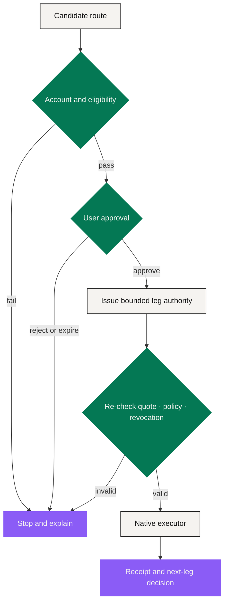

# Agent Runtime

The Agent Runtime is the **coordination engine** between a structured intent and the systems that actually execute. It may interpret, compare, simulate and prepare. It may execute only inside a valid, bounded authorization. It is not a custodian, an exchange, a compliance authority, a card issuer, a merchant, or a source of return.

That definition is narrow **on purpose**. A capable model can produce a genuinely useful route and still be wrong about a price, a product rule, a destination, or what the user meant. So the runtime treats model output as a **proposal** — one that deterministic controls are entitled to reject.

## What a route looks like

A route is a directed sequence of legs. Every leg declares:

* its input and its expected output;
* who executes it and where it lands;
* the quote source, amount, cost and expiry;
* the eligibility and policy checks it requires;
* whether it is reversible, refundable or irreversible;
* which earlier leg it depends on;
* the receipt expected if it completes;
* the action taken if it does not.

The runtime compares routes against **the user's constraints**, not an undisclosed platform objective. A cheaper route through a prohibited venue is ineligible. A faster route that breaks a reserve floor is ineligible. If nothing satisfies the intent, **"no eligible route" is a valid and necessary answer.**

## Three nested layers of authority

**Layer one · account and eligibility.** First confirm that this user, this account and this jurisdiction may reach each product. An AI explanation cannot overturn a failed check. Eligibility references come from the responsible provider and expose no more identity data than the executor requires.

**Layer two · route approval.** The preview lays out the full economic and operational consequence: legs, maximum amount, estimated costs, timing, executors, permissions, irreversible steps, failure behavior. The user approves **this version** of the route. A material change to amount, destination, source asset or executor voids that approval immediately.

**Layer three · leg authority.** Each executor receives only the narrow instruction it needs. A payment leg cannot read or move unrelated assets. A supplier leg cannot place a market order. Permission expires on use, or at the stated deadline. Before every dependent leg, the runtime re-checks revocation and whether upstream assumptions still hold.

## Deterministic controls wrapped around probabilistic output

The runtime should never ask one component both to propose an action and to police it.

| Who | Does what |
|---|---|
| Models | Parse language and rank eligible options |
| Deterministic services | Enforce hard amounts, allowlists, reserve floors, expiry, nonce and signature rules |
| Native contracts and venue APIs | Enforce the product mechanics themselves |
| Independent telemetry | Record what actually happened |

Applied to an approved Staking Platform order, the runtime **validates** the published fields rather than improvising them. It verifies the two records: 28% bought into EXON at 1 USDT each in the fuel wallet, and the rest swapped into XO and staked. The fuel wallet can only be burned; when fuel runs short at withdrawal, the order takes a slower settlement speed — the runtime never authorises selling another asset to cover it.

## Revocation and recovery

Revocation must work at the same granularity as authorization. A user can cancel a route that has not begun, revoke unused later legs, or switch off a standing rule.

Revocation **cannot** undo an irreversible leg that already settled. The interface has to keep "authority withdrawn" and "consequence reversed" as two different statements.

When execution fails, the runtime follows the disclosed response:

| Condition | Runtime behavior |
|---|---|
| Quote or inventory expired | Stop, re-route, request fresh approval |
| Policy or eligibility changed | Stop the affected leg; keep the reason code |
| Executor unavailable | Retry only within disclosed limits; otherwise expire or escalate |
| Receipt missing | Mark unknown/pending — **never infer success from submission** |
| First leg settled, later leg failed | Preserve the partial state and enter the product's refund, offset or dispute path |
| Model proposes an unsupported action | Reject it before authorization |

## Audit and explanation

Every event should identify the responsible actor, the input state, the rule and model version, the policy result, the approval object, the native transaction or supplier reference, and the final status.

The explanation shown to a user need not expose proprietary reasoning, but it must speak in operational terms: why the route was eligible, what changed, which rule blocked it, and who holds the next switch.

The audit trail also keeps **advice** and **execution** apart. Social content, market forecasts and model recommendations are inputs. The authorization object and the native receipts are what prove what the system was allowed to do and what it actually did.

## Six runtime invariants

1. Holding XO or EXON never substitutes for account permission.
2. After approval, the runtime cannot widen an amount, destination, asset scope or deadline.
3. A later leg cannot execute when its required earlier receipt is absent or invalid.
4. A model cannot change any economic parameter fixed by the approved Tokenomics.
5. Submitting an instruction is never enough to mark a route complete.
6. Unknown states stay visible until they genuinely reconcile — never converted to success for the sake of a tidy interface.

*Previous: [Intent Layer](intent-layer.md) · Next: [Settlement & Custody](settlement-and-custody.md)*
