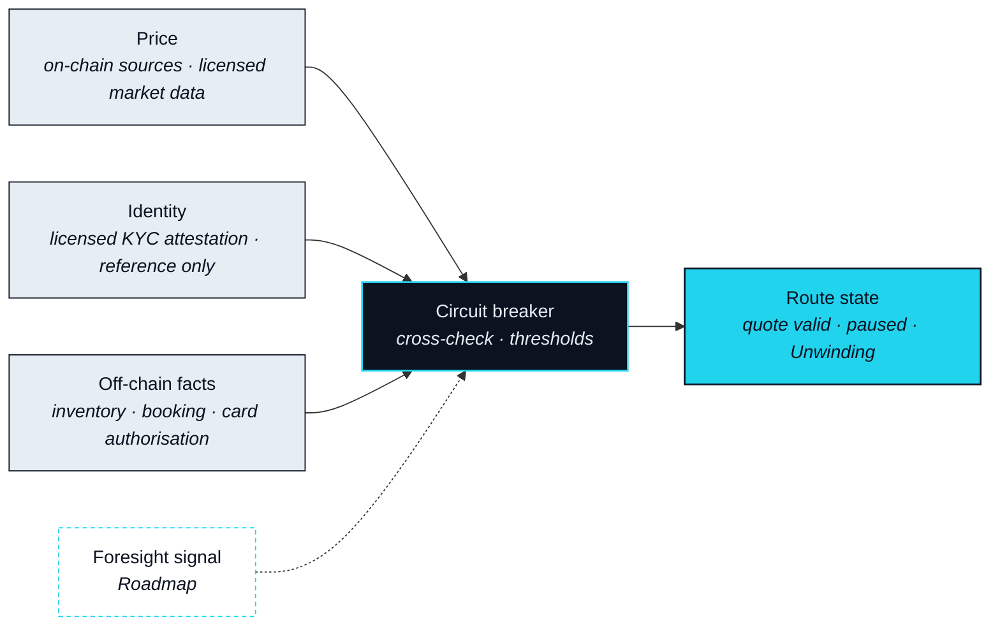

# Data & Oracles

> No human does that well. An agent does.

Watching every leg while it is in flight is the part of translation a person cannot do, and it is the part that depends entirely on what the agent can see. This subsystem is the agent's eyes: the sources it reads before proposing a Route, while executing one, and when deciding that a Route can no longer be trusted. The protocol produces none of this data itself. It chooses where to read it, checks one source against another, and fixes what a Route does when the reading goes wrong.

## Four kinds of input

### Price

**Status** · `In development`

Every leg that moves an asset needs a price, and no leg is priced from a single source. Digital-asset legs read on-chain sources; anything a capital-market leg would touch reads licensed market data, and that leg is `Roadmap`. A quote is accepted when independent sources agree within a band, and it carries an expiry from the moment it is taken. Which providers are read is `Open` (OP-16).

### Identity

**Status** · `In development`

Some Leg Executors will not act for an unverified party. Verification is done by licensed KYC and AML providers, who issue an attestation; the protocol stores a reference to that attestation and nothing underneath it. No document, no personal record and no Circle content is held by NEXON. A Leg Executor that needs to know checks the reference. Which providers are accepted is `Open` (OP-22).

### Off-chain facts

**Status** · `In development`

A Real Leg depends on facts that live in a supplier's system: that the room is available, that the item is in stock, that the booking is confirmed, that a card authorisation went through. These are read through the Leg Executor for that leg, and the last of them — the confirmation — becomes the Landing Receipt. Card authorisation is a fact the protocol will read once a stablecoin card exists, and that is `Roadmap`.

### Foresight signal

**Status** · `Roadmap`

**Foresight** is the wallet's decentralised market for forward-looking views: a reading of what the market expects, which the agent can consult to decide whether to execute now or wait. NEXON provides only the infrastructure and the entry point for it; it does not operate the market and it does not take positions in it. As an input, Foresight is a judgment signal and never a gate. It can delay a Route; it cannot by itself start or stop a leg. Its scope is `Open` (OP-26).



Reads nothing external. Parse resolves what you meant, not what it costs.



Reads price, to quote each leg; identity, to know which Leg Executors may act; off-chain facts, to confirm the Real Leg can be landed at all. Reads the Foresight signal, once it exists, to decide timing.



Re-reads price before each leg is instructed and checks the quote is still inside its band and its expiry. Re-reads identity if a delegation has been revoked.



Reads the supplier's confirmation and writes it into the Landing Receipt. Reads it again if the fact is disputed inside the dispute window.



## When the data is wrong

An oracle is only worth what it does on a bad day. Each kind of input can fail in five ways, and each failure has a response fixed in advance. The responses form a ladder, and the Route climbs it one rung at a time.

| Failure mode | What it looks like | Response | Status |
|---|---|---|---|
| Stale | A source has not updated within its window | The quote expires; no Route is proposed on it | `In development` |
| Deviating | Independent sources disagree beyond the band | The Route pauses; a fresh quote is taken; you approve again | `In development` |
| Unavailable | A required source cannot be reached | The Route pauses; if the source stays unreachable past the deadline, Rollback | `In development` |
| Spoofed | A source fails its authenticity check | The source is dropped; the Route pauses; Rollback if a leg already depended on it | `In development` |
| Disputed | A fact is contested after a leg has landed | The dispute window opens; unresolved, the Route is Partially unwound and the Risk Council resolves it | `In development` |

### Circuit breaker

**Status** · `In development`

The circuit breaker is the component that reads the table above and acts on it. Its rungs are fixed: a quote that fails expires; a Route that loses a reading pauses; a Route that cannot regain one within its deadline unwinds; and a dispute that a rule cannot settle goes to the Risk Council. The breaker is a filter, not a decision-maker. It never proposes a leg, never changes one, and never widens a band; it only stops things. The thresholds that trip it are a `Design Target` (OP-17), and the set of providers it reads is `Open` (OP-16).


**Scope of this section.** Commits to: four kinds of input, no leg priced from a single source, identity held only as a reference to a licensed attestation, and a fixed escalation from quote expiry to Risk Council. Does not commit to: any provider, any threshold, or the scope of Foresight as an input. Open items: [OP-16 · OP-17 · OP-22 · OP-26](../open-parameters/README.md).


*Spine: [The Translator](../02-the-translator/README.md) · Next: [The NEXON Stack](../04-product-stack/README.md)*
