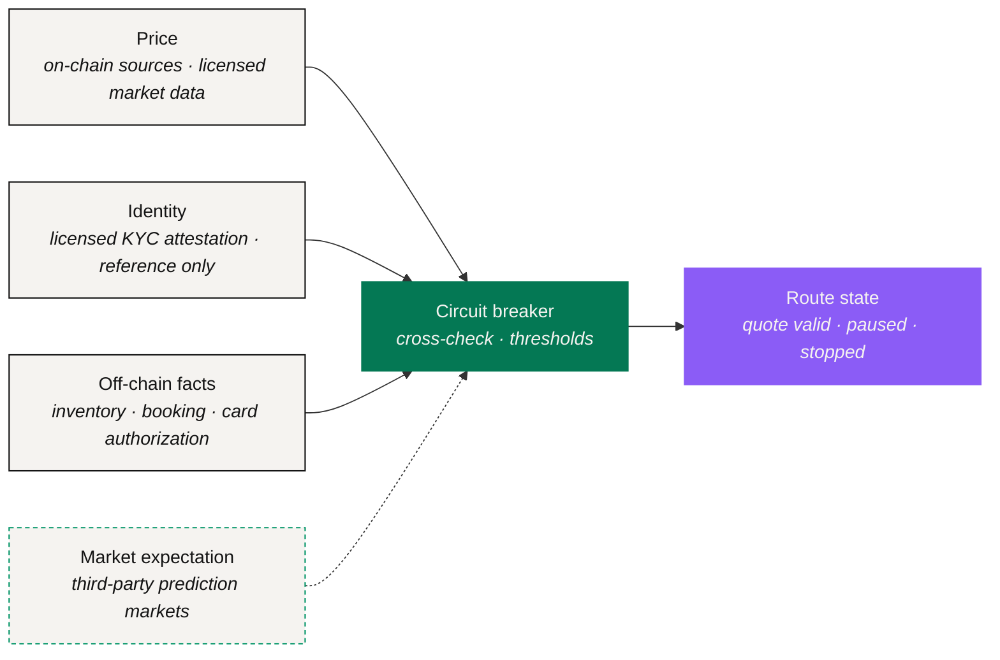

# Data & Oracles

> A route has to be watched while it is in flight. No human does that well. An agent does.

Watching every leg mid-flight is the part of translation a person cannot do, and the part that depends entirely on what the agent can see. This subsystem is the agent's eyes: what it reads before proposing a route, what it reads while executing one, and what it uses to decide a route can no longer be trusted.

The protocol produces none of this data. It decides **where to read it**, **how sources check each other**, and **what a route does when a reading goes wrong.**

## Four kinds of input



Every leg that moves an asset needs a price, and **no leg is priced from a single source.** Digital-asset legs read on-chain sources; anything touching a capital market reads licensed market data.

A quote is accepted only when independent sources agree inside a band, and it starts expiring the moment it is taken. Which providers are read, how wide the band is and how long a quote lives are [Open Parameters](../open-parameters/README.md) (OP-D01).



Some executors will not act for an unverified party. Verification is done by licensed KYC and AML providers, who issue an attestation. **The protocol stores a reference to that attestation and nothing underneath it.**

No document, no personal record and no conversation content is held on the NEXON side. An executor that needs to know checks the reference. Which providers are accepted is Open (OP-D02).



A real-world leg depends on facts that live in a supplier's system: that the room is available, that the item is in stock, that the booking is confirmed, that a card authorization went through.

These are read through the executor responsible for that leg. The last of them — the confirmation — becomes the fulfillment receipt for that leg.



The wallet can expose third-party decentralized prediction markets so the agent can consult what the market expects when deciding whether to **act now or wait**.

NEXON provides the infrastructure and the entry point. It does not operate the market and it takes no positions in it. As an input, this is a judgment signal and **never a gate**: it can delay a route; it cannot start or stop a leg on its own. Its scope is Open (OP-P03).



## What each stage reads

| Stage | Reads |
|---|---|
| Intent | Nothing external. This step resolves what you meant, not what it costs |
| Route | Price, to quote each leg; identity, to know which executors may act; off-chain facts, to confirm the real-world leg can land at all. Optionally market expectation, for timing |
| Policy Check | Reuses the readings taken during routing and confirms they are still inside their band and their expiry |
| User Approval | Introduces no new external reading. What is approved must be exactly what was shown |
| Execution | Re-reads price before instructing each leg and confirms the quote still holds; re-reads identity if a delegation has been revoked |
| Receipt | Reads the supplier's confirmation and writes it into the receipt; reads it again if the fact is contested inside the dispute window |

## When the data is wrong

An oracle is worth what it does on a bad day. Each kind of input fails in five ways, and each failure has a response fixed **in advance**. The responses form a ladder, and a route climbs it one rung at a time.

| Failure mode | What it looks like | Response |
|---|---|---|
| **Stale** | A source has not updated inside its window | The quote expires; no route is proposed on it |
| **Deviating** | Independent sources disagree beyond the band | The route pauses; a fresh quote is taken; the user approves again |
| **Unavailable** | A required source cannot be reached | The route pauses; if it stays unreachable past the deadline, follow the disclosed failure path |
| **Spoofed** | A source fails its authenticity check | Drop the source; pause the route; stop if a leg already depended on it |
| **Disputed** | A fact is contested after a leg has landed | Open the responsible provider's dispute path and preserve the partial state |

### Circuit breaker

The circuit breaker is the component that reads the table above and acts on it. Its response order is deliberately conservative: **a failed quote expires → a route missing a required reading pauses → a route that cannot regain one before its deadline follows the disclosed failure path → a disputed external fact goes to the responsible provider.**

It is a filter, not a decision-maker. It never proposes a leg, modifies one, or widens a band. Thresholds and providers are Open (OP-D01, OP-A01).

*Previous: [Staking & Reward Layer](trust-and-bonding.md) · Next: [The NEXON Product Ecosystem](../04-product-stack/README.md)*
