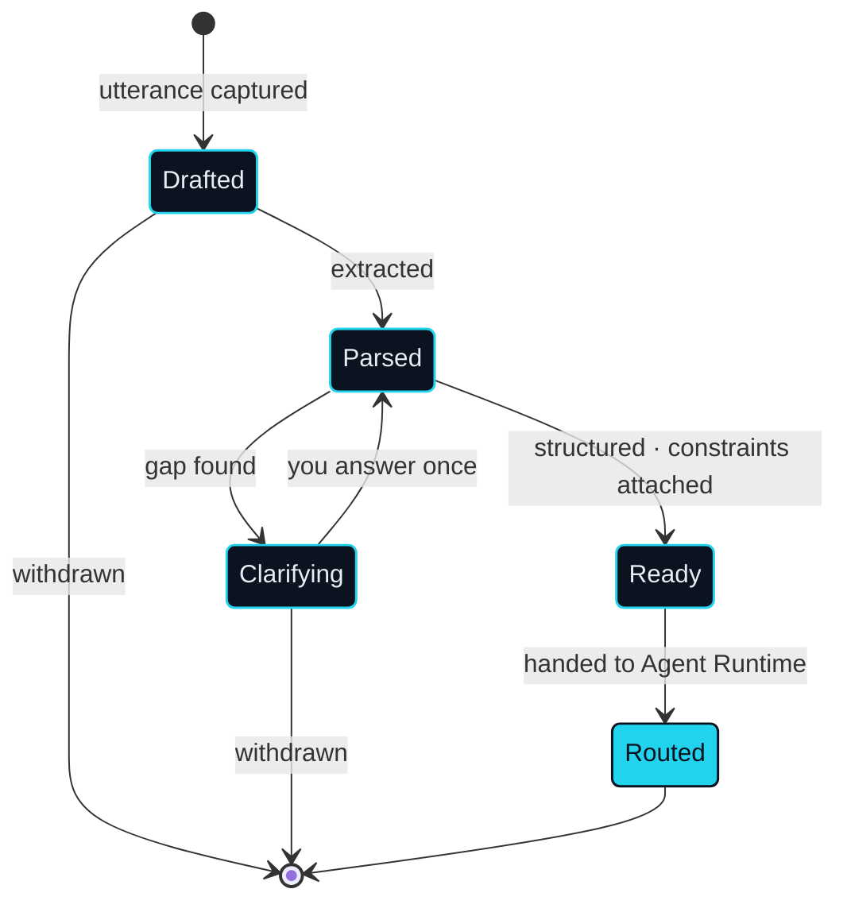

# Intent Layer

> Intent, not operation — you state what you want; agents parse it into an executable route.

The Intent Layer is where the connection begins. It takes one thing in — a sentence — and hands one thing out — an Intent that the Agent Runtime can turn into a Route. Nothing in this subsystem touches an asset. Its whole job is to be certain about what you meant before anything else is allowed to happen.

Two terms are fixed here and used throughout the paper. An **Intent** is the goal you express in natural language; it is the agent's unit of input. **Parse** is the act of turning that sentence into a structured Intent. The vocabulary is deliberate: on NEXON you submit an Intent, you do not place an order. An order is an operation on one product. An Intent is a statement about an outcome, and the route to that outcome is the agent's problem, not yours.

## Where an Intent comes from

### Capture

**Status** · `In development`

An Intent enters through one of two doors. The first is a Circle — the social unit Part IV describes — where a sentence said in conversation can be lifted straight into an Intent without leaving the conversation. The second is the wallet, for an Intent you state on your own. Either way the Intent Layer records the source as a reference, not a transcript. What was said in a Circle stays in the Circle; only the Intent's own fields travel onward into the Route log.

## Parse in three moves

Parse is not one step but three, and the middle one is the one that matters.

```mermaid
flowchart LR
    U["Utterance<br/><i>one sentence, from a Circle or the wallet</i>"] --> E["Extract<br/><i>goal · quantity or share · place · time</i>"]
    E --> D["Disambiguate<br/><i>ask once, never guess</i>"]
    D --> S["Structure<br/><i>schema · constraints · approval mode</i>"]
    S --> I["Intent<br/><i>Ready</i>"]
    I --> R["Agent Runtime<br/><i>Route</i>"]
    %% NEXON palette v0 · placeholder until VI locks
    classDef navy  fill:#0B1220,stroke:#22D3EE,stroke-width:1.5px,color:#E6EDF3
    classDef cyan  fill:#22D3EE,stroke:#0B1220,stroke-width:1.5px,color:#0B1220
    classDef light fill:#E6EDF3,stroke:#0B1220,stroke-width:1px,color:#0B1220
    classDef ghost fill:#FFFFFF,stroke:#22D3EE,stroke-width:1px,stroke-dasharray:4 3,color:#0B1220
    class U,I cyan
    class E,D,S,R navy
```



### Extract

**Status** · `In development`

The first move pulls the parts of a goal out of the sentence: what should exist at the end, how much of it or what share of what, where it must land, and within what window. It also pulls out what the sentence implies but does not say — the asset the outcome will be drawn from, the market that asset lives in, and whether the last leg is a digital asset, a booking or a delivered good.

### Disambiguate

**Status** · `In development`

The second move checks whether the extracted parts are enough to route without guessing. If they are not — "this position" could name two positions, "four nights" could start on any day — the agent asks one question, in the same conversation, and waits. It does not fill the gap with a default, and it does not ask twice about the same gap. A sentence that is still open after one answer stays in a clarifying state until you restate it.

<details>

<summary>Why the agent asks instead of guessing</summary>

A wrong guess in a form is corrected before you press submit. A wrong guess in an Intent becomes a Route, a Capacity Reservation and, once approved, legs that have to be unwound. One question costs a moment of your attention. One guess can cost a Rollback. The agent translates what you said; it does not decide what you must have meant.

</details>

### Structure

**Status** · `In development`

The third move writes the resolved goal into a fixed shape and attaches the constraints that every Route proposed from it will be held to. The shape below is illustrative: the fields are the ones this design needs, the names are not final.


```json
{
  "intent_id": "…",
  "owner": "…",
  "utterance": "Turn thirty percent of what this position earned into four nights in Tokyo in October.",
  "goal": {
    "asset_out": "hotel_booking",
    "share": "thirty percent of what <position_ref> earned",
    "place": "Tokyo",
    "time_window": "October · four nights"
  },
  "constraints": {
    "max_slippage": "…",
    "max_burn_rate": "…",
    "deadline": "…",
    "venue_allowlist": ["…"]
  },
  "source": { "circle_ref": "…" },
  "approval_mode": "approve_each_route",
  "status": "Ready"
}
```


The `goal` is what must be true at the end; it carries either a `quantity` or a `share`, never both. The `constraints` are the Intent's standing instructions to the Agent Runtime. `max_slippage` is the band a quote may move before the Route it belongs to expires. `max_burn_rate` is a ceiling on the EXON a Route may consume as Burn Rate, so that the cost of translation is bounded before any path is drawn. `deadline` is the moment after which no leg may start. `venue_allowlist` is optional and restricts which Leg Executors may be used. `approval_mode` records how you want Routes from this Intent approved; the modes are the Agent Runtime's subject. `status` is the lifecycle state below.

## Lifecycle



### Lifecycle states

**Status** · `In development`

An Intent is Drafted the moment its utterance is captured, Parsed once extraction succeeds, Clarifying while a question is outstanding, Ready when it is structured with constraints attached, and Routed when the Agent Runtime has taken it. Routed is the last state this subsystem owns. Everything after it — the Route, the approval, the legs — belongs to the Agent Runtime and to Settlement & Custody. An Intent can be withdrawn at any point before Routed, and withdrawing costs nothing because nothing has been reserved.

## Three markets, three Intents

The same layer serves all three markets, and the same schema holds a request from any of them. The examples below show the shape; the legs each would need are the Agent Runtime's concern.



**Status** · `Roadmap`

"Turn thirty percent of what this position earned into four nights in Tokyo in October."

The goal is a booking; the share is drawn from a capital-market position. The capital-market leg is executed by a licensed third party — NEXON never brokers securities — and is `Roadmap`. Landing four nights is a travel redemption, also `Roadmap`. The Intent can be parsed in full today; the Route it would need cannot yet be executed.



**Status** · `In development`

"Move a third of this holding into the stable asset I usually hold, and only if it fits the slippage I set."

The goal is a digital asset; the share is drawn from another digital asset on the chain that holds it. The constraint on slippage is read straight into `max_slippage`. Both legs settle on-chain, and the Route stays within the digital-asset market end to end.



**Status** · `In development`

"Get the coffee machine my Circle was talking about, delivered to my usual address before the month ends."

The goal is a delivered good; the source is the Circle, so `circle_ref` is set and the product reference is lifted from the conversation. The Real Leg lands in the Marketplace with a Landing Receipt. Landing the same Intent as a card limit is `Roadmap`.




**Scope of this section.** Commits to: an Intent is captured as a reference to its source, parsed in three moves with at most one clarifying question per gap, and handed onward only when Ready. Does not commit to: the final field names, the default values of any constraint, or which venues an allowlist may name. Open items: [OP-13 · OP-15](../open-parameters/README.md).


*Spine: [The Translator](../02-the-translator/README.md) · Next: [Agent Runtime](agent-runtime.md)*
