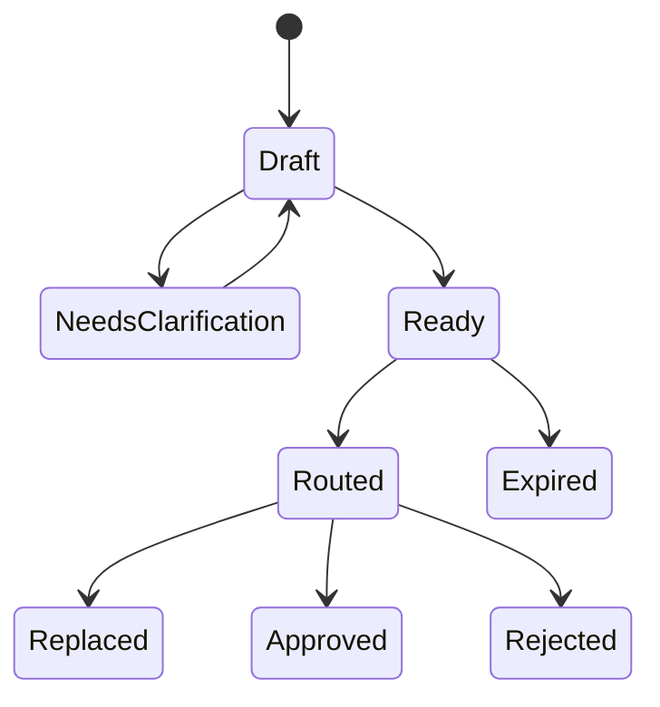

# Intent Layer

The Intent Layer turns human language into a **durable request** software can evaluate. It is the first component in the application architecture, and the point where conversational convenience becomes a control problem.

An intent is not a transaction. It carries no hidden authority and moves nothing. It states what outcome is sought, under what constraints, for how long and with what approval mode. The system may point out a missing field, but it must not **infer** a material permission from tone, social context or an unrelated earlier action.

## The intent object

A minimum usable intent carries these fields:

| Field | What it prevents | Example form |
|---|---|---|
| Owner and account scope | Whose policy and balances may be considered | One user plus named sub-accounts |
| Outcome | Ambiguity about what "done" means | A conversion, a position action, a fulfilled purchase |
| Amount and unit | Vague sizing | Exact amount or hard maximum |
| Eligible sources | Uncontrolled reach | Explicit allowlist |
| Prohibited sources | A reserve being eaten | Explicit denylist and minimum balances |
| Time | Running on stale assumptions | Deadline plus route expiry |
| Price and cost limits | Economic drift beyond expectation | Slippage, total fee and exchange-rate ceilings |
| Venue and supplier limits | Landing on the wrong counterparty | Eligible providers and jurisdictions |
| Approval mode | Authority widening by default | Per leg / whole route / narrow standing rule |
| Failure policy | The system improvising | No substitution without approval |

Every field has provenance. Some come straight from the current request; others come from a policy profile the user maintains. **A value inherited from policy must display as inherited**, not as though the user just said it. The user can inspect and change that policy on its own.

## Parsing is a controlled transformation

Natural language is flexible — which is exactly why parsing has to be conservative. "Use the usual account" is meaningful to a person and unsafe as an executable constraint.

The parser should return three categories, not one:



**Resolved**

Unambiguous and ready for routing.



**Unresolved**

Missing or ambiguous; must be filled in.



**Assumed, pending confirmation**

An inference the system made, waiting for a yes.



Only a **fully resolved** intent proceeds to routing.

The transformation should be reproducible enough to audit: one record links the original request, the structured result, the parser or model version and any clarification. Sensitive conversational context should not be copied into a public or on-chain record — the route needs the approved constraints, not the conversation that produced them.

Social context follows the same rule. A discussion in a community can inspire a request or supply background for a question. It grants other members no authority, and it does not turn a community view into an investment instruction.

## Product-specific extensions

The base schema extends only through **explicit product fields**. A marketplace intent needs delivery, inventory, cancellation and fulfillment conditions. A card action needs issuer and merchant restrictions. A prediction-market interface needs the third-party market, its resolution source and jurisdictional eligibility. A staking order needs the parameter version and the economic fields the mechanism defines.

For a staking order, the recorded variables are:

```text
P = qualifying order principal
B = 0.28 × P   EXON purchase into Treasury Liquidity
S = 0.72 × P   XO staking / PV base
F = 0.28 × P   matching EXON balance check; stays with the user
```

The order also records term, weight, the 12-hour epoch schedule and the redemption choice once selected. **These variables belong to the Staking Platform.** The Intent Layer does not reuse EXON as an execution-cost unit for unrelated routes, and does not reinterpret the fuel check as a payment.

## State machine

An intent needs a small, explicit state machine:



"Approved" here means **that route** was approved. It does not mean every leg completed — execution and fulfillment states live downstream. If the intent changes materially after routing, the earlier route becomes replaced or expired and a new one must be evaluated.

## Privacy and retention

The system should keep as little as it can. A person's objective can reveal travel, finances, relationships and location. The durable record needs enough evidence to explain an approval and settle a dispute — not every message and every personal detail. Retention periods, export, deletion and what is shared with executing parties all have to be defined before launch.

## Six invariants

1. An unresolved material field never becomes implicit authority.
2. A user can tell which constraint came from this request and which came from saved policy.
3. Product-specific economics stay attached to their own product type and parameter version.
4. Editing an intent after routing invalidates the old approval object.
5. Conversation and social popularity never count as authorization.
6. The original request and structured result stay linkable for audit without exposing anything unnecessary.

*Previous: [Protocol Architecture](README.md) · Next: [Agent Runtime](agent-runtime.md)*
