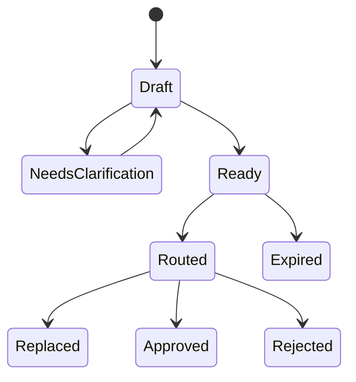

# Intent Layer

The Intent Layer turns human language into a durable request that software can evaluate. It is the first Roadmap component in the NEXON application architecture and the point where conversational convenience becomes a control problem.

An intent is not a transaction. It contains no hidden authority and moves no asset. It says what outcome is sought, under what constraints, for how long and with what approval mode. The system may suggest missing fields, but it must not infer a material permission from tone, social context or a prior unrelated action.

## The intent object

A minimum object should contain:

| Field | Purpose | Example form |
|---|---|---|
| Owner and account scope | Identifies whose policy and balances may be considered | One user and named sub-accounts |
| Outcome | States what completion means | A conversion, position action or fulfilled purchase |
| Amount and unit | Prevents ambiguous sizing | Exact amount or hard maximum |
| Eligible sources | Limits assets and accounts used | Explicit allowlist |
| Prohibited sources | Preserves reserves or sensitive positions | Explicit denylist and minimum balances |
| Time | Bounds quote, execution and completion | Deadline plus route expiry |
| Price and cost limits | Defines acceptable economic deviation | Slippage, total fee and exchange-rate ceilings |
| Venue and supplier limits | Restricts counterparties and destinations | Eligible providers and jurisdictions |
| Approval mode | Defines how authority is granted | Per leg, whole route or narrow recurring rule |
| Failure policy | Defines stop, re-price, retry or escalation behavior | No substitution without approval |

Each field has provenance. Some come directly from the current request; others may come from a user-managed policy profile. A value inherited from policy should appear as inherited, not as though the user typed it in the current conversation. The user can inspect and change the policy independently.

## Parsing is a controlled transformation

Natural language is flexible, which is precisely why parsing must be conservative. “Use the usual account” may be meaningful to the user and still unsafe as an executable constraint. The parser should return three categories: resolved fields, unresolved fields and assumptions proposed for confirmation. Only a resolved intent can progress to routing.

The transformation should be reproducible enough to audit. A record links the original request, the structured result, the model or parser version and any clarification. Sensitive conversational context should not be copied into a public or on-chain record. The route needs the approved constraints, not the entire conversation that produced them.

Social context follows the same rule. A discussion inside the Roadmap decentralized Social App may inspire a request or supply context for a question. It does not grant other members authority and does not transform a community view into an investment instruction.

## Product-specific extensions

The base schema can be extended only through explicit product fields. A marketplace intent needs delivery, inventory, cancellation and fulfillment conditions. A future card action needs issuer and merchant restrictions. A prediction-market interface needs the third-party market, resolution source and jurisdictional eligibility. A staking order needs the parameter version and economic fields defined by the approved mechanism.

For a staking order, the recorded variables include:

```text
P = qualifying order principal
B = 0.28 × P  (EXON purchase into Treasury Liquidity)
S = 0.72 × P  (XO staking/PV base)
F = 0.28 × P  (matching EXON balance check; remains with user)
```

The order also records the term, weight, 12-hour epoch schedule and the redemption choice when selected. These variables belong to the Staking Platform. The Intent Layer must not reuse EXON as an execution-cost unit for unrelated routes or reinterpret the fuel check as payment.

## State transitions

An intent should have a small, explicit state machine:



“Approved” here means the associated route was approved; it does not mean every leg completed. Execution and fulfillment states belong downstream. If the intent changes materially after routing, the prior route becomes replaced or expired and a new route must be evaluated.

## Privacy and retention

The system should minimize what it retains. A user's objective may reveal travel, finances, relationships or location. The durable record needs sufficient evidence to explain an approval and resolve a dispute, but not every message or personal detail. Retention periods, export, deletion and any data sharing with executing parties must be specified before launch.

## Design invariants

1. No unresolved material field can become implicit authority.
2. A user can tell which constraint came from the current request and which came from saved policy.
3. Product-specific economics remain attached to their own product type and parameter version.
4. Editing an intent after route generation invalidates the old approval object.
5. Conversation and social popularity never count as authorization.
6. The original request and structured result remain linkable for audit without exposing unnecessary content.


**Roadmap status.** The Intent Layer and its schemas are design requirements. Final fields, retention periods, model providers and supported product extensions remain Open until implementation specifications are published.


*Previous: [Protocol Architecture](README.md) · Next: [Agent Runtime](agent-runtime.md)*
