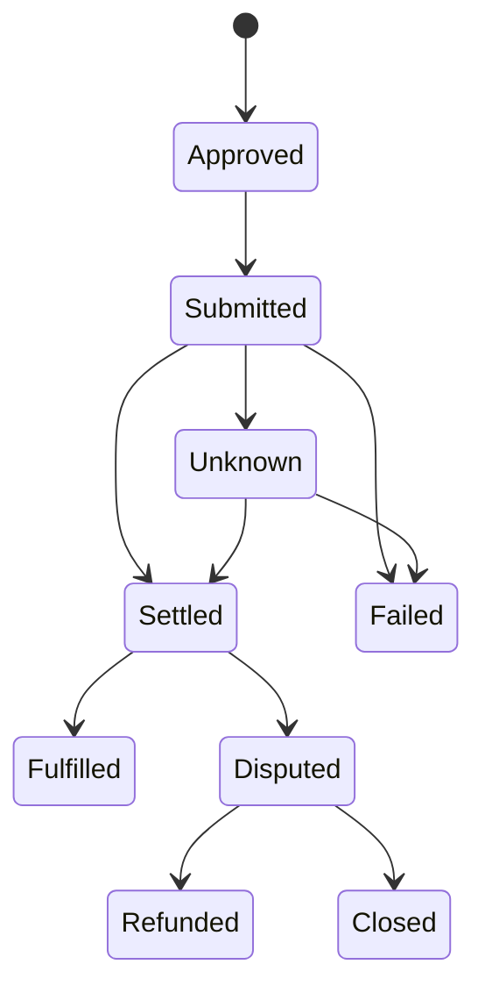

# Settlement & Custody

A route can look continuous to the user while its assets and obligations remain distributed. Settlement and custody architecture exists to show that distribution precisely. The agent's instruction is not custody. A route proposal does not move funds. A unified account view does not make NEXON the holder or guarantor of every displayed asset.

## Native execution first

Each leg should settle in the system responsible for that asset or service:

- exchange-side EXON purchases, sales and release displays belong to NEX Main Exchange/CEX records;
- XO staking orders, epoch accruals and redemption belong to the Staking Platform ledger;
- on-chain transfers belong to the relevant chain and wallet/custody arrangement;
- future card authorization and settlement belong to the responsible licensed issuer and its network;
- marketplace payment and fulfillment belong to the disclosed payment provider and supplier terms;
- any third-party prediction-market position belongs to that protocol and remains subject to its access and resolution rules.

The Roadmap application layer reconciles these states into a route receipt. It does not rewrite their legal character.

## Custody is a per-leg attribute

“Is NEXON custodial?” is too broad to answer once for the entire ecosystem. The useful question is who controls the asset at each moment and under which terms. A route preview should identify:

| Attribute | Disclosure required |
|---|---|
| Holder or controller | User wallet, exchange account, contract, issuer or other provider |
| Authority | Signature, account instruction, delegated permission or supplier order |
| Settlement evidence | Transaction hash, venue order, internal ledger entry or supplier confirmation |
| Reversibility | Irreversible, cancellable, refundable or subject to dispute |
| Counterparty risk | The entity or protocol whose failure affects the leg |
| Recovery route | Responsible support, refund, dispute or technical remediation process |

A route that moves between custody models requires a fresh explanation at the boundary. An on-chain transfer may be irreversible; an exchange order may be final under venue rules; a card transaction may support chargeback under issuer terms; a hotel booking may be cancellable only until a supplier deadline. “Rollback” cannot mean the same thing in all four cases.

## Reconciliation states

Submission, settlement and fulfillment are distinct.



Financial legs may end at Settled. Real-world legs normally require Fulfilled. A supplier order is not complete merely because payment settled. An Unknown state must remain visible until the native system can be reconciled; retry logic must protect against duplicate execution.

## Current economic ledgers

The approved mechanism implies at least three separable record domains. Exchange records cover EXON purchases, sales and vesting release display. Staking records cover XO principal, the order parameter version, term weight, each 12-hour epoch and the selected redemption schedule. Treasury records cover EXON acquired through the 28% build into Treasury Liquidity.

Reward redemption produces two explicit outputs when a burn-bearing lane is selected:

```text
Net = W × (1 − b)
Burn = W × b
```

where `W` is the pending reward and `b` is the selected burn rate: 30% for T+0, 15% for 30D or 0% for 60D. The system must verify the equivalent EXON burn and produce a permanent destruction record before completing a redemption that requires burning. This mechanism is not a PayFi route fee, card fee or marketplace charge.

The `F = 0.28 × P` EXON fuel balance is also not custody transferred to Treasury. It is a qualification check and remains in the user's account. The ledger must distinguish the Treasury's EXON build from the user's checked balance.

## Partial failure and recovery

No architecture can guarantee recovery for every failure. Instead, each route should define its response before approval.

- **Before submission:** cancel or expire without moving value.
- **After submission but before confirmation:** hold the route in pending/unknown and reconcile; do not duplicate automatically.
- **After an irreversible leg:** protect the receipt, stop dependent legs and disclose whether an offsetting transaction is possible at current market conditions.
- **After payment but before fulfillment:** use the supplier or issuer's refund and dispute process.
- **After incorrect model advice:** stop unexecuted legs; model error alone does not reverse a native settlement.
- **After account or provider compromise:** revoke future permissions, isolate affected routes and follow the responsible custodian's incident process.

Treasury balances, token burns and automated retry do not guarantee user recovery. Recovery depends on the native leg, available liquidity, contract behavior, responsible operator and applicable terms.

## Architecture commitments

The Roadmap settlement layer should make custody legible at approval time, use idempotent execution identifiers, preserve native receipts, reconcile unknown states, separate payment from fulfillment and name the responsible dispute path. Service levels, custody providers, settlement networks and supported jurisdictions remain Open.


Digital assets, staking positions and automated routes can lose value or fail. Neither a unified interface nor an audit receipt provides principal protection, guaranteed liquidity or guaranteed delivery.


*Previous: [Agent Runtime](agent-runtime.md) · Next: [Staking & Reward Layer](trust-and-bonding.md)*
