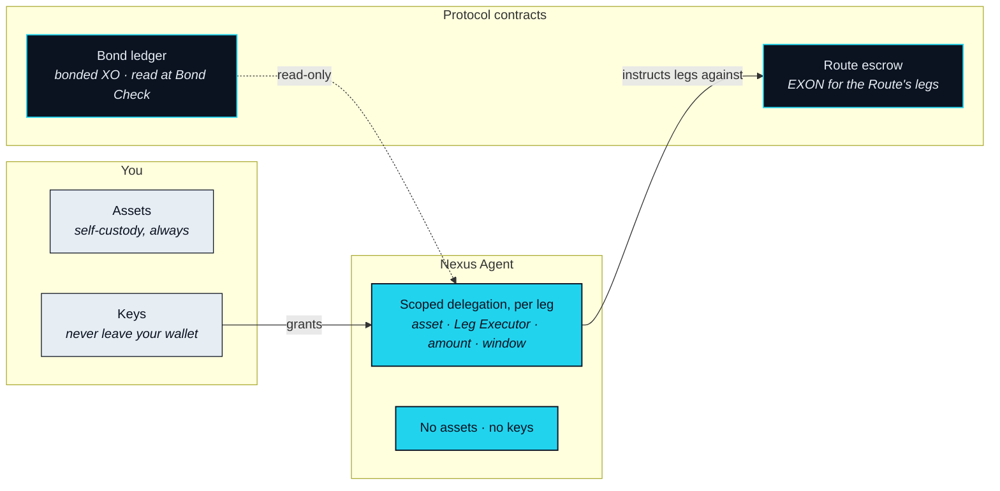
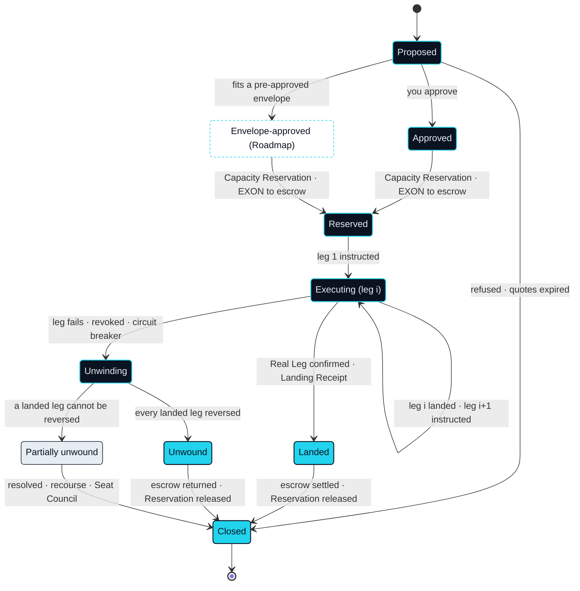

# Settlement & Custody

> Settlement to the real leg — a booking, a card limit, a delivered good. Not another swap.

This subsystem is where a Route stops being a plan. It executes the legs the runtime has been delegated, holds what has to be held while they are in flight, and unwinds them if one fails. It is also where the question "which chain?" gets its answer — which is that the question is asked one leg at a time.

## Every leg settles where its asset lives

NEXON does not choose a chain for a Route, because a Route does not live on a chain. Each leg settles on the ledger or system its asset is native to. That rule is what keeps the Translation Layer chain-agnostic, and what keeps it out of the bridge business: no leg requires an asset to be wrapped, mirrored or moved onto a ledger it did not come from.



**Status** · `In development`

Settles on the chain that holds the asset, through a Leg Executor on that chain. The leg's finality is that chain's finality. NEXON's own contracts record the leg's outcome; they do not carry the asset.



**Status** · `Roadmap`

Executed by a licensed third party on that party's own books; NEXON never brokers securities. The leg's finality is the third party's confirmation. What returns to the Route is a settled position or its proceeds, together with the confirmation reference. Equity-linked settlement is `Roadmap`; the partner is `Open` (OP-24).



**Status** · `In development` for the Marketplace · `Roadmap` for a stablecoin card

Settles in the supplier's own system — an inventory reservation, a booking confirmation, a card authorisation. Its finality is the supplier's confirmation, and its proof is a Landing Receipt.



### Route finality

**Status** · `In development`

A Route is final when its slowest leg is final. The runtime does not report a Route as Landed until every leg has reached its own finality and the Real Leg has produced a Landing Receipt. Because the slowest leg may be a supplier's confirmation or a licensed third party's settlement cycle, a Route's finality is not a property of the protocol; it is inherited from the systems the Route touches. NEXON does not make that faster. It makes it visible, and it makes what happens on failure predictable.

## The custody boundary

Three parties touch a Route, and each holds a different kind of thing.

### Three parties, three holdings

**Status** · `In development`

You hold your assets, in your own custody, before, during and after a Route. The Nexus Agent holds delegation and nothing else: what it can instruct is bounded per leg and expires with the leg. The protocol's contracts hold two things and only two. The Bond ledger holds the XO you have bonded, which never enters a leg and is only ever read. The Route escrow holds the EXON a Route will spend on its legs, from approval until the Route is Landed or Unwound. Neither contract can move what the other holds, and neither can move anything of yours that has not been placed in it.

Those contracts are deployed on BNB Smart Chain (BSC). Nothing above this paragraph depends on that choice.

## Rollback

**Rollback** is the return along the path it came when any leg fails mid-execution. It is not an exception path added afterwards; it is the other half of Execute, and every leg is instructed with its unwind already known.

### The state machine

**Status** · `In development`

A Route is Proposed until you answer, and Approved when you do. It becomes Reserved at approval, when the runtime places the Capacity Reservation. At the same moment the EXON the Route will spend moves into escrow, and from then on the Route has a claim on both and nothing else does. It is Executing one leg at a time. Each landed leg is recorded together with the instruction that would reverse it, so that the unwind path is never improvised. The Route reaches Landed when the Real Leg confirms and a Landing Receipt is written, and Closed once escrow settles: what the legs consumed as Burn Rate flows to the Leg Executors, to the operation of the Settlement Rail and to the Protocol Reserve in a split that is `Open` (OP-11), what remains returns to you, and Rebate is credited.

Three things send an Executing Route to Unwinding: a leg fails, you revoke, or the circuit breaker in Data & Oracles trips. Unwinding reverses the landed legs in reverse order. If every one of them reverses, the Route is Unwound, escrow is returned and the Reservation is released. Whether a reversed leg's Burn Rate is refunded is `Open` (OP-13). The pre-approved envelope path is shown for completeness and is `Roadmap` (OP-18).

### Partial unwinds

**Status** · `In development`

Not every leg reverses. A booking already confirmed may be cancellable but not free; a delivered good is delivered. When a landed leg cannot be reversed, the Route enters Partially unwound and stays there until it is resolved. Resolution draws first on what remains in the Route's EXON escrow. If a shortfall persists, it draws on the Bond recourse described in Trust & Bonding, whose scope is `Open` (OP-10). Where a judgment is needed rather than a rule, the Seat Council makes it. A partially unwound Route is never silently closed, and it is never left without an owner.


**Partial unwinds can require human resolution.** The state machine guarantees that a partially unwound Route has an explicit state, a defined order of recourse and a named resolver. It does not guarantee that every leg can be reversed by software alone. Where a Real Leg has already changed the world, closing the Route can involve a dispute window, a supplier's cancellation terms and a decision made by people.


### Landing Receipt

**Status** · `In development`

A Landing Receipt is the verifiable proof that the Real Leg happened: the supplier's confirmation reference, what was booked or delivered, to whom, when, and which leg of which Route it belongs to. It is written to the Route log, it is what moves a Route from Executing to Landed, and it opens the dispute window that Part IV describes for the Marketplace. No Real Leg is treated as complete without one.


**Scope of this section.** Commits to: each leg settles where its asset is native; three-party custody in which the protocol holds only bonded XO and escrowed EXON; a Rollback state machine with an explicit partially-unwound state and a fixed order of recourse. Does not commit to: any bridge, any settlement time, or software-only resolution of every failed leg. Open items: [OP-10 · OP-11 · OP-13 · OP-15](../open-parameters/README.md).


*Spine: [The Translator](../02-the-translator/README.md) · Next: [Trust & Bonding](trust-and-bonding.md)*
