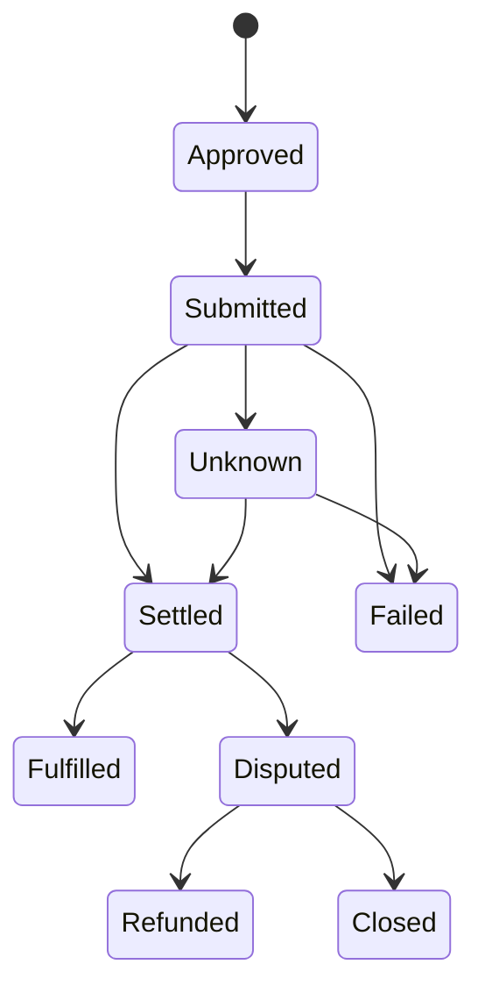

# Settlement & Custody

A route looks continuous to the user while its assets and obligations stay distributed underneath. Settlement and custody architecture exists to **show that distribution precisely**.

An agent's instruction is not custody. A route proposal moves no funds. A unified account view does not make NEXON the holder or guarantor of every balance it displays.

## Native settlement first

Every leg settles in the system actually responsible for that asset or service:

* EXON purchases, sales and release display → NEX Main Exchange / CEX records;
* XO staking orders, epoch accruals and redemption → the Staking Platform ledger;
* on-chain transfers → the relevant chain and wallet/custody arrangement;
* card authorization and settlement → the responsible licensed issuer and its network;
* marketplace payment and fulfillment → the disclosed payment provider and supplier terms;
* any third-party prediction-market position → that protocol, under its own access and resolution rules.

The application layer **reconciles** those states into one route receipt. It does not rewrite their legal character.

## "Is NEXON custodial?" is the wrong question

It is too broad to answer once for a whole ecosystem. The useful question is: **at each moment, who controls this asset, and under whose terms.**

A route preview should answer six things, leg by leg:

<table><thead><tr><th width="170">Attribute</th><th>Must be disclosed</th></tr></thead><tbody><tr><td>Holder or controller</td><td>User wallet, exchange account, contract, issuer or other provider</td></tr><tr><td>Source of authority</td><td>Signature, account instruction, delegated permission or supplier order</td></tr><tr><td>Settlement evidence</td><td>Transaction hash, venue order, internal ledger entry or supplier confirmation</td></tr><tr><td>Reversibility</td><td>Irreversible / cancellable / refundable / disputable</td></tr><tr><td>Counterparty risk</td><td>The entity or protocol whose failure affects this leg</td></tr><tr><td>Recovery route</td><td>The support, refund, dispute or remediation process that applies</td></tr></tbody></table>

Where a route crosses between two custody models, **the boundary needs a fresh explanation**. An on-chain transfer may be irreversible. An exchange order is final under venue rules. A card transaction may support chargeback under issuer terms. A booking may be cancellable only until a supplier deadline. "Rollback" is not the same word in any two of those cases.

## Three states, three facts

Submission, settlement and fulfillment are recorded separately.



A financial leg may end at Settled. A real-world leg normally has to reach Fulfilled — **a payment that settled is not an order that completed.** An Unknown state stays visible until the native system can be reconciled, and retry logic must protect against duplicate execution.

## The three ledgers that exist today

The approved mechanism implies at least three separable record domains:

| Record domain | Records |
|---|---|
| Exchange records | EXON purchases, sales and vesting release display |
| Staking records | XO principal, the order parameter version, term weight, every 12-hour epoch, the selected redemption schedule |
| Fuel-wallet records | EXON bought with 28% of each deposit at 1 USDT each; burn only |

When a burn-bearing lane is chosen, reward redemption produces two explicit outputs:

```text
Net  = W × (1 − b)
Burn = W × b
```

`W` is the reward withdrawn and `b` the burn share of the chosen settlement speed: 30% immediate, 20% for 30-day, 10% for 60-day. The system burns the equivalent EXON from the fuel wallet and writes a permanent destruction record before completing the withdrawal. **This mechanism belongs to the withdrawal choice itself** — it is not a PayFi route fee, a card fee or a marketplace charge.

The fuel wallet is likewise not custody transferred to an operator: it is the user's EXON, bought with 28% of the deposit, and it can only be burned. The ledger must keep **the EXON in the fuel wallet** and **the XO under stake** apart.

## Partial failure and recovery

No architecture guarantees recovery from every failure. What it can do is **define the response before approval**.

| Failure lands | Response |
|---|---|
| Before submission | Cancel or expire; nothing of value moves |
| Submitted, unconfirmed | Hold at pending/unknown and reconcile; never auto-duplicate |
| After an irreversible leg | Protect the receipt, stop dependent legs, disclose whether an offsetting transaction is possible at current prices |
| Paid but not fulfilled | Use the supplier's or issuer's refund and dispute process |
| After incorrect model advice | Stop unexecuted legs. Model error alone does not reverse a native settlement |
| After account or provider compromise | Revoke future permissions, isolate affected routes, follow the custodian's incident process |

**Recovery depends on the native leg, available liquidity, contract behavior, the responsible operator and the applicable terms.**

## Six commitments for this layer

Make custody legible at approval time; use idempotent execution identifiers; preserve native receipts; reconcile unknown states; keep payment and fulfillment separate; name the dispute path for every leg.

*Previous: [Agent Runtime](agent-runtime.md) · Next: [Staking & Reward Layer](trust-and-bonding.md)*
