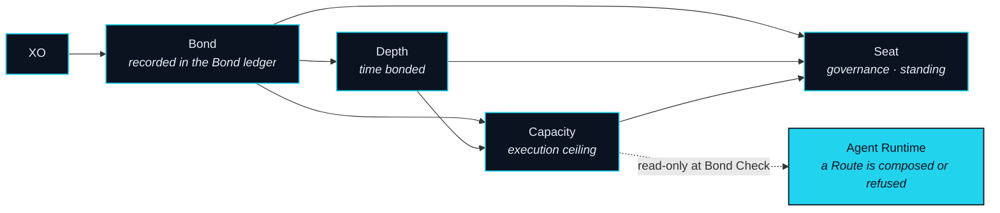
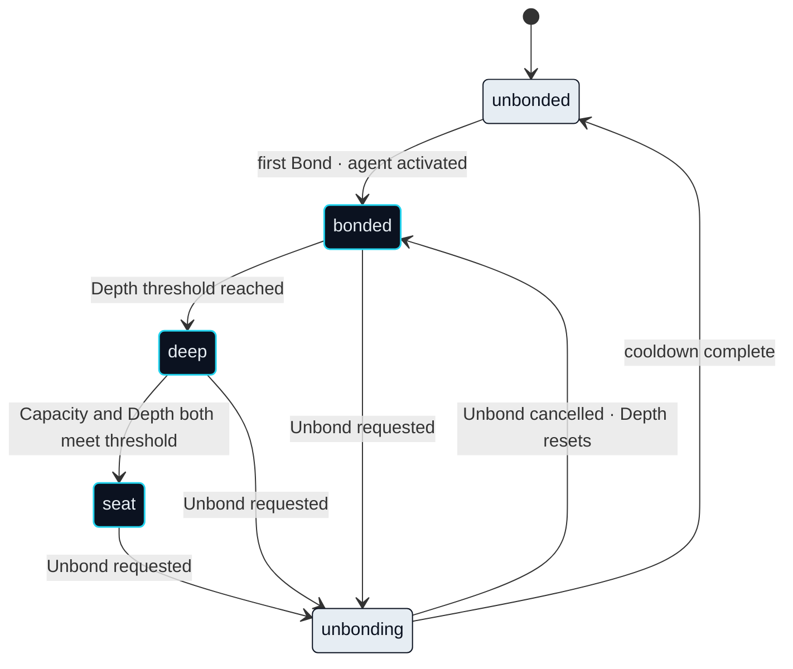

# Trust & Bonding

For an agent to move value on your behalf, the network has to answer one question before it lets the agent Route anything: why should it be trusted to act at all? Not because it is clever, and not because it is caged. NEXON's answer is collateral. Something is put up before the connection is switched on, and the size of what is put up is the size of what the agent may do.

> XO is bonded, never spent: it is the collateral that earns your agent its execution capacity, your governance weight and your standing in the ecosystem.

Four terms carry this subsystem, and their definitions are fixed. **Bond** is the act of bonding XO. **Capacity** is what a Bond confers: the ceiling on what an agent may execute on your behalf. **Seat** is standing in governance and in the ecosystem's tiers. **Depth** is the length of time a Bond has been held. Everything below is a relation between those four.

## Where a Bond is held

### At launch: a custodial record within NEX

**Status** · `In development`

The Bond ledger described on this page is the protocol's form of one record: how much XO an account has bonded, since when, and how much of the resulting Capacity is reserved. At launch that record is kept as a custodial product within NEX, a licensed digital-asset exchange. XO bonded there is held and recorded by the exchange under its own product terms, and the standing it confers — Capacity, Depth, Seat — is derived from that record. Bond Check reads whichever record is authoritative for an account. Any reward the exchange attaches to its custodial product is the exchange's, is floating and is not guaranteed; it is not a protocol mechanism, and this paper does not describe it.

### The on-chain Bond ledger

**Status** · `In development`

The on-chain Bond ledger on BNB Smart Chain (BSC) is the protocol's own record, and it is the one the rest of this section assumes. The migration of custodial records to it, and the order in which accounts move, is an open item (OP-31). Nothing in the mechanics below changes with the move. What changes is who holds the record.

## What a Bond becomes

### Bond

**Status** · `In development`

Bonding places XO into the Bond ledger, a protocol contract that records how much is bonded, since when, and how much of the resulting Capacity is currently reserved by open Routes. Bonded XO stays yours. It is not spent, not lent, not moved into any leg, and it never touches the Route escrow. The ledger is the single source the Agent Runtime reads at Bond Check, and the only thing Bond Check does with it is read.

### Capacity

**Status** · `In development`

Capacity is the figure Bond Check compares a Route against. It rises with the amount bonded and with Depth, and it never falls while both hold: the function is monotone in Bond and in Depth. Its exact form is an Open Parameter (OP-07). What is fixed is its shape — more bonded means more Capacity, longer bonded means more Capacity, and no other input moves it. Capacity is consumed by reservation, not by spending: an open Route reserves the Capacity it needs, and that portion returns when the Route closes.

### Depth

**Status** · `In development`

Depth is time. It accrues from the moment a Bond is placed and resets for any XO that is unbonded. Depth improves standing — where you sit in the tiers, when you qualify for a Seat, how much Capacity a given Bond commands — and standing is all it improves. Longer is better because it moves you up an order, not because it pays anything.

### Seat

**Status** · `In development`

A Seat is reached when Capacity and Depth both meet thresholds that are an Open Parameter (OP-09). Seat holders vote on the parameters that governance controls, and elect from among themselves a Seat Council: a small group with a time-limited power to pause, whose composition is `Open` (OP-20). A Seat is standing, not income. The Governance chapter describes what a Seat decides; this one describes only how it is reached.

## Four standings

Every standing in the network is set by Bond, and by nothing else. There are four, and their names are used as they are.

| Standing | Meaning | Reached by | Status |
|---|---|---|---|
| unbonded | Has not yet bonded XO | Default; deliberately neutral | `In development` |
| bonded | Has bonded; agent activated | First Bond | `In development` |
| deep | Long-term bonder | Bond reaches a Depth threshold | `In development` |
| seat | Holds a governance Seat | Capacity and Depth both meet threshold | `In development` |

### Unbonding

**Status** · `In development`

Unbonding is a cooldown, not a switch. Over the cooldown, the Capacity that Bond provided decays linearly to nothing (`Design Target`, OP-08), so that no new Route can be proposed against Capacity that is about to leave. Capacity that is reserved by an open Route cannot begin to unbond until that Route closes. The XO itself is returned at the end of the cooldown, and nothing is deducted for leaving; what is lost is Depth, which starts again from zero if you bond again.

## Recourse

### Bond recourse

**Status** · `In development`

A Route that cannot fully unwind leaves a shortfall: a leg that landed and cannot be reversed, with a Leg Executor owed. Recourse is the order in which that shortfall is covered. It draws first on what remains in the Route's EXON escrow. Only if the shortfall persists does it draw on the XO that stood behind that Route's Capacity Reservation — never on bonded XO beyond the reservation, and never on any other Route. Whether the second step applies at all, and to which classes of failure, is `Open` (OP-10). This is recourse, not penalty. It is bounded to the Route that caused it, and it is the reason a Bond is collateral rather than a fee.



**What Bond gives**

* Capacity — the ceiling on what your agent may execute.
* Depth — standing that improves with time bonded.
* A Seat — governance weight, once both thresholds are met.
* Recourse — the reason a Leg Executor can accept a Route it has never seen before.



**What Bond never does**

* It never pays for a leg. XO does not enter a Route.
* The protocol pays nothing for a Bond. Depth improves standing, not income.
* It never leaves your ownership. Bonded XO is yours, held in the Bond ledger.
* It never covers another Route's shortfall. Recourse is bounded to the reservation.



Why Bond, and not the usual word

The industry's usual word for locking a token says only that something is locked. Bond says two things at once: that something has been put up and held, and that a tie now binds two parties to a contract. That second meaning is the one that matters here, and it is the same root the name NEXON comes from — nexus, the tie itself. What you bond is not a wager on the network. It is the tie that lets an agent act as you, and the collateral that makes a Leg Executor accept it.


**Scope of this section.** Commits to: Bond as read-only collateral that sets Capacity, accrues Depth and qualifies for a Seat; a cooldown with linear Capacity decay; recourse bounded to a single Route's reservation. Does not commit to: the Capacity function, threshold values, cooldown length, or the classes of failure recourse covers. Open items: [OP-07 · OP-08 · OP-09 · OP-10 · OP-20 · OP-31](../open-parameters/README.md).


*Spine: [The Translator](../02-the-translator/README.md) · Next: [Data & Oracles](data-and-oracles.md)*
