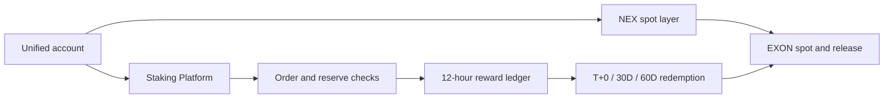

# Staking & Reward Layer

This path is retained for link stability; the former bond-ledger design is superseded by the approved Staking Platform model.

The platform has four responsibilities: open single-token staking orders, validate the EXON fuel reserve, calculate term-weighted rewards every 12 hours, and execute the selected redemption schedule. It shares identity, balances and capital operations with NEX Main Exchange/CEX while keeping staking rules outside the exchange's spot-market rulebook.

Implementations should record the parameter version used by every order and epoch. A parameter change must not silently rewrite historical calculations. Reserve checks, burn instructions and net releases require auditable receipts and reconciliation against the relevant spot and Treasury records.

*Next: [Data & Oracles](data-and-oracles.md) · Economics: [Token Economics](../05-tokenomics/README.md)*
