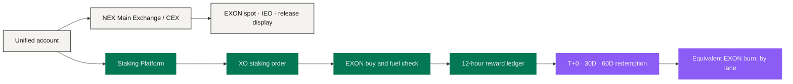
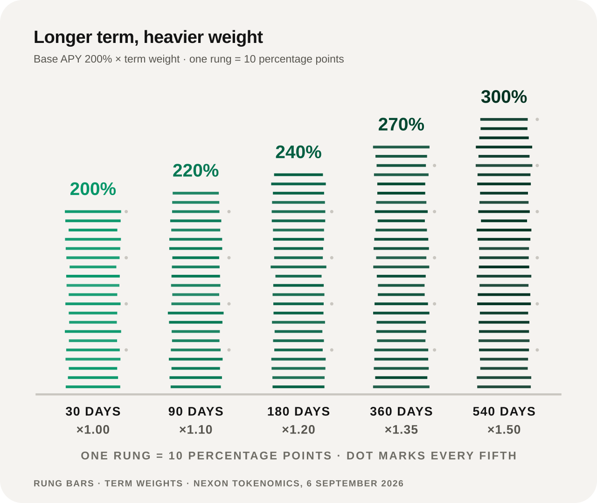
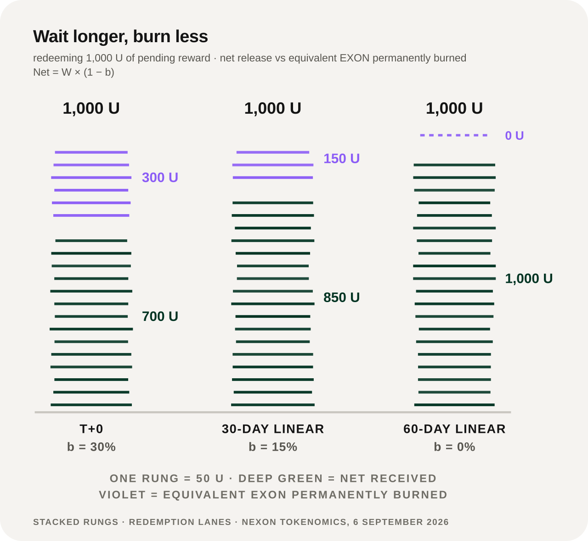

# Staking & Reward Layer

The authoritative product in this layer is the separate **Staking Platform**, defined by the Tokenomics the project approved on 6 September 2026.

It has four core jobs: **open single-token staking orders, validate the EXON fuel balance, calculate term-weighted rewards every 12 hours, and execute one of three approved redemption lanes.** It may share identity, account visibility and capital operations with NEX Main Exchange / CEX; its reward rules do not belong to the exchange's spot rulebook.

## One account, two operating layers



NEX Main Exchange / CEX **does not** distribute the staking rewards described here. And the Staking Platform **does not** turn its product-specific variables into universal payment, card, marketplace or agent rules.

## Opening an order

For a qualifying order amount `P`, the current mechanism records three quantities:

```text
B = 0.28 × P    EXON bought through the spot market into Treasury Liquidity
S = 0.72 × P    XO staking / PV base
F = 0.28 × P    matching EXON balance required in the user's account
```

`F` is **checked** — not transferred, charged or burned — and it stays with the user. If the fuel requirement is not met, the order does not open; the check does not authorize the platform to source the shortfall from another asset. Any acquisition of EXON is a separate market action carrying its own price and liquidity exposure.

## A parameterized reward ledger

The Base APY parameter is **200%**, multiplied by the term weight `w` and settled every 12 hours:

```text
Epoch Reward = (S × 200% × w) ÷ (365 × 2)
```

<figure><figcaption>Term weights lift the 200% Base APY into a 200%–300% band</figcaption></figure>

| Term | Weight `w` | Effective APY parameter | Liquidity condition |
|---:|---:|---:|---|
| 30 days | 1.00 | 200% | Flexible; early exit deducts 10%–15% of the principal base |
| 90 days | 1.10 | 220% | Unlocks at maturity |
| 180 days | 1.20 | 240% | Unlocks at maturity |
| 360 days | 1.35 | 270% | Unlocks at maturity |
| 540 days | 1.50 | 300% | The long term recommended in the approved paper |

Every order and every epoch records the **parameter version** in force at the time. A later change does not silently rewrite a historical accrual. The ledger preserves input principal, term, weight, epoch time, gross reward, and any correction or reversal with an attributable reason.

## Redemption and burn

Pending rewards take one of three lanes:

<figure><figcaption>Wait longer, burn less: what redeeming 1,000 U of pending reward produces</figcaption></figure>

| Lane | Wait | Equivalent EXON burned | Net release |
|---|---:|---:|---:|
| T+0 | Immediate | 30% | 70% |
| 30D linear | 30 days | 15% | 85% |
| 60D linear | 60 days | 0% | 100% |

For pending reward `W` and burn rate `b`: `Net = W × (1 − b)` and `Burn = W × b`. A burn-bearing redemption requires the equivalent EXON to be permanently destroyed. **The burn attaches to the redemption choice** — it does not stand for an ongoing market-purchase programme.

## Dynamic rewards

The approved model also carries a dynamic system built on an **adjacent-level Differential Matching Bonus**, with a Reward Payout Ratio band of 150%–200%, settled in the same epoch as static rewards and adjustable by issuance round and market conditions.

The complete level table, qualification thresholds, per-level differential rates and team-performance boundaries **have not been published**. The architecture can reserve versioned fields for those rules; it should not fill in the missing table itself, and it should not display a personalized projection as a confirmed result (see [Open Parameters](../open-parameters/README.md), OP-T04).

## How it relates to the product ecosystem

The Staking Platform can appear inside the Wallet and be explained through the PayFi interface, but **an interface creates no new source of reward**. The AI layer can explain the term choices, or simulate the formula from assumptions the user supplies. It cannot change the order split or waive the EXON check.

In the narrative, XO is the Value Anchor and EXON the Circulation Engine — those positions explain the long-term ecosystem. The staking and redemption operations running today are exactly the ones set out above.

## Six implementation controls

1. Parameter versions are immutable for events already recorded, unless a disclosed correction is made.
2. Balance checks, Treasury purchases, epoch accruals, redemption elections and burns each get their own record.
3. Exchange permissions and staking permissions stay separable.
4. Every reward view distinguishes **accrued / pending / redeemable / released**.
5. A user-facing calculation states the price assumption it rests on, right next to the result.
6. Unpublished dynamic-reward detail stays Open rather than inferred.

This layer is the most concretely defined economic core today. The broader application architecture surrounds it; it does not rewrite it.

*Previous: [Settlement & Custody](settlement-and-custody.md) · Next: [Data & Oracles](data-and-oracles.md) · Full economics: [Token Economics](../05-tokenomics/README.md)*
