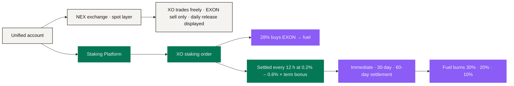

# Staking & Reward Layer

The authoritative product of this layer is the standalone **Staking Platform**, running NEXON's current economic mechanism (finalised 10 September 2026).

It has five core jobs: **open XO staking orders, buy 28% of every deposit into EXON as fuel, settle term-weighted static yield every 12 hours, settle 20 generations of referral rewards and V1 – V12 leadership bonuses in EXON, execute static withdrawals and burns across three settlement speeds, and deduct daily X Points by level.** It can share identity, account visibility and fund operations with the NEX exchange, but its reward rules are not part of the exchange's spot rulebook.

## One account, two operating layers <a href="#one-account-two-operating-layers" id="one-account-two-operating-layers"></a>



The NEX exchange **does not distribute** the staking rewards described here. Nor does the Staking Platform turn its own product variables into general payment, card, marketplace or agent rules.

## Opening an order <a href="#opening-an-order" id="opening-an-order"></a>

For a deposit `P`, the current mechanism records two entries:

```text
Fuel  = 0.28 × P   → buys EXON at 1 USDT each → fuel (burn only)
Stake = the rest   → swapped into XO → staked, settled every 12 hours
```

<figure><figcaption>A 10,000 USDT deposit: 2,800 EXON as fuel, the rest swapped into XO and earning</figcaption></figure>

Fuel only ever fills: no withdrawals, no transfers, burned only when static yield is withdrawn. Minimum order 100 USDT. EXON is acquired through the private sale or as dynamic rewards, each carrying its own price and liquidity.

## A parameterised reward ledger <a href="#a-parameterized-reward-ledger" id="a-parameterized-reward-ledger"></a>

**Settlement every 12 hours, 0.2% – 0.6% each time**, multiplied by the term bonus:

```text
Per settlement = staked amount × (0.2% – 0.6%) × (1 + bonus)
```

<figure><figcaption>The longer the term, the higher the bonus — set by term alone, never by amount</figcaption></figure>

| Term | Bonus | 10,000 USDT staked · per day | At maturity | Cumulative lock |
|---:|---:|---:|---|---:|
| 30 days | base | 40 – 120 USDT | Back at maturity, no penalty | 1,200 days |
| 90 days | +10% | 44 – 132 USDT | Rolls into the next term | 1,170 days |
| 180 days | +20% | 48 – 144 USDT | Rolls into the next term | 1,080 days |
| 360 days | +30% | 52 – 156 USDT | Rolls into the next term | 900 days |
| 540 days | +50% | 60 – 180 USDT | Principal returned | 540 days |

Every order and every settlement records the **parameter version** it ran under. A later parameter change cannot quietly rewrite a historical accrual. The ledger keeps the deposit, term, bonus, settlement time, total rewards, and any correction or reversal with its stated reason.

## Withdrawal and burn <a href="#withdrawal-and-burn" id="withdrawal-and-burn"></a>

Static yield lands in XO and can be withdrawn at any time through one of three settlement speeds:

<figure><figcaption>The faster the settlement, the larger the burn: three outcomes of withdrawing 10,000 USDT of rewards</figcaption></figure>

| Settlement | Wait | Fuel-wallet burn |
|---|---:|---:|
| Immediate | none | 30% |
| 30-day linear | 30 days | 20% |
| 60-day linear | 60 days | 10% |

For a withdrawal `W` and burn share `b`: `Burn = W × b ÷ P_EXON`. Burned EXON leaves circulation for good. If the fuel holds enough, settle immediately; if not, pick a slower settlement. **The platform never sells another asset to top up fuel on the user's behalf.**

## Referral rewards and leadership bonuses <a href="#referral-rewards-and-leadership-bonuses" id="referral-rewards-and-leadership-bonuses"></a>

Referral rewards are calculated on each downline's daily static output, up to 20 generations and 76% in total, unlocked block by block by own stake and direct referrals; leadership bonuses V1 – V12 are paid as a Differential Matching Bonus, assessed cumulatively on deposits with no demotion, and V10 – V12 share a global pool of 3% of XO deposits. Both settle in the same cycle as static rewards, are always paid in EXON, and burn no fuel on withdrawal; each level buys X Points with EXON daily (V1 and V2 use 0), and meeting the day's quota lets the day's platform rewards be claimed. The full rate tables are in [Staking & Returns](../05-tokenomics/staking-and-returns.md).

## How it relates to the product ecosystem <a href="#how-it-relates-to-the-product-ecosystem" id="how-it-relates-to-the-product-ecosystem"></a>

The Staking Platform can appear inside the Wallet and be explained through the PayFi interface, but **an interface never creates a new source of yield**. The AI layer can explain term choices or simulate the formula under assumptions the user supplies; it cannot change the order split and cannot touch the fuel.

In the narrative, XO is the Value Anchor and EXON the Circulation Engine — positions that explain the long-term ecosystem. The current staking and withdrawal operations are exactly what is written above.

## Six implementation controls <a href="#six-implementation-controls" id="six-implementation-controls"></a>

1. Parameter versions on recorded events are immutable except through a disclosed correction;
2. Fuel purchase, XO stake, each settlement, settlement-speed choice and burn each keep their own record;
3. Exchange permissions and staking permissions can be separated;
4. Every reward view distinguishes **pending / settling / settled**;
5. User-facing calculations state the price assumption they rely on next to the result;
6. Leadership execution rates are recorded by parameter version, and the interface shows the version governing each order.

This layer is the most concretely defined economic core today. The wider application architecture is built around it and does not rewrite it.

*Previous: [Settlement & Custody](settlement-and-custody.md) · Next: [Data & Oracles](data-and-oracles.md) · The full economics: [Token Economics](../05-tokenomics/README.md)*
