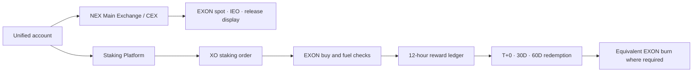

# Staking & Reward Layer

This chapter preserves the link used by the earlier whitepaper draft, but the former bonding design is superseded. The authoritative economic product is the separate **Staking Platform** defined by the project party's 6 September 2026 Tokenomics paper.

The platform has four core responsibilities: open single-token staking orders, validate the EXON fuel balance, calculate term-weighted rewards every 12 hours and execute one of the approved redemption schedules. It may share identity, account visibility and capital operations with NEX Main Exchange/CEX, but its reward rules do not belong to the exchange's spot-market rulebook.

## One account, two operating layers



NEX Main Exchange/CEX does not distribute the staking rewards described here. The Staking Platform does not turn its product-specific variables into universal payment, card, marketplace or agent rules.

## Opening an order

For a qualifying order amount `P`, the current mechanism records:

```text
B = 0.28 × P
S = 0.72 × P
F = 0.28 × P
```

`B` is the EXON purchase made through the spot market into Treasury Liquidity. `S` is the XO staking/PV base. `F` is the matching EXON balance required in the user's account. `F` is checked, not transferred, charged or burned, and remains with the user.

The order cannot open if the fuel requirement is not met. The check does not authorize the platform to obtain the missing amount from a different asset. Any acquisition of EXON is a separate market action exposed to price and liquidity risk.

## Parameterized reward ledger

Base APY is 200% under the current approved parameters. Term weights are 1.0 for 30 days, 1.1 for 90 days, 1.2 for 180 days, 1.35 for 360 days and 1.5 for 540 days. The 30-day term has a 10–15% early-exit penalty; the exact rate within that band is unpublished.

The single-epoch reward is calculated twice daily:

```text
Epoch Reward = (S × 200% × w) ÷ (365 × 2)
```

Every order and epoch should record the parameter version used. A later parameter change must not silently alter a historical accrual. The ledger should preserve input principal, term, weight, epoch time, gross reward and any correction or reversal with an attributable reason.

The published APY and formula are mechanism parameters, not a guarantee of realized return. EXON price, liquidity, access, smart-contract operation, platform performance, penalties and other risks may materially reduce outcomes or cause principal loss.

## Redemption and burn

Pending rewards can follow three approved lanes:

| Lane | Wait | Equivalent EXON burn | Net release |
|---|---:|---:|---:|
| T+0 | Immediate | 30% | 70% |
| 30D | 30 days | 15% | 85% |
| 60D | 60 days | 0% | 100% |

For pending reward `W` and burn rate `b`, `Net = W × (1 − b)` and `Burn = W × b`. A burn-bearing redemption requires the equivalent EXON amount to be permanently destroyed. The burn is attached only to the redemption choice; it does not imply a general market-purchase program or guarantee price support.

## Dynamic rewards

The approved model also contains a dynamic system built around adjacent-level Differential Matching Bonus logic. It uses a 150–200% payout range. Complete level tables, qualification thresholds, caps, timing and calculation details have not been published. The architecture can reserve versioned fields for those rules, but it must not invent the missing schedule or display a personalized projection as though it were confirmed.

## Separation from the ecosystem Roadmap

The Staking Platform can appear inside the future Wallet or be explained through the future PayFi interface, but the interface does not create a new reward source. The AI layer may explain the term choices or simulate the formula from user-provided assumptions. It cannot promise an APY outcome, change the order split or waive the EXON check.

Similarly, the narrative calls XO the Value Anchor and EXON the Circulation Engine. Those positions help explain the long-term ecosystem. The current staking and redemption operations remain exactly those published above. Future governance, payment, fee and consumption utilities require separate product terms.

## Implementation controls

- parameter versions are immutable for already recorded events unless a disclosed correction is made;
- balance checks, Treasury purchases, epoch accruals, redemption elections and burns receive independent records;
- exchange and staking permissions remain separable;
- every reward view distinguishes accrued, pending, redeemable and released states;
- user-facing illustrations show price and principal-loss risk beside the result;
- unpublished dynamic-reward details remain Open rather than inferred.

This layer is the economic core defined today. The broader application architecture surrounds it; it does not rewrite it.

*Previous: [Settlement & Custody](settlement-and-custody.md) · Next: [Data & Oracles](data-and-oracles.md) · Economics: [Token Economics](../05-tokenomics/README.md)*
