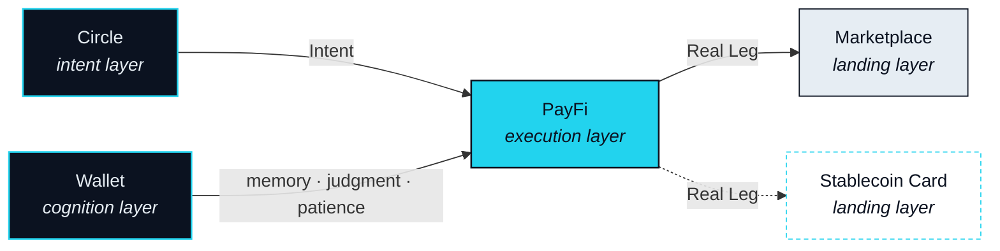

# The NEXON Stack

> Intent is born in conversation, so NEXON starts social. It runs through a payments app that agents operate and you approve. It thinks with a wallet that holds your memory, reads the market, and knows when to wait. And it lands in a marketplace and a card, where value finally touches the real world.

Part III described the nerves: the five subsystems that carry an Intent from a sentence to a settled Route. This Part describes the body those nerves run through. NEXON reaches you as five products, and the one rule of this chapter is that none of them is presented as a list of features. Each is defined by where it sits on the path from what you mean to what gets settled, and by what the Nexus Agent needs from it there.

Read it as anatomy, not as a catalogue. An organ is not there because it is impressive on its own. It is there because the body cannot complete one function without it, and it is judged by whether it performs that function.

## One path, four layers

The path from Part II has four positions at which a product has to exist. Intent has to come from somewhere. Something has to execute it. Something has to remember, judge and wait on your behalf while it does. And the last leg has to touch the real world. Those four positions are the four layers of the stack, and five products fill them.

| Layer | Product | Its place on the spine |
|---|---|---|
| Intent layer | Circle — the social app | The agent's source of intent |
| Execution layer | PayFi — the AI-native payments app · **lead** | The agent's hand |
| Cognition layer | Wallet · **lead** | The agent's memory, judgment and patience |
| Landing layer | Storefront — Marketplace · Stablecoin Card | Where the agent reaches the real world |

Two names in this table are fixed before the sub-sections use them. A **Circle** is the basic unit of the social layer and the source of intent; it is not a group or a chat room, and this paper never calls it one. The **Storefront** is the collective name for the Marketplace and the Stablecoin Card — the two ends at which a Route stops being on-chain value and becomes something you can hold, use or sleep in.

## Why organs, not features

Three things follow from defining products this way.

First, no product is optional in the way a feature is optional. Remove the Circle and the agent still executes, but it executes Intents that had to be typed into a form. Remove the Storefront and every Route ends in another token. The body would still move; it would no longer do the job.

Second, two of the five carry more weight. PayFi is where every Route is executed, priced and settled; the Wallet is where the agent decides how, how much and when. They are the lead products of this Part and get the most concrete treatment.

Third, a product's place on the spine is more stable than its shape. If a product changes form before it ships, the layer it serves does not move, and neither does what the agent needs from it. That is why this chapter argues from position, and why product names appear only in headings and in the status table below.

## The five organs

<table data-view="cards"><thead><tr><th></th><th></th><th data-hidden data-card-target data-type="content-ref"></th></tr></thead><tbody><tr><td><strong>Social — the Intent Layer</strong></td><td>A sentence in a Circle becomes an Intent without leaving the conversation.</td><td><a href="social.md">social.md</a></td></tr><tr><td><strong>PayFi — the Agent's Hand</strong></td><td>Every Route is executed, priced and settled here — after you approve it.</td><td><a href="payfi.md">payfi.md</a></td></tr><tr><td><strong>Wallet — Memory, Judgment, Patience</strong></td><td>What the agent knows when it decides how, how much and when.</td><td><a href="wallet.md">wallet.md</a></td></tr><tr><td><strong>Marketplace — the Real Leg</strong></td><td>The landing inside the ecosystem: a good, a booking, a Landing Receipt.</td><td><a href="marketplace.md">marketplace.md</a></td></tr><tr><td><strong>Stablecoin Card</strong></td><td>The landing outside the ecosystem, provided by a licensed issuer. Roadmap.</td><td><a href="stablecoin-card.md">stablecoin-card.md</a></td></tr></tbody></table>

## Status at this version


**How to read the badges in this Part.** Every capability below carries one of the five status badges introduced at the front of this paper. No capability in this Part is described as live. Confirmation of the whole matrix is an open item, [OP-29](../open-parameters/README.md).


| Capability | Organ | Status |
|---|---|---|
| Circle and Intent capture | Social | `In development` |
| Route preview · approval · digital-asset legs | PayFi | `In development` |
| Rebate | PayFi | `In development` |
| Pre-approved envelope | PayFi | `Roadmap` |
| Memory — assets and history | Wallet | `In development` |
| Foresight | Wallet | `Roadmap` |
| Patience | Wallet | `Roadmap` |
| Marketplace and Landing Receipt | Storefront | `In development` |
| travel redemption | Storefront | `Roadmap` |
| Stablecoin Card | Storefront | `Roadmap` |
| Capital-market leg · equity-linked settlement | PayFi · Storefront | `Roadmap` |


**Scope of this section.** Commits to: five products defined by four positions on the intent-to-settlement path, with the status of each capability stated as of this version. Does not commit to: the final form, name or launch order of any product, or to any capability being live. Open items: [OP-29](../open-parameters/README.md).


*Spine: [The Translator](../02-the-translator/README.md) · Next: [Social — the Intent Layer](social.md)*

*Turning what you mean into what gets settled.*
