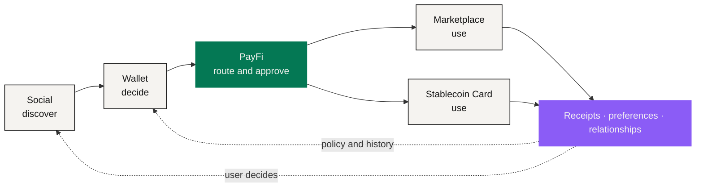

# The NEXON Product Ecosystem

> Discover in Social → decide in Wallet → route through PayFi → use in Marketplace or Card → return with data, relationships and activity.

NEXON's product direction is a **financial-social ecosystem** built from five connected surfaces: AI-Native PayFi, the Wallet, the Marketplace, the Stablecoin Card and a decentralized Social App. They are not five unrelated feature lists — each owns **one particular moment** in the user's value loop, and each carries its own set of responsibilities.

AI-Native PayFi is the **second focus** of the overall narrative. The first remains NEXON's own thesis and dual-asset architecture: NEXON connects capital, digital finance and real consumption; XO carries value, EXON drives circulation. PayFi is what makes that thesis tangible — it turns an objective into a route that can be checked, approved, executed and receipted.

## Five surfaces, one loop

| Product | Its place in the loop | What it does not become |
|---|---|---|
| Decentralized Social App | Discovery, communities, communication, strategy context, value interaction | Automatic financial authority, or investment advice |
| Wallet | Asset state, permissions, staking access, decision support, third-party entry points | A new source of yield |
| AI-Native PayFi | Intent capture, route preview, policy checks, approval, execution coordination, receipts | Custodian, merchant, compliance authority or return engine |
| Marketplace | Travel, hotel, goods and services inventory, with supplier fulfillment evidence | A NEXON guarantee of every supplier's performance |
| Stablecoin Card | Everyday acceptance through a licensed issuer/operator | A card that has already been issued |

## The target experience



### Discover in Social

A user encounters a community discussion, a strategy, an event or a travel idea. Social context can help form an intent. It **cannot** spend, trade or approve on their behalf. A strategy someone shared is information, not an instruction.



### Decide in Wallet

The user sees available balances, protected reserves, current staking positions, permissions already granted and relevant third-party experiences. The wallet helps them decide **which resources may even be considered**.



### Route through PayFi

The user states the outcome and the constraints. PayFi structures the intent, compares eligible paths, applies policy, and lays out costs, timing, parties and irreversible steps. The user approves a bounded route.



### Use in Marketplace or Card

The route reaches a real-world endpoint. The Marketplace connects to travel, hotel, goods or services inventory; the Stablecoin Card extends eligible value through a licensed issuer. **The supplier or issuer owns its leg, and payment settlement is booked separately from fulfillment.**



### Return with data, relationships and activity

Receipts, preferences and outcomes can improve the next decision, within consent and retention rules. A completed action can return to the social layer if the user chooses. **Private financial state does not become social content by default.**



## The seams inside the loop

The loop is a product narrative, not a circular guarantee. Both assets keep their confirmed mechanical roles. XO currently carries staking principal. EXON is currently the spot, release, purchase, check and burn asset.

Every surface has to keep its **responsible executor** visible:

* a wallet view does not merge custody;
* a PayFi recommendation does not replace user approval;
* a marketplace payment does not prove delivery;
* a card interface does not replace the issuer's terms;
* social popularity does not establish suitability.

## Progress measured by capability gates

Progress is measured by evidence, not calendar promises. To move past planned, a product has to deliver: published specifications, a threat model, custody and issuer arrangements, jurisdictional review, test results, incident procedures and user-facing disclosures.

**When the gates are met and availability is published, the product is live. Not before.**

<table data-view="cards"><thead><tr><th></th><th></th><th data-hidden data-card-target data-type="content-ref"></th></tr></thead><tbody><tr><td><strong>Decentralized Social App</strong></td><td>Discovery and context. Let relationships enrich decisions without letting social pressure bypass control.</td><td><a href="social.md">social.md</a></td></tr><tr><td><strong>AI-Native PayFi</strong></td><td>The second focus. Six stages from financial intent to execution evidence.</td><td><a href="payfi.md">payfi.md</a></td></tr><tr><td><strong>Wallet</strong></td><td>Financial home and control surface: state, permissions, staking access, decision support.</td><td><a href="wallet.md">wallet.md</a></td></tr><tr><td><strong>Marketplace</strong></td><td>The real-consumption leg. Payment and delivery are two different facts.</td><td><a href="marketplace.md">marketplace.md</a></td></tr><tr><td><strong>Stablecoin Card</strong></td><td>Everyday acceptance, resting on a licensed issuer/operator.</td><td><a href="stablecoin-card.md">stablecoin-card.md</a></td></tr></tbody></table>

*Previous: [Data & Oracles](../03-architecture/data-and-oracles.md) · Next: [Decentralized Social App](social.md)*
