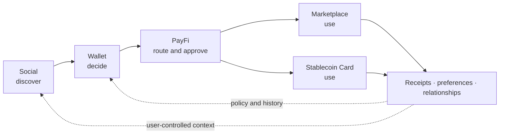

# The NEXON Product Ecosystem

> Discover in Social → Decide in Wallet → Route through PayFi → Use in Marketplace or Card → Return with data, relationships and activity.

NEXON's product direction is a **super financial-social ecosystem** built around five connected Roadmap surfaces: an AI-Native PayFi application, Wallet, Marketplace, Stablecoin Card and decentralized Social App. They are not five unrelated feature lists. Each owns a distinct moment in the user value loop and a distinct set of responsibilities.

AI-Native PayFi is the **secondary focus** of the overall narrative. The primary focus remains the project-approved NEXON thesis and dual-asset architecture: NEXON connects capital, digital finance and real consumption; XO anchors value; EXON drives circulation. PayFi makes that thesis tangible by translating a user objective into a route that can be checked, approved, executed and receipted.

All five products in this Part are **Roadmap**. The journey describes a target product experience, not a live transaction flow or launch commitment.

## Five surfaces, one loop

| Roadmap product | Role in the loop | Does not become |
|---|---|---|
| Decentralized Social App | Discovery, communities, communication, strategy context and value interaction | Automatic financial authority or investment advice |
| Wallet | Asset state, permissions, staking access, decision support and third-party application entry | A new source of yield or guarantee of liquidity |
| AI-Native PayFi | Intent capture, route preview, policy checks, approval, execution coordination and receipts | Custodian, merchant, compliance authority or return engine |
| Marketplace | Travel, hotel, goods and services inventory with supplier fulfillment evidence | A guarantee by NEXON of every supplier's performance |
| Stablecoin Card | Potential everyday acceptance through a responsible licensed issuer/operator | An already issued card or proof that EXON is universal settlement fuel |

## The target journey

### Discover in Social

A user encounters a community discussion, strategy, event or travel idea. Social context can help form an intent. It cannot spend, trade or approve on the user's behalf. A strategy shared by another person remains information, not an instruction.

### Decide in Wallet

The user sees available balances, protected reserves, current staking positions, permissions and relevant third-party experiences. The wallet helps the user decide which resources may be considered. Prediction-market interfaces, if supported, remain third-party, jurisdiction-dependent Roadmap integrations whose outcomes are uncertain.

### Route through PayFi

The user states the outcome and constraints. PayFi structures the intent, compares eligible paths, applies policy and presents the costs, timing, parties and irreversible steps. The user approves a bounded route. Product-specific fees and settlement assets will be defined by the relevant product terms; they are not inferred from token narrative.

### Use in Marketplace or Card

The route reaches a real-world endpoint. The Marketplace may connect to travel, hotel, goods or services inventory. A future Stablecoin Card may extend supported value through an eligible issuer. The supplier or issuer remains responsible for its leg, and payment settlement is recorded separately from fulfillment.

### Return with data, relationships and activity

Receipts, preferences and outcomes can improve the user's future decisions, subject to consent and retention rules. A completed action can also return to the social layer as a user-chosen update. Private financial state does not become social content by default.

## Separation within connection

The closed loop is a product narrative, not a circular guarantee of token demand or financial return. XO and EXON keep their approved current mechanics. XO is the current staking-principal carrier; broader rights are Roadmap. EXON is the current spot/release/buy/check/burn asset; broader payment, fee and consumption uses are Roadmap.

Every surface should expose the responsible executor. A wallet view does not merge custody. A PayFi recommendation does not replace user approval. A marketplace payment does not prove delivery. A card interface does not replace the issuer's terms. Social popularity does not establish suitability.

## Capability gates

Progress should be measured by evidence, not calendar promises: published specifications, threat models, custody and issuer arrangements, jurisdictional review, test results, incident procedures and user-facing disclosures. A product moves beyond Roadmap only when those gates and its actual availability are documented.


**Roadmap status.** No capability in this Part is described as live. Product names, operators, supported assets, fees, jurisdictions, release order and service levels remain subject to published implementation terms.


*Previous: [Data & Oracles](../03-architecture/data-and-oracles.md) · Next: [Decentralized Social App](social.md)*
