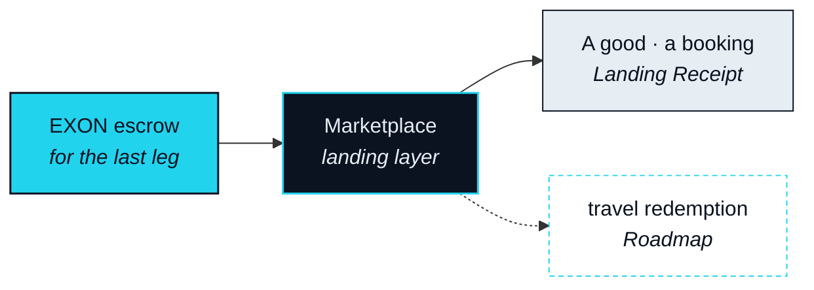

# Marketplace — the Real Leg

> Settlement to the real leg — a booking, a card limit, a delivered good. Not another swap.

The value of a Route is realised entirely in its last leg. The Marketplace is the landing inside the ecosystem; the Card is the landing outside it — only together does the agent truly touch the real world. This layer is the hardest, and the one that can least be skipped: a connection without a Real Leg is just another place to swap tokens.

That is why this paper groups the two under one name, the Storefront, and why the Marketplace comes first. It is the landing the protocol can see end to end — supplier, inventory, receipt — and so the first place where "Land the Real Leg" can be shown rather than asserted.

## The landing inside the ecosystem

### Marketplace

**Status** · `In development`

The Marketplace is the last leg's venue, not a shop with a token checkout. The Nexus Agent arrives with a Route whose earlier legs have landed and with EXON in escrow for this one. The Marketplace's job is to turn that escrow into a real thing — a good shipped, a booking confirmed — and hand back proof that it did. Nothing is browsed here in the ordinary sense. The agent is fulfilling an Intent, and the Marketplace is where the object of that Intent lives.

### Landing Receipt and the dispute window

**Status** · `In development`

A Route does not close when the supplier is paid. It closes when the Real Leg can be shown. The Landing Receipt is that proof: a record that can be checked against the supplier's own system, not against a NEXON log alone. It opens a dispute window, and inside that window a Real Leg paid for and not delivered is handled as a partial unwind — escrow returns, the supplier's standing is affected, and the Route closes as partially unwound rather than complete.

### Who may be a supplier

**Status** · `In development`

Three conditions, no exceptions. Inventory must be real: what is offered exists, and is held when the leg executes. It must be refundable: a failed leg can be unwound in the supplier's own system. It must be verifiable: the supplier can produce a confirmation that stands as a Landing Receipt. A supplier that meets all three is a Leg Executor for the Real Leg. The set is an open parameter ([OP-15](../open-parameters/README.md)); this version names none.

### travel redemption

**Status** · `Roadmap`

The Tokyo example in Part II ends in four nights in a hotel. When that landing happens inside the ecosystem, it happens here: the booking is the Real Leg, the hotel is the supplier, the confirmation is the Landing Receipt. Nothing in the mechanism changes; only the object does. Travel redemption is `Roadmap`, and until it is built the Marketplace lands goods before it lands rooms.

## Inside and outside



**Inside — the Marketplace.** The supplier is a Leg Executor the protocol has admitted. Inventory, refund and receipt are visible to the agent before the leg runs. This is the landing the protocol can vouch for.


**Outside — the Stablecoin Card.** The last leg becomes a spending limit on a card from a licensed issuer, and the real world is reached wherever that card is accepted. NEXON is only the access layer. This is the landing the protocol can enable but not vouch for. `Roadmap`.



The real leg is the hard part

Every earlier leg settles in a system built for settlement. The last one settles in a hotel's booking engine or a warehouse. A supplier can say yes and not deliver; a room can be confirmed and then overbooked. No chain can force delivery. Only escrow, receipt, dispute and standing can make it likely — and they are slow, manual and unglamorous to build. They are also the entire difference between a translation and a swap.


**Scope of this section.** Commits to: the Marketplace as the in-ecosystem Real Leg, a Landing Receipt verifiable against the supplier's system, a dispute window that resolves into partial unwinds, and three admission conditions for suppliers. Does not commit to: any supplier, any category of goods, or travel redemption being available. Open items: [OP-15](../open-parameters/README.md).


*Spine: [The Translator](../02-the-translator/README.md) · Next: [Stablecoin Card](stablecoin-card.md)*
