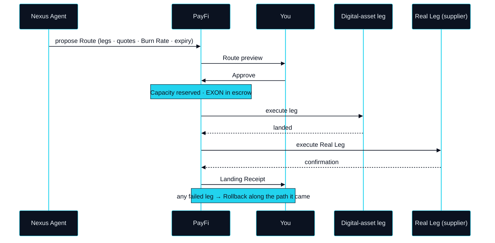

# PayFi — the Agent's Hand

> You are the approver, not the operator.

Everything the Route step produces has to be carried out somewhere. On NEXON that place is PayFi: the product in which a Route is executed, priced and settled, and in which you see it before it runs. It is the agent's hand — the part of the body that actually moves — and it is the lead product of this Part because every Intent, whatever its origin, passes through it on the way to the real world.

## What "AI-native" means here

The phrase is used loosely across the industry. Here it has one meaning. PayFi is not a payments app with AI features added. It is a payments app in which the agent initiates every transaction by default, and you only confirm or reject. You are the approver, not the operator.

The difference shows in what your hands do. In a payments app with AI on top, you still pick the asset, type the amount, choose the recipient and press send; the AI helps you do it faster. In PayFi you never do them. The Nexus Agent arrives with a whole Route — every leg, every quote, every cost — and asks one question. The operating has already happened. What is left for you is judgment.

## The Route on screen

A Route passes through four states in PayFi. Each is a screen, and each corresponds to something the protocol in Part III is doing underneath.



### Route preview

**Status** · `In development`

The agent's proposal, before anything moves. Every leg is listed: what leaves, what arrives, where that leg settles, and the quote it settles at. The estimated Burn Rate for the whole Route is shown in EXON — what the execution will consume, leg by leg. The preview carries an expiry; when the quotes behind it age out it lapses, and the agent proposes again rather than running on stale numbers.



### Approve or reject

**Status** · `In development`

One decision, on the whole Route. Approve, and the agent's Capacity is reserved for it and the first leg begins. Reject, and nothing happens — no leg, no escrow, no record beyond the fact that a Route was declined. The default mode is Approve-each-Route. A pre-approved envelope, in which Routes inside limits you set in advance run without a fresh approval, is `Roadmap` ([OP-18](../open-parameters/README.md)).



### Leg progress

**Status** · `In development`

Legs execute in order and each reports its state as it goes — reserved, executing, landed. Digital-asset legs are the first this screen will carry; a capital-market leg, executed by a licensed third party, is `Roadmap`. If a leg fails, this is where Rollback becomes visible: the legs already landed unwind along the path they came, and you are told the moment an unwind cannot complete on its own.



### Landing Receipt

**Status** · `In development`

The record that the Real Leg happened: a booking reference, a card limit, a delivery confirmation, in a form that can be checked against the supplier's own system. The Route closes on the Landing Receipt, and the dispute window on the Real Leg opens from it.



One thing is decided before any of these screens appear. Whether the agent may propose the Route at all is decided by the Bond Check in Part III, against the Capacity that your bonded XO gives it. That check is read-only, and nothing it reads enters a leg.

## Priced and settled in EXON

### Settlement Rail and Burn Rate

**Status** · `In development`

Every leg of a Route is priced and settled in EXON. That is what makes EXON the Settlement Rail: the one unit in which a digital-asset leg, a supplier's confirmation and the cost of executing them can be stated together. At approval, the EXON the Route needs is placed in escrow. As each leg executes its share is consumed — this is the Burn Rate, and consumed means used up in execution, not destroyed. When the Route closes, escrow that was not consumed returns to you. Burn Rate per leg type is an open parameter ([OP-13](../open-parameters/README.md)).

### Rebate

**Status** · `In development`

Rebate is the first thing in PayFi that can be verified on-chain, which is why it is first to be built. Part of the EXON a Route consumed is returned to the Intent's owner after the Route closes, on a schedule that is an open parameter ([OP-12](../open-parameters/README.md)). It is a return of fuel already spent, paid in EXON and only in EXON. It is not a reward for holding anything.

## When a leg fails

From where you sit, Rollback is a screen that changes direction. Legs that had landed unwind in reverse along the path they came; escrow for legs that never ran is released; the Route moves from executing to unwinding. Some legs cannot unwind on their own — a parcel already shipped, a confirmation the supplier cannot reverse. Then the Route is partially unwound, the agent stops, and what remains comes to you as a question, not as a decision already made.


**Approval is not optional in this version's design.** Every Route is shown before it runs and requires your approval to run. The agent cannot execute a Route you have not seen, and a Route that lapses before you answer is proposed again, not executed. The pre-approved envelope that would relax this is `Roadmap`, and its limits are [OP-18](../open-parameters/README.md).


None of this is a feature added to a payments app. It is what a payments app looks like when its default operator is an agent and your default role is to judge. The hand moves; you decide whether it should.


**Scope of this section.** Commits to: agent-initiated Routes, per-Route approval before execution, four visible states ending in a Landing Receipt, EXON as the unit in which every leg is priced and settled, and Rebate paid in EXON. Does not commit to: Burn Rate values, the Rebate schedule, pre-approved envelope limits, or any capital-market leg. Open items: [OP-12 · OP-13 · OP-18](../open-parameters/README.md).


*Spine: [The Translator](../02-the-translator/README.md) · Next: [Wallet — Memory, Judgment, Patience](wallet.md)*
