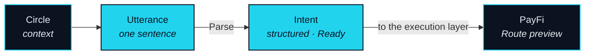

# Social — the Intent Layer

> A social layer as the source of intent — because intent is born in conversation, not in a form.

Intent does not come from nowhere. You want to go to Tokyo because a friend posted photos; you want to add to a position because a Circle is discussing it. Intent is born in relationships. So the social layer is not a chat tool built on the side. It is the agent's entry point for intent on NEXON — the place where one sentence becomes an executable Intent directly, without you switching to another app to reorganise your words.

That is the whole mechanism behind the phrase "financial social", stated as a mechanism rather than worn as a label. Money is not being added to a conversation. The conversation is where the reason for a Route first exists, and the agent is listening at the point where that reason becomes a sentence.

## Three things the layer does

### Circle

**Status** · `In development`

A **Circle** is the basic unit of the social layer and the source of intent. It is not a group and not a chat room, and the difference is not cosmetic. A group is a list of people and a stream of messages. A Circle is a context: the people in it, what they hold and are discussing, what they have already done together, and what the agent may draw on when one of them says something that sounds like an Intent. That context is what lets a sentence be parsed without a form.

### From a sentence to an Intent

**Status** · `In development`

Inside a Circle, a sentence that expresses a goal is offered to the Nexus Agent as a candidate Intent. Parse runs on it there, with the Circle as its context; if the sentence is ambiguous, the agent asks once rather than guessing. When the Intent is Ready it is handed to the execution layer, and the Route preview appears where the sentence was said. You did not leave the conversation, and you did not restate yourself.

### What stays in the Circle

**Status** · `In development`

The content of a Circle never goes on-chain. What enters the Route log is a reference — the Intent's identifier and a pointer to the Circle it came from — so a Route can be traced to its origin without exposing what was said. Other members see the Intent formed from a conversation only if its owner shows them. Approval of any Route belongs to the owner alone, in PayFi; nothing said in a Circle, by anyone, counts as approval.

## The direction is social → intent → execution

Two designs use the same three words and are not the same machine. This paper commits to one of them.



**The other way round.** Some products start from a payment and grow people around it: a transfer with a message attached, a bill split among friends, a feed of what others paid for. The payment is the object and the social layer is its wrapper. Nothing in that design knows why the payment happened.


**The NEXON way.** Conversation comes first, because that is where intent forms. The Intent is extracted from it. Execution is the consequence. The social layer never touches settlement; it hands a structured Intent to the agent and stops. Social is upstream of finance here, never downstream.



The order is the point. In the first design a better social layer makes payments more pleasant. In the second, it makes the agent's Intents more accurate — closer to what you meant, formed earlier, with less of you spent restating them.

What a Circle is not

- **Not a group chat with a pay button.** The Circle produces Intents; it does not move, hold or settle value.
- **Not a channel for following someone else's trades.** A Circle produces your Intent, in your words. Nothing in it is a recommendation, and the agent mirrors no one.
- **Not an authority.** No one in a Circle can approve a Route on your behalf. Approval is per Route, by its owner, on the execution layer.


**Scope of this section.** Commits to: the Circle as the source of intent, Parse running inside it, and Circle content staying off-chain with only an Intent reference entering the Route log. Does not commit to: the final form of the social product, or to Circle content influencing execution beyond the Intent it produced. Open items: [OP-29](../open-parameters/README.md).


*Spine: [The Translator](../02-the-translator/README.md) · Next: [PayFi — the Agent's Hand](payfi.md)*
