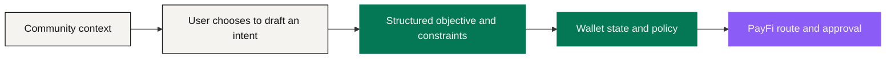

# Decentralized Social App — Discovery and Context

*Product stage · Roadmap*

Financial intent usually starts inside a relationship: a community is discussing something, a friend shares a trip, a group compares views on a market. NEXON's decentralized Social App brings that context into the ecosystem while **never letting conversation become invisible financial authority**.

The direction is to hold communication, communities, strategy sharing and user-controlled value interaction in one place. "Decentralized" here means self-held identity, portability, verifiable relationships and open participation; the protocol finally adopted, the moderation model and the degree of decentralization are [Open Parameters](../open-parameters/README.md) (OP-P06).

## From discovery to intent

A user can choose to turn a message, a post, an event or a shared strategy into a **draft intent**. The application extracts the possible objective and then asks: how much, from which assets, what reserve floor, by when, approved how.

**Nothing moves inside the Social App.** The structured request reaches Wallet and PayFi controls only after its owner confirms it.

That order prevents one specific thing: **a social signal becoming an execution trigger.** A widely shared strategy is not thereby right for you. A prediction is not a guarantee. A creator, an administrator or any community member cannot approve a route for someone else's account.

## Strategy sharing without hidden delegation

The product can let people publish analyses, model portfolios, route templates and market views. A template helps someone understand a sequence — and **importing one only creates a new draft under the recipient's own policy**. Amounts, eligible venues, costs and risks are recalculated for that person, at that moment.

The system should keep **education, personal opinion, promotion and regulated advice** apart. Sponsorship, referral and any routing incentive that could affect ordering must be disclosed. Where performance history is shown, it states its source, time range, whether fees are included, and whether the results are realized, simulated or selected.

## Value interaction inside social

Future interactions might include permitted transfers, group purchasing, event access, marketplace discovery and community participation. Their payment assets, fees, limits and eligibility are defined by the responsible product terms.

EXON's narrative role as Circulation Engine **does not** make it a universal social payment token, and XO's role as Value Anchor gives a community administrator no control over anyone else's position.

Every value action leaves the conversation and enters the same six-stage path used everywhere else: Intent → Route → Policy Check → User Approval → Execution → Receipt. The interface can return a user-selected outcome to the conversation, while **balances and transaction detail stay private by default**.

## Identity, privacy and moderation

A decentralized social product still needs accountable rules. Users should know which identity elements are public, portable, private or verified; who can remove content; how abuse and fraud reports work; and what data is shared with financial executors. **Financial eligibility information should not become a public reputation score.**

Communities get attacked through impersonation, coordinated manipulation, malicious links and false claims. The matching controls are signed identity or provenance signals, permissioned link handling, clear promotion labels, rate limits, moderation appeals, and a separate path for a suspected account compromise.

## Its place in the loop

The Social App owns **discovery and context**. The Wallet owns financial state and permissions. PayFi owns route preparation and approval. Marketplace suppliers and card operators own real-world execution. Afterwards, the user decides whether a receipt becomes a private memory, a public update, or no social object at all.

**That separation lets relationships enrich decisions without letting popularity bypass control.**

## What has to ship before launch

<table><thead><tr><th width="230">Deliverable</th><th>Why</th></tr></thead><tbody><tr><td>Identity and data architecture</td><td>Users have to be able to tell public from portable from private</td></tr><tr><td>Content and moderation rules</td><td>Impersonation and coordinated manipulation need a documented process</td></tr><tr><td>Financial promotion policy</td><td>Keeps education, opinion, promotion and regulated advice apart</td></tr><tr><td>Privacy and retention terms</td><td>Conversations can carry highly sensitive financial and travel detail</td></tr><tr><td>Security review and abuse response</td><td>The social surface is the first door an attacker tries</td></tr><tr><td>Portability design and jurisdictional controls</td><td>"Decentralized" has to be checkable</td></tr></tbody></table>

*Previous: [The NEXON Product Ecosystem](README.md) · Next: [AI-Native PayFi](payfi.md)*
