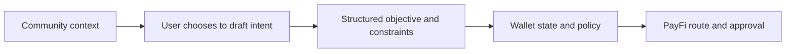

# Decentralized Social App — Discovery and Context

**Status** · `Roadmap`

Financial intent often begins in a relationship: a community discusses an event, a friend shares a trip, or a group compares views about a market. NEXON's planned decentralized Social App brings that context into the ecosystem without allowing conversation to become invisible financial authority.

The product direction combines communication, communities, strategy sharing and user-controlled value interactions. “Decentralized” describes a target for user identity, portability, verifiable relationships and open participation; the final protocol, moderation model and degree of decentralization remain Open.

## From discovery to intent

A user may choose to turn a message, post, event or shared strategy into a draft intent. The application extracts the possible objective and asks the user to set amount, source assets, reserve limits, deadline and approval mode. Nothing moves in the Social App. The structured request proceeds to Wallet and PayFi controls only after its owner confirms it.

This order prevents a social signal from becoming an execution trigger. A widely shared strategy is not automatically suitable. A prediction is not a guarantee. A creator, administrator or other community member cannot approve a route for the user's account unless a separate, explicit authorization product is later specified.

## Strategy sharing without hidden delegation

The Roadmap may let people publish analyses, model portfolios, route templates or market views. A template can help another user understand a sequence, but importing it should create a new draft under the recipient's policy. Amounts, eligible venues, costs and risks must be recalculated for that user at that time.

The system should distinguish education, personal opinion, promotion and regulated advice where applicable. Sponsorship, referral or routing incentives require disclosure. Performance history, if displayed, should state its source, time range, fees and whether results are realized, simulated or selected.

## Social value interactions

Future interactions might include permitted transfers, group purchasing, event access, marketplace discovery or community participation. Their payment assets, fees, limits and eligibility will be defined by the responsible product terms. The narrative role of EXON as Circulation Engine does not make it a current universal social payment token. XO's Value Anchor role does not give a community administrator control over another member's position.

Every value action leaves the conversation and enters the same six-stage control path used elsewhere: intent, route, policy check, user approval, native execution and receipt. The interface may return a user-selected outcome to the conversation, but private balances and transaction details stay private by default.

## Identity, privacy and moderation

A decentralized social product still needs accountable rules. Users should understand which identity elements are public, portable, private or verified; who can remove content; how abuse and fraud reports work; and which data is shared with financial executors. Financial eligibility information should not become a public reputation score.

Communities can be attacked through impersonation, coordinated manipulation, malicious links and false claims. Relevant controls include signed identity or provenance signals, permissioned link handling, clear promotion labels, rate limits, moderation appeals and a distinct security path for suspected account compromise.

## Connection to the loop

The Social App owns discovery and context. The Wallet owns financial state and permissions. PayFi owns route preparation and approval. Marketplace suppliers and card operators own real-world execution. After completion, the user can choose whether a receipt becomes a private memory, a public activity update or no social object at all.

This separation lets relationships enrich decisions without allowing social pressure or popularity to bypass control.

## Launch gates

Before moving beyond Roadmap, the Social App requires published identity and data architecture, content and moderation rules, financial-promotion policy, privacy and retention terms, security review, portability design, abuse response and jurisdictional controls. No launch date, protocol or governance arrangement is committed here.


Social and community content can be wrong, manipulated or conflicted. It is not a promise of return or a substitute for independent judgment. Users remain responsible for reviewing and approving any financial action under its own terms and risks.


*Previous: [The NEXON Product Ecosystem](README.md) · Next: [AI-Native PayFi](payfi.md)*
