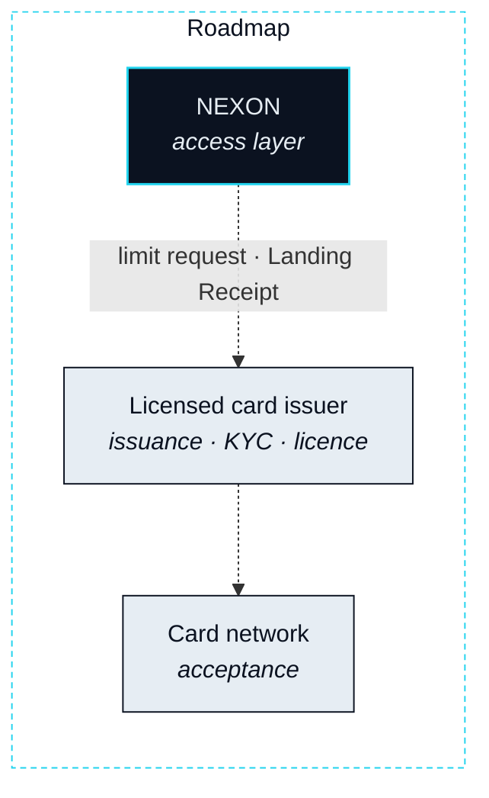

# Stablecoin Card


**Roadmap.** Nothing on this page is live. The Stablecoin Card is described here so that its place on the spine and its compliance surface are stated before it exists, not after.


**Status** · `Roadmap`

The Marketplace is the landing inside the ecosystem. The Stablecoin Card is the landing outside it: the last mile from a Route to the everyday spending the ecosystem does not host. Together they are the Storefront. Part II named three forms the last leg can take — a booking, a card limit, something delivered — and the Card is the second.

## The Card on the spine

### A card limit as the last leg

**Status** · `Roadmap`

When an Intent ends in spending outside the ecosystem, the Route's final leg is not a purchase. It is a limit. EXON in escrow for that leg is settled on the Settlement Rail into the stablecoin the card carries, and the issuer confirms a spending limit against it. That confirmation is the Landing Receipt. From there the real world is reached wherever the card is accepted, and the Route closes — the agent's job ended at the limit, not at the till.

The narrowness is deliberate. The agent lands value on a card; it does not spend from one. What happens after the limit exists is between you, the issuer and the merchant, on rails the ecosystem does not run.

## Who provides what

### Issuer, network, access layer

**Status** · `Roadmap`

The Card is provided by a licensed card issuer and reached through compliant aggregation channels. NEXON is the access layer and nothing more: it turns a landed leg into a limit request and records the confirmation. It does not issue cards, hold cardholder funds, or verify identity.

| Function | Provided by | Status |
|---|---|---|
| Card issuance and the issuing licence | Licensed card issuer | `Open` · [OP-25](../open-parameters/README.md) |
| Cardholder identity verification (KYC) | Licensed providers, attested to the issuer | `Open` · [OP-22](../open-parameters/README.md) |
| Acceptance at merchants | The card network, through the issuer | `Roadmap` |
| Landed Route → limit request · Landing Receipt | NEXON — the access layer | `Roadmap` |
| Where the Card is offered | Wherever the issuer is licensed | `Open` · [OP-21](../open-parameters/README.md) |

## The compliance surface

The Card creates an exposure the rest of the stack does not, and this paper lists it rather than leaving it to be discovered.

- **The issuing licence** belongs to the issuer, not to NEXON. The Card exists only where a licensed issuer provides it.
- **Identity.** Cardholders are verified by licensed providers, attested to the issuer. NEXON stores a reference to that attestation, never the documents behind it.
- **Jurisdiction.** The Card is offered only where the issuer is licensed to offer it. That set is an open parameter ([OP-21](../open-parameters/README.md)).

Part VI carries the same three items in its disclosure table. This page offers no feature list — no top-up flows, no spending categories, no fee schedule — because those belong to the issuer's product, not to the protocol's spine.


**Scope of this section.** Commits to: the Stablecoin Card as the out-of-ecosystem Real Leg, provided by a licensed issuer with NEXON as the access layer only, and a stated compliance surface of licence, identity and jurisdiction. Does not commit to: any issuer, any jurisdiction, any card feature, or any date. Open items: [OP-21 · OP-22 · OP-25](../open-parameters/README.md).


*Spine: [The Translator](../02-the-translator/README.md) · Next: [Token Economics](../05-tokenomics/README.md)*
