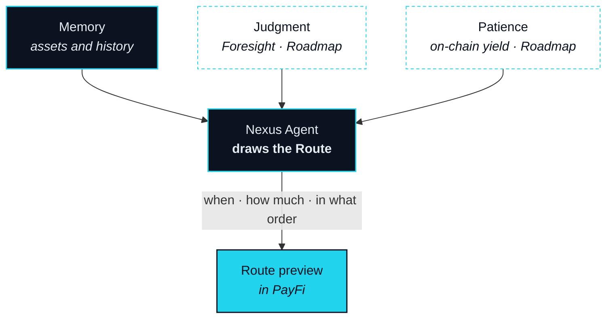

# Wallet — Memory, Judgment, Patience

> It thinks with a wallet that holds your memory, reads the market, and knows when to wait.

In most products a wallet is an asset list with a send button. On NEXON the Wallet is the agent's cognitive centre: the organ that lets the hand in the previous section act on more than the sentence in front of it. It is the second lead product of this Part, because a Route is only as good as what the agent knew when it drew it.

The Wallet gives the Nexus Agent three faculties. They are fixed in three lines, and this section keeps them as written:

- **Assets and history = Memory.** The agent knows what you hold and how you tend to handle it.
- **Foresight = Judgment.** The agent needs to know what the market thinks before it can decide whether to execute now or wait.
- **Patience = on-chain yield.** Not every intent needs to execute immediately. While it waits, assets should not sit idle.

## Three faculties

### Memory — assets and history

**Status** · `In development`

Memory is what makes the second Intent easier than the first. The Wallet holds what you own across the three markets and what you have done with it: which assets you draw on and which you leave alone, how large you tend to size a Route, which suppliers you have landed with, which Routes you rejected and why. None of it leaves the Wallet. The agent reads it when it draws a Route, so that "thirty percent of what this position earned" resolves to the right position without a question, and a Route you would never approve is not proposed at all.

### Judgment — Foresight

**Status** · `Roadmap`

Foresight is a decentralised venue, reached from inside the Wallet, where participants put a position behind what they expect to happen. NEXON only builds the infrastructure and the entry point; it does not operate Foresight and does not make markets in it. For the agent, Foresight is a fourth kind of data alongside price, identity and off-chain fact — a signal about what the market thinks, used to decide whether a Route runs now or waits. It never overrides you: a Route that Foresight argues against still appears as a preview, with the reason attached. Its scope is an open parameter ([OP-26](../open-parameters/README.md)).

### Patience — on-chain yield

**Status** · `Roadmap`

Not every Intent should execute the moment it is stated. A better quote may be minutes away; a supplier's date may be next month; Foresight may say wait. Patience is what makes waiting affordable: while an Intent is held back, the assets set aside for it are placed in on-chain yield instead of sitting idle, and are released when the Route is ready. The agent decides when to wait; Patience decides what the wait costs.


**Patience is on-chain yield: floating · not guaranteed · non-principal-protected.** Any yield is variable, is not promised by NEXON or anyone else, and can result in loss of principal. Its sources are not described in this version and are an open parameter ([OP-27](../open-parameters/README.md)).


## How the three feed a Route

A Route has three variables the agent must set before it proposes anything: when, how much, and in what order. Each faculty speaks to each variable, but not equally.



Judgment leads. Foresight tells the agent whether the market is likely to move for or against the Route, and so whether now or later serves the Intent better. Patience makes "later" affordable. Memory sets the boundary: the deadline the Intent carries, and how long you have been willing to wait before.



Memory leads. It knows what you hold, which of it you actually draw on, and how large your Routes usually are — so "thirty percent" resolves without a question. Judgment adjusts at the margin: a Route may be proposed in tranches if Foresight suggests the market is unsettled. Patience does not size anything; it keeps the unused part productive.



Memory leads again. It knows which assets you would rather not touch and which legs you have seen fail, and the agent orders legs so the most reversible run first. Patience adds one rule: assets not yet needed by a later leg keep working until that leg is reached. Judgment decides whether the whole sequence should wait.



The Wallet, then, is not where value sits. It is where the agent thinks — and the hand in the previous section is only as steady as the thinking behind it.


**Scope of this section.** Commits to: the Wallet as the cognition layer, three faculties that feed Route timing, size and order, Foresight as infrastructure and entry point only, and Patience described as floating, not guaranteed and non-principal-protected. Does not commit to: the scope of Foresight, the sources of any yield, or any rate. Open items: [OP-26 · OP-27](../open-parameters/README.md).


*Spine: [The Translator](../02-the-translator/README.md) · Next: [Marketplace — the Real Leg](marketplace.md)*
