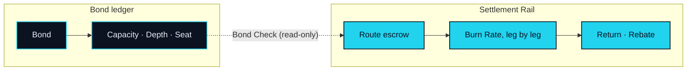

# Token Economics

> Collateral is not fuel. That's why there are two.

Four Parts have passed without a token being needed to explain anything. The connection is performed by agents. The five steps run from Parse to Land the Real Leg. The products are organs on that path. That order was deliberate: an asset exists to make the connection run, and it can only be judged against a connection that already stands on its own.

Now the assets. NEXON is the ecosystem. XO carries value. EXON drives circulation.

## Two ledgers

The network keeps two ledgers, and they never merge.

The first is the **Bond ledger**. It records what each participant has bonded in XO, for how long, and what Capacity, Depth and Seat that Bond confers. Entries change when someone bonds, unbonds or crosses a threshold. They do not change because an Intent executed. An executed Intent is not an event on this ledger at all. At launch the record is kept as a custodial product within NEX; the on-chain ledger on BNB Smart Chain (BSC) is the protocol record it migrates to (OP-31). Where the record is held does not change what it records.

The second is the **Settlement Rail**. It records what each Route consumed in EXON, leg by leg: what was placed in escrow, what each leg's Burn Rate took, what was returned, what came back as Rebate. Entries change with every executed Intent and with nothing else. A participant's Bond is not an event on this ledger at all.

The two touch at exactly one of the five steps: **Bond Check**. Before a Route executes, the Rail asks the Bond ledger one question — does this owner's Capacity cover this Route? — and receives one answer. The question is read-only. Nothing moves from one ledger to the other, in either direction.

Everything else in this Part follows from that picture. One ledger holds what stays; the other records what turns over. Each asset lives on one ledger only, and a sentence that puts it on the other is wrong by construction.

## What this Part covers

<table data-view="cards"><thead><tr><th></th><th></th><th data-hidden data-card-target data-type="content-ref"></th></tr></thead><tbody><tr><td><strong>Two Assets, Two Jobs</strong></td><td>Why one asset cannot both anchor trust and settle execution. The argument, the comparison, and the sentences this paper will never contain.</td><td><a href="two-assets-two-jobs.md">two-assets-two-jobs.md</a></td></tr><tr><td><strong>XO — Collateral, Not Fuel</strong></td><td>Bonded, never spent. What a Bond confers, where the value comes from, and what XO never does.</td><td><a href="xo.md">xo.md</a></td></tr><tr><td><strong>EXON — Fuel and Unit of Settlement</strong></td><td>Spent, never bonded. One Intent from escrow to Rebate, and four uses in order of verifiability.</td><td><a href="exon.md">exon.md</a></td></tr><tr><td><strong>Distribution &amp; Emission</strong></td><td>What will be disclosed, under which principles, and why the figures wait for v2.</td><td><a href="distribution.md">distribution.md</a></td></tr><tr><td><strong>Value Flows</strong></td><td>Six roles, two flows, three points of contact and six invariants.</td><td><a href="value-flows.md">value-flows.md</a></td></tr></tbody></table>

The order matters. Two Assets, Two Jobs makes the case for the separation. The two asset pages then describe each ledger on its own terms — neither is explained by reference to the other. Distribution & Emission sets out what will be disclosed and under which principles. Value Flows closes with the roles, the flows, the three points where the ledgers touch, and six invariants that any later revision must keep.

## Mechanism first, numbers second

Version 1 of this paper describes mechanism, roles, flows and invariants. It does not describe quantities. Supply, allocation, vesting, emission and the relationship between the two assets are each an Open Parameter, listed with an owner and an expected version on the [Open Parameters](../open-parameters/README.md) page. When those cells are filled, the sentences around them will not need to change. That is the test the mechanism has been written to pass.


**What this Part does not contain in v1.** No total supply. No allocation. No vesting or release schedule. No emission rate. No conversion mechanism between the two assets, in any direction. No price, valuation or return of any kind. Each of these is an Open Parameter (OP-01 to OP-06); v2 fills the cells and does not rewrite the chapters.



**Scope of this section.** Commits to: two assets on two ledgers that touch only at Bond Check, and only by reading. Does not commit to: any quantity, schedule, ratio or price. Open items: [OP-01 · OP-02 · OP-03 · OP-04 · OP-05 · OP-06](../open-parameters/README.md).


*Spine: [The Translator](../02-the-translator/README.md) · Next: [Two Assets, Two Jobs](two-assets-two-jobs.md)*

*Turning what you mean into what gets settled.*
