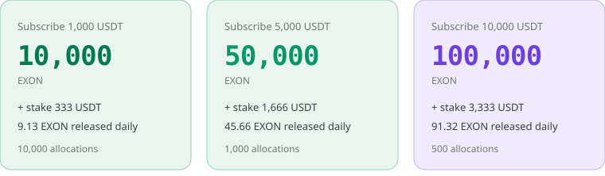
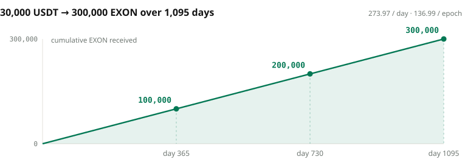

# Distribution & Release

## From private sale to listing <a href="#from-private-sale-to-listing" id="from-private-sale-to-listing"></a>

| Stage | Price | What happens |
|---|---|---|
| **Private sale** | Fixed `0.1 USDT`, limited by tier | The only route to EXON; each subscription is paired with an XO stake at 3:1, and both income lines start together |
| **Listing** | `1.0 USDT`, ten times the subscription price | NEX spot opens with sell orders only, no buy orders; the first day's release lands on listing day |
| **Release** | — | Daily for 1,095 days from listing day, one payout every 12 hours, 2,190 in total |

## The three tiers <a href="#the-three-tiers" id="the-three-tiers"></a>

<figure><figcaption>11,500 allocations across three tiers, 20 million USDT in total, 200 million EXON</figcaption></figure>

| Tier | XO stake alongside | Total in | EXON received | Released per day | Allocations |
|---:|---:|---:|---:|---:|---:|
| 1,000 USDT | 333 USDT | 1,333 USDT | 10,000 | 9.13 | 10,000 |
| 5,000 USDT | 1,666 USDT | 6,666 USDT | 50,000 | 45.66 | 1,000 |
| 10,000 USDT | 3,333 USDT | 13,333 USDT | 100,000 | 91.32 | 500 |
| **Total** | | | **200 million** | | **11,500** |

The paired stake is rounded down to the integer; after listing the pairing switches to 1:1. EXON supply is 1 billion; the private sale offers only 200 million, 20% of supply, closed once sold out.

## Linear release <a href="#linear-release" id="linear-release"></a>

An allocation `A` is released over **1,095 days**, twice a day, **2,190 payouts** in total:

```text
D = A ÷ 1,095                  released per day
R_epoch = D ÷ 2 = A ÷ 2,190    released per payout
```

<figure><figcaption>The release is a straight line: one third after a year, two thirds after two, complete on day 1,095</figcaption></figure>

Released EXON lands in the spot account, to hold or to sell on NEX.


**The release curve is a line, not a staircase.** No cliff unlocks, no accelerated segments. The whole 200 million of the private sale releases at a fixed 182.6k EXON a day — a supply schedule that is fully predictable.


*Previous: [EXON — Circulation Engine](exon.md) · Next: [Staking & Returns](staking-and-returns.md)*
