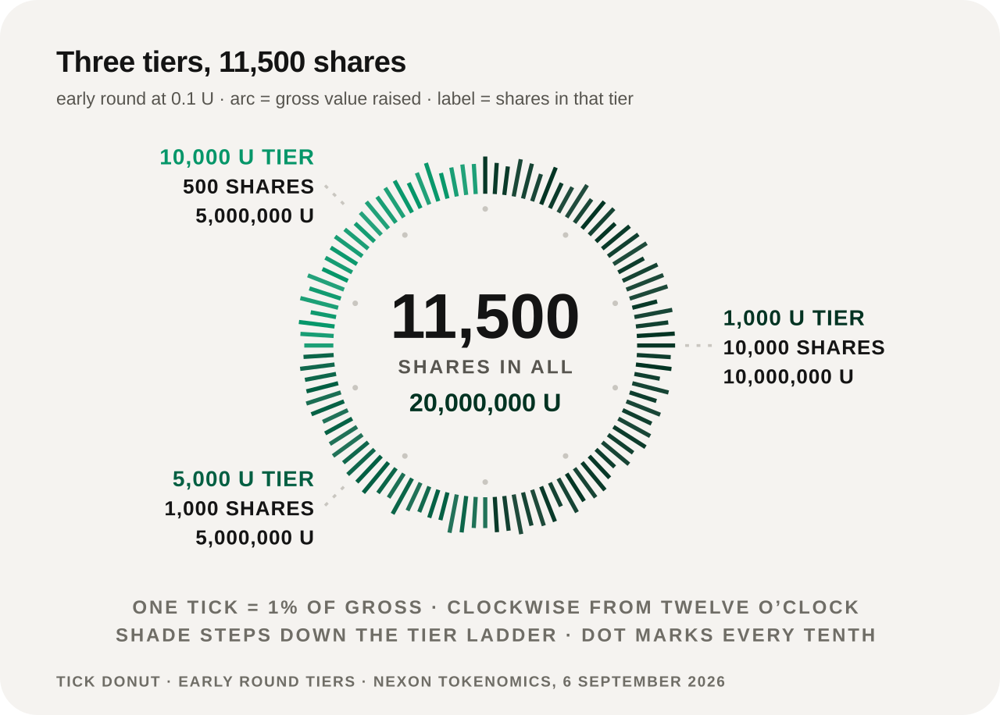
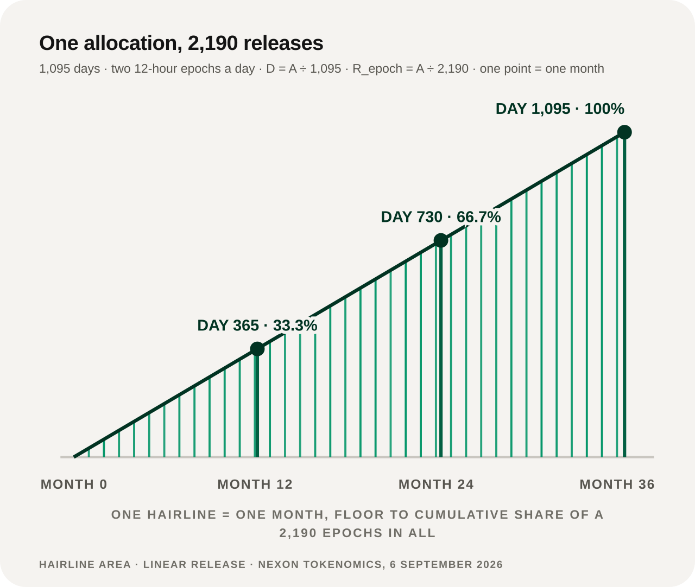

# Distribution & Release

## Pricing and rounds

| Stage | Pricing mechanism | Release |
|---|---|---|
| **Early round** | Fixed at `0.1 U`, in capped tiers | Enters the common 1,095-day release from TGE |
| **TGE** | Guide price `1.0 U`; the NEX spot market opens | Linear release begins |
| **Later rounds** | Issued at a discount to the prevailing market price, disclosed per round | Release begins T+1 |

## The three early tiers

<figure><figcaption>Three tiers, 11,500 shares, 20 million U in total. The larger the ticket, the fewer the shares</figcaption></figure>

| Order size | Shares | Tier total |
|---:|---:|---:|
| 1,000 U | 10,000 | 10,000,000 U |
| 5,000 U | 1,000 | 5,000,000 U |
| 10,000 U | 500 | 5,000,000 U |
| **Total** | **11,500** | **20,000,000 U** |

At the early price of `0.1 U`, 20 million U corresponds to 200 million EXON entering the same release curve.

## Linear release

An allocation `A` releases over **1,095 days**, in two 12-hour epochs a day, for **2,190 releases**:

```text
D = A ÷ 1,095                  released per day
R_epoch = D ÷ 2 = A ÷ 2,190    released per epoch
```

<figure><figcaption>The release is even: a third at one year, two thirds at two, complete on day 1,095</figcaption></figure>

Released EXON enters the spot account and can be held or traded.


**The release curve is a straight line, not a staircase.** There is no cliff unlock and no acceleration phase. The share released at any moment is simply the days elapsed divided by 1,095.


## Not yet published

* The numerical EXON total supply;
* the complete team, ecosystem, Treasury and market allocation;
* the initial circulating supply;
* later-round size, discount and per-account cap;
* final TGE and round dates.

These stay [Open](../open-parameters/README.md) (OP-T01, OP-T02, OP-T03, OP-T05), and no other document fills them in.

*Previous: [EXON — Circulation Engine](exon.md) · Next: [Staking & Returns](staking-and-returns.md)*
