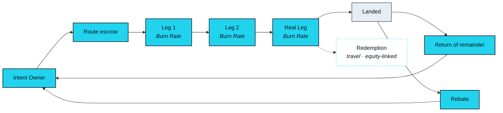

# EXON — Fuel and Unit of Settlement

> EXON is spent, never bonded: it is the fuel and settlement unit of every executed intent. Collateral is not fuel — which is exactly why they cannot be one asset.

## Spent, never bonded

An executed Intent has costs that have nothing to do with trust. Each leg must be priced in a common unit so the agent can compare routes across three markets. Each leg consumes something when it runs — venue fees, executor fees, the cost of the Rail itself. And the whole must clear across several systems that share no ledger. EXON is the unit in which all of that is priced, consumed and returned. It exists inside Routes, and it has no role outside them.

That is what "fuel" means here, and it is the only meaning this paper gives the word. Fuel is bought for a journey, consumed by the journey, and whatever is left goes back in the tank. It is not kept for its own sake, it is not a claim on anything, and it confers no standing. Properties of that kind belong to the other ledger, and they are described on the other ledger's page.

## One Intent, start to finish



### Fund
The Route preview states, in EXON, what this Route is expected to consume. You fund it from your own account, and nothing is drawn until you approve.


### Escrow
On approval, that EXON moves into a Route-scoped escrow. It is committed to this Route and to no other, and it is the only EXON the Route may touch.


### Burn Rate, leg by leg
As each leg executes, it consumes its portion from escrow. **Burn Rate** is the EXON one Intent's execution consumes. What a leg of a given type consumes is an Open Parameter ([OP-13](../open-parameters/README.md)). Consumed EXON is not destroyed: it is settled onward to the parties who executed the leg and to the Rail, in a split that is an Open Parameter ([OP-11](../open-parameters/README.md)).


### Return
When the Route reaches Landed — or Unwound, if Rollback ran — whatever remains in escrow returns to you. A leg that never ran consumes nothing. A leg that ran and was unwound consumes what its execution and its unwind cost, on the same schedule.


### Rebate
After the Route closes, a portion of what it consumed is credited back to you as **Rebate**, in EXON, against future Routes. Rebate is the first EXON mechanism you can verify end to end on a single receipt, which is why it comes first in the list below. Its schedule is an Open Parameter ([OP-12](../open-parameters/README.md)).




**Burn Rate means consumed, not destroyed.** The EXON a Route consumes is settled onward — to Leg Executors, to Rail operations, to the Protocol Reserve and to the Rebate pool. It leaves the Route; it does not leave circulation. Nothing on this page describes a reduction of supply, and no sentence in it should be read as one.


## Four uses, in order of verifiability

The uses are listed in the order in which you will be able to check them for yourself, from a single receipt to a full Route across three markets.

| Use | What it is | Who executes | Status |
|---|---|---|---|
| **Rebate** | Fee offset, credited in EXON against future Routes | The Settlement Rail | `In development` |
| **Settlement Rail** unit | Every leg of every Route is priced and settled in EXON | The Settlement Rail, with Leg Executors | `In development` |
| **Redemption** · travel redemption | An Intent whose Real Leg is a booking: EXON is consumed on the Rail, the supplier delivers the booking | A supplier on the Marketplace | `Roadmap` |
| **Redemption** · equity-linked settlement | An Intent whose capital-market leg is executed by a licensed third party; NEXON never brokers securities | A licensed third party ([OP-24](../open-parameters/README.md)) | `Roadmap` |
| **Early participation round** | The asset of any early participation round, if one is held. Whether one is held, and on what terms, is open | — | `Open` ([OP-23](../open-parameters/README.md)) |

**Redemption** is the collective name for the scenarios in which EXON is consumed for a real-world outcome — travel redemption and equity-linked settlement among them. This paper describes the mechanism and the status of each and nothing further: no target, no supplier, no partner. The last row describes a structure, not an offer.

## Where the value comes from

EXON's source of value is how many Intents the network executes each day. Every Route consumes some; the more Routes, the more consumed; nothing else on the Rail creates demand for it. The analogies are an electricity bill and a road toll: you pay for what you use, when you use it, and you are not asked to think about it otherwise. In three words: built to use.

## Where EXON circulates

EXON is issued on BNB Smart Chain (BSC). It is designed to circulate within the NEX ecosystem as well as on the Settlement Rail, and it is not an exchange token — not NEX's, and not a claim on NEX. Any venue where EXON trades, and when, is announced through official channels only; this paper names none.

## What EXON does not do

EXON confers no Capacity, no Depth and no Seat. It carries no governance weight, however much of it a participant has spent. It is not described anywhere in this paper as scarce, as a store of value or as something to keep, because none of those describes fuel. Every property of that kind lives on the Bond ledger, and is described on [XO's page](xo.md).


**Scope of this section.** Commits to: EXON is spent, never bonded; it lives inside a Route as escrow, Burn Rate, return and Rebate; Burn Rate is consumption, not destruction. Does not commit to: any Burn Rate figure, fee split, Rebate schedule, issuance policy or emission rate, or any Redemption partner or target. Open items: [OP-04 · OP-05 · OP-11 · OP-12 · OP-13 · OP-23 · OP-24](../open-parameters/README.md).


*Spine: [The Translator](../02-the-translator/README.md) · Next: [Distribution & Emission](distribution.md)*
