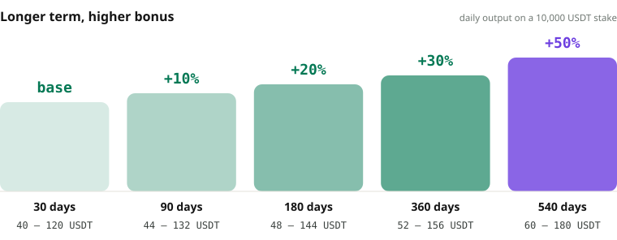
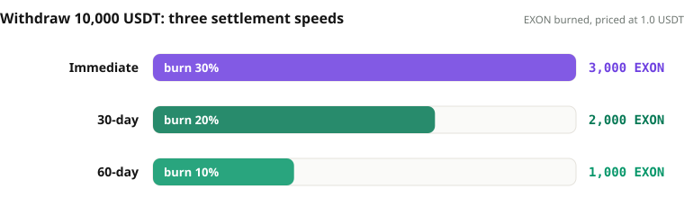
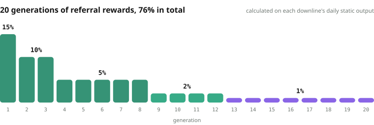

# Staking & Returns

A staking deposit is swapped into XO and starts earning at once. **Settlement every 12 hours, 0.3% – 1.0% each time, at 08:00 and 20:00 Beijing time, twice a day.** Rewards land directly in XO.

```text
Per settlement = staked amount × (0.3% – 1.0%) × (1 + term bonus)
Per day        = per settlement × 2
```

1,000 USDT staked earns 6 – 20 USDT a day; on the 540-day term with its +50% bonus, 9 – 30 USDT a day.

## Five terms <a href="#five-terms" id="five-terms"></a>

<figure><figcaption>The longer the term, the higher the bonus — set by term alone, never by amount</figcaption></figure>

| Term | Bonus | 1,000 USDT staked · per day | 10,000 USDT staked · per month | At maturity | Cumulative lock |
|---:|---:|---:|---:|---|---:|
| 30 days | base | 6 – 20 USDT | 1,800 – 6,000 USDT | Day-31 exit window | 1,200 days |
| 90 days | +10% | 6.6 – 22 USDT | 1,980 – 6,600 USDT | Rolls into the next term | 1,170 days |
| 180 days | +20% | 7.2 – 24 USDT | 2,160 – 7,200 USDT | Rolls into the next term | 1,080 days |
| 360 days | +30% | 7.8 – 26 USDT | 2,340 – 7,800 USDT | Rolls into the next term | 900 days |
| 540 days | +50% | 9 – 30 USDT | 2,700 – 9,000 USDT | Principal returned | 540 days |

## Exit and renewal <a href="#exit-and-renewal" id="exit-and-renewal"></a>

* **30-day term**: day 31 is the exit window — principal plus 30 days of rewards, no penalty. Miss the window and the order renews automatically, 90 → 180 → 360 → 540 days, for a cumulative lock of 1,200 days.
* **540-day term**: one step, +50% bonus, and a cumulative lock of only 540 days — the shortest lock and the largest bonus.
* Minimum order 100 USDT; once 100 USDT of rewards has accrued it can be staked as a new order, and the principal keeps compounding.

## Withdrawal and burn <a href="#withdrawal-and-burn" id="withdrawal-and-burn"></a>

Rewards can be withdrawn at any time, through one of three settlement speeds — the faster the settlement, the larger the burn:

<figure><figcaption>How much EXON each settlement speed burns on a 1,000 USDT withdrawal</figcaption></figure>

| Settlement | Burned | EXON burned on a 1,000 USDT withdrawal (at 1.0 USDT) |
|---|---:|---:|
| Immediate | 30% | 300 |
| 30-day linear | 20% | 200 |
| 60-day linear | 10% | 100 |

What burns is EXON from the fuel wallet, gone from circulation for good. If the fuel wallet holds enough, settle immediately; if not, pick a slower settlement or top up fuel through the private sale. Static rewards, referral rewards and leadership bonuses each burn on every withdrawal.

## Referral rewards: 20 generations, 76% in total <a href="#referral-rewards-20-generations" id="referral-rewards-20-generations"></a>

Referral rewards are calculated on each downline's daily static output, across up to 20 generations, settled in the same cycle as static rewards and always paid in XO.

<figure><figcaption>15% on the first generation, all the way down to the twentieth</figcaption></figure>

| Generation | Rate | Unlock: own stake | Unlock: direct referrals (cumulative) |
|---|---:|---:|---:|
| Gen 1 | 15% | 100 USDT | 4, each order ≥ 100 USDT |
| Gen 2 – 3 | 10% | 100 USDT | 4 |
| Gen 4 | 5% | 100 USDT | 4 |
| Gen 5 – 8 | 5% | 500 USDT | 8, each order ≥ 500 USDT |
| Gen 9 – 12 | 2% | 1,000 USDT | 12, each order ≥ 1,000 USDT |
| Gen 13 – 16 | 1% | 2,000 USDT | 16, each order ≥ 1,000 USDT |
| Gen 17 – 20 | 1% | 5,000 USDT | 20, each order ≥ 1,000 USDT |

## Leadership bonuses: V1 – V12 on the level differential <a href="#leadership-bonuses-v1-v12" id="leadership-bonuses-v1-v12"></a>

Leadership bonuses are paid as a **Differential Matching Bonus**: your rate minus your downline's rate. Assessment is cumulative on deposits — the largest leg plus all other legs combined — and a level once reached is never lost; from V6 upward, two separate legs must each produce the next level down.

| Level | Own stake | Largest leg | Other legs combined | Rate |
|---|---:|---:|---:|---:|
| V1 | 500 USDT | 20,000 USDT | 10,000 USDT | 1% – 15% |
| V2 | 1,000 USDT | 30,000 USDT | 20,000 USDT | 16% – 25% |
| V3 | 2,000 USDT | 100,000 USDT | 50,000 USDT | 26% – 35% |
| V4 | 3,000 USDT | 200,000 USDT | 100,000 USDT | 36% – 45% |
| V5 | 5,000 USDT | 500,000 USDT | 200,000 USDT | 46% – 55% |
| V6 | 6,000 USDT | 2,000,000 USDT | 2 × V5 teams | 56% – 65% |
| V7 | 7,000 USDT | 5,000,000 USDT | 2 × V6 teams | 66% – 75% |
| V8 | 8,000 USDT | 8,000,000 USDT | 2 × V7 teams | 76% – 85% |
| V9 | 9,000 USDT | 10,000,000 USDT | 2 × V8 teams | 86% – 100% |
| V10 | 13,000 USDT | 20,000,000 USDT | 2 × V9 teams | global pool 20% |
| V11 | 17,000 USDT | 30,000,000 USDT | 2 × V10 teams | global pool 30% |
| V12 | 20,000 USDT | 50,000,000 USDT | 2 × V11 teams | global pool 50% |

V10 – V12 share a global pool of 3% of all XO deposits, weighted 20 / 30 / 50 and split equally within each level. Referral rewards and leadership bonuses burn EXON from the fuel wallet on withdrawal in the same way.


**Every order and every settlement records the parameter version it ran under.** The per-settlement range, term bonuses and leadership execution rates are set by market stage; later adjustments never rewrite historical accruals, and the interface tells the user which version governs their order.


*Previous: [Distribution & Release](distribution.md) · Next: [Worked Examples](worked-examples.md)*
