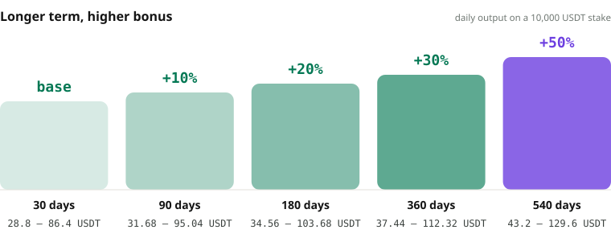
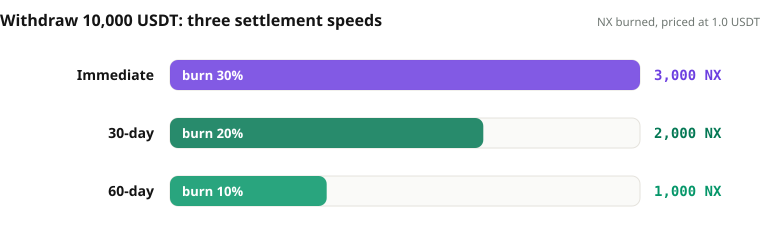
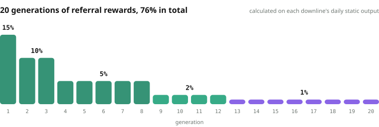

# Staking & Returns

28% of a staking deposit buys NX at the 1 USDT equivalent and is held as fuel; the other **72% is swapped into XO and enters staking — that 72% is the interest base**. **Settlement every 12 hours, 0.2% – 0.6% each time, twice a day — 0.4% – 1.2% across the day.** Static yield lands directly in XO.

```text
Interest base  = deposit × 72%
Per settlement = interest base × (0.2% – 0.6%) × (1 + term bonus)
Per day        = per settlement × 2
```

10,000 USDT deposited gives a 7,200 USDT interest base and earns 28.8 – 86.4 USDT a day; on the 540-day term with its +50% bonus, 43.2 – 129.6 USDT a day. What maturity pays, and how far reinvesting the rewards takes it, is Example B in [Worked Examples](worked-examples.md): up to 10.7 × the principal on the 540-day term.

## Five terms <a href="#five-terms" id="five-terms"></a>

<figure><figcaption>The longer the term, the higher the bonus — set by term alone, never by amount</figcaption></figure>

| Term | Bonus | 10,000 USDT deposited · per day | 10,000 USDT deposited · per month | At maturity | Cumulative lock |
|---:|---:|---:|---:|---|---:|
| 30 days | base | 28.8 – 86.4 USDT | 864 – 2,592 USDT | Back at maturity | 1,200 days |
| 90 days | +10% | 31.7 – 95 USDT | 950 – 2,851 USDT | Rolls into the next term | 1,170 days |
| 180 days | +20% | 34.6 – 103.7 USDT | 1,037 – 3,110 USDT | Rolls into the next term | 1,080 days |
| 360 days | +30% | 37.4 – 112.3 USDT | 1,123 – 3,370 USDT | Rolls into the next term | 900 days |
| 540 days | +50% | 43.2 – 129.6 USDT | 1,296 – 3,888 USDT | Principal returned | 540 days |

## Exit and renewal <a href="#exit-and-renewal" id="exit-and-renewal"></a>

* **30-day term**: principal plus 30 days of rewards come back at maturity, no penalty. Left in place, the order renews automatically, 90 → 180 → 360 → 540 days, for a cumulative lock of 1,200 days.
* **540-day term**: one step, +50% bonus, and a cumulative lock of only 540 days — the shortest lock and the largest bonus.
* Minimum order 100 USDT; rewards can be reinvested as they land, and the principal keeps compounding.

## Withdrawal and burn <a href="#withdrawal-and-burn" id="withdrawal-and-burn"></a>

Rewards can be withdrawn at any time, through one of three settlement speeds — the faster the settlement, the larger the burn:

<figure><figcaption>How much NX each settlement speed burns on a 10,000 USDT withdrawal</figcaption></figure>

| Settlement | Burned | NX burned on a 10,000 USDT withdrawal (at 1.0 USDT) |
|---|---:|---:|
| Immediate | 30% | 3,000 |
| 30-day linear | 20% | 2,000 |
| 60-day linear | 10% | 1,000 |

What burns is fuel NX, gone from circulation for good. If the fuel holds enough, settle immediately; if not, pick a slower settlement. Static yield burns on every withdrawal; referral and leadership rewards are paid in NX and burn no fuel.

## Referral rewards: 20 generations, 76% in total <a href="#referral-rewards-20-generations" id="referral-rewards-20-generations"></a>

Referral rewards are calculated on each downline's daily static output, across up to 20 generations, settled in the same cycle as static rewards and always paid in NX.

<figure><figcaption>15% on the first generation, all the way down to the twentieth</figcaption></figure>

| Generation you collect | Rate for that generation | Own stake | Qualified direct referrals (cumulative) | Minimum stake of each added referral |
|---|---:|---:|---:|---:|
| Gen 1 | 15% | 100 USDT | 1 | ≥ 100 USDT |
| Gen 2 | 10% | 100 USDT | 2 | ≥ 100 USDT |
| Gen 3 | 10% | 100 USDT | 3 | ≥ 100 USDT |
| Gen 4 | 5% | 100 USDT | 4 | ≥ 100 USDT |
| Gen 5 | 5% | 500 USDT | 5 | ≥ 500 USDT |
| Gen 6 | 5% | 500 USDT | 6 | ≥ 500 USDT |
| Gen 7 | 5% | 500 USDT | 7 | ≥ 500 USDT |
| Gen 8 | 5% | 500 USDT | 8 | ≥ 500 USDT |
| Gen 9 | 2% | 1,000 USDT | 9 | ≥ 1,000 USDT |
| Gen 10 | 2% | 1,000 USDT | 10 | ≥ 1,000 USDT |
| Gen 11 | 2% | 1,000 USDT | 11 | ≥ 1,000 USDT |
| Gen 12 | 2% | 1,000 USDT | 12 | ≥ 1,000 USDT |
| Gen 13 | 1% | 2,000 USDT | 13 | ≥ 1,000 USDT |
| Gen 14 | 1% | 2,000 USDT | 14 | ≥ 1,000 USDT |
| Gen 15 | 1% | 2,000 USDT | 15 | ≥ 1,000 USDT |
| Gen 16 | 1% | 2,000 USDT | 16 | ≥ 1,000 USDT |
| Gen 17 | 1% | 5,000 USDT | 17 | ≥ 1,000 USDT |
| Gen 18 | 1% | 5,000 USDT | 18 | ≥ 1,000 USDT |
| Gen 19 | 1% | 5,000 USDT | 19 | ≥ 1,000 USDT |
| Gen 20 | 1% | 5,000 USDT | 20 | ≥ 1,000 USDT |

Every condition in the table applies to **the person collecting the reward**: an own stake at the tier, enough qualified direct referrals, and each added referral staking at least the minimum. Downline members have no conditions to meet, and their own static yield is never reduced. Each rate applies only to the people in that generation: direct referrals are generation 1 and pay 15%; the people they refer are generation 2 and pay 10%; and so on down to 1% on generation 20.

**Unlocking, by example:** with an own stake of 500 USDT and 6 qualified direct referrals — 4 staking 100 USDT or more and 2 staking 500 USDT or more — generations 1 – 6 are open; add 2 more referrals staking 500 USDT or more and generations 7 and 8 open too. For how the reward itself is computed, see Example D in [Worked Examples](worked-examples.md).

## Leadership bonuses: V1 – V12 on the level differential <a href="#leadership-bonuses-v1-v12" id="leadership-bonuses-v1-v12"></a>

Leadership bonuses are paid as a **Differential Matching Bonus**: your rate minus your downline's rate. Assessment is cumulative on deposits — the largest leg plus all other legs combined — and a level once reached is never lost; from V6 upward, two different regions must each produce the next level down.

| Level | Own stake | Largest leg | Other legs combined | Rate |
|---|---:|---:|---:|---:|
| V1 | 500 USDT | 20,000 USDT | 10,000 USDT | 1% – 15% |
| V2 | 1,000 USDT | 30,000 USDT | 20,000 USDT | 16% – 25% |
| V3 | 2,000 USDT | 100,000 USDT | 50,000 USDT | 26% – 35% |
| V4 | 3,000 USDT | 200,000 USDT | 100,000 USDT | 36% – 45% |
| V5 | 5,000 USDT | 500,000 USDT | 200,000 USDT | 46% – 55% |
| V6 | 6,000 USDT | 2,000,000 USDT | 2 × V5 teams | 56% – 65% |
| V7 | 7,000 USDT | 5,000,000 USDT | 2 × V6 teams | 66% – 75% |
| V8 | 8,000 USDT | 8,000,000 USDT | 2 × V7 teams | 76% – 85% |
| V9 | 9,000 USDT | 10,000,000 USDT | 2 × V8 teams | 86% – 100% |
| V10 | 13,000 USDT | 20,000,000 USDT | 2 × V9 teams | global pool (20% of 3%) |
| V11 | 17,000 USDT | 30,000,000 USDT | 2 × V10 teams | global pool (30% of 3%) |
| V12 | 20,000 USDT | 50,000,000 USDT | 2 × V11 teams | global pool (50% of 3%) |

V10 – V12 share a global pool of 3% of all XO deposits, weighted 20 / 30 / 50 and split equally within each level. Referral rewards and leadership bonuses are paid in NX and burn no fuel on withdrawal.

**X Points.** The daily condition for claiming dynamic rewards at each level, bought only with NX at 1 point = 10 USD of NX.

| Level | V1 | V2 | V3 | V4 | V5 | V6 | V7 | V8 | V9 | V10 | V11 | V12 |
|---|---|---|---|---|---|---|---|---|---|---|---|---|
| Daily use (points) | 0 | 0 | 1 | 2 | 3 | 5 | 7 | 10 | 15 | 20 | 25 | 30 |

* The quota refreshes every 24 hours; meet your level's daily quota to claim that day's platform rewards; miss it and that day's rewards cannot be claimed.
* Unused X Points burn on the spot that day; claiming the previous day's rewards later means making up the previous day's quota first.
* Every promotion grants 30 points and the balance is capped at 30 points; a newly promoted member gets a 3-month relief period at 50% of the level's standard rate, then the full 100% applies.
* Example: V8 to V9 — 30 points granted on promotion; V9's standard rate is 15 a day, 7.5 a day during relief, back to 15 a day after 3 months.

X Points govern dynamic rewards only — static yield and principal are untouched.


**Every order and every settlement records the parameter version it ran under.** The per-settlement range, term bonuses and leadership execution rates are set by market stage; later adjustments never rewrite historical accruals, and the interface tells the user which version governs their order.


*Previous: [Distribution & Release](distribution.md) · Next: [Worked Examples](worked-examples.md)*
