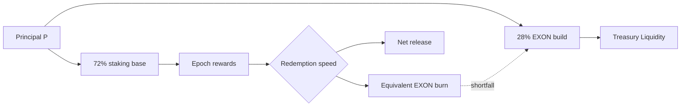

# Value Flows

The approved value loop has six connected mechanisms:

1. **Programmatic buy.** Every principal input routes 28% to an EXON spot purchase.
2. **Term lock.** The staking schedule rewards longer terms with higher weights.
3. **Fuel reserve.** Opening an order requires an EXON balance equal to 28% of order value; the balance remains with the user.
4. **Permanent burn.** Faster reward redemption destroys more equivalent EXON.
5. **Second purchase.** An insufficient reserve requires a spot purchase before redemption burn.
6. **Reinvestment.** Later rounds use a disclosed market discount and begin release T+1.

This is a demand-and-supply mechanism, not a price floor. Programmatic purchases and burns may be outweighed by releases, sales, low liquidity, market conditions or rule changes.

*Previous: [Worked Examples](worked-examples.md) · Next: [Governance](../06-governance/README.md)*
