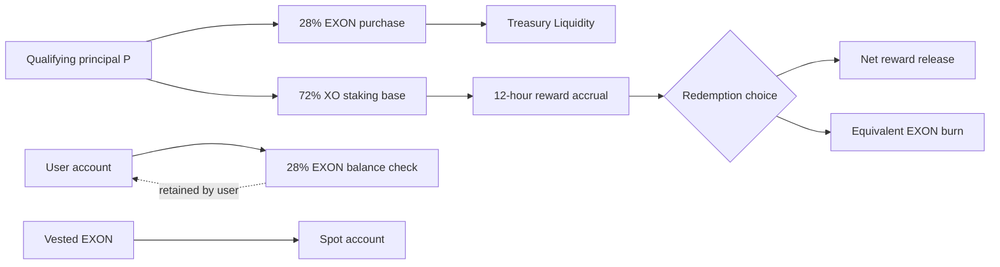

# Value Flows

The NEXON economy contains several flows that are easy to collapse into one story. Keeping them separate is essential: principal allocation is not a fee; a user balance check is not Treasury custody; an accrued reward is not realized cash; a burn does not provide assured price support; and the Roadmap product loop is not the current token flow.

## Flow 1 — qualifying principal

For a qualifying order `P`, the capital path is:

```text
B = 0.28 × P  → EXON spot purchase → Treasury Liquidity
S = 0.72 × P  → XO staking and reward/PV base
B + S = P
```

The `B` purchase executes at the prevailing EXON price, so the token amount acquired is not fixed by the U value alone. `S` becomes the base for static and dynamic reward accounting inside the Staking Platform.

## Flow 2 — user-held fuel balance

Opening the order additionally requires:

```text
F = 0.28 × P of EXON value
```

`F` remains in the user's account. It is checked for qualification and should be recorded separately from the `B` amount owned by Treasury Liquidity. If EXON's price changes, the quantity corresponding to the U-value requirement may change. A shortfall stops the order; it does not authorize an automatic sale of another asset.

## Flow 3 — time and reward accrual

The XO staking base enters the chosen 30/90/180/360/540-day term. Longer terms apply weights of 1.00/1.10/1.20/1.35/1.50. The Staking Platform calculates a reward every 12 hours:

```text
Epoch Reward = (S × 200% × w) ÷ (365 × 2)
```

This is an accounting flow under the current parameter version. Accrued or pending rewards should not be displayed as though they were already redeemed, liquid or immune to platform and market risk.

## Flow 4 — vesting release

An EXON allocation `A` releases linearly over 1,095 days and 2,190 epochs:

```text
D = A ÷ 1,095
R_epoch = A ÷ 2,190
```

Released EXON enters the spot account and can be held or traded if access and liquidity are available. Release expands tradable availability and can create selling pressure. It does not guarantee execution at the guide price or at the assumptions used in a worked example.

## Flow 5 — reward redemption and equivalent burn

For pending reward `W`, the user selects a release speed:

| Choice | Burn rate `b` | Net rate | Economic action |
|---|---:|---:|---|
| T+0 | 30% | 70% | Immediate net release plus equivalent EXON destruction |
| 30D | 15% | 85% | Linear release plus equivalent EXON destruction |
| 60D | 0% | 100% | Linear release with no EXON burn |

```text
Net = W × (1 − b)
Burn = W × b
```

The burn is permanent. If the user lacks enough EXON for a burn-bearing choice, the mechanism may require a second spot purchase. Price and liquidity affect how much EXON can be obtained and at what cost.

## Flow 6 — later-round participation

Later rounds may use a disclosed discount to the prevailing market price and begin release T+1. Round size, discount, caps and final timing are unpublished and must be announced per round. Reinvestment is a new participation decision under new terms, not an automatic continuation of a prior outcome.

## Current economic loop



The arrows do not establish a guaranteed circular economy. Programmatic purchases and burns may be outweighed by vesting release, sales, low demand, limited liquidity, fees, technical failure or rule change.

## Roadmap product loop

The broader narrative adds a separate user-experience loop: Social discovery, Wallet decision, PayFi routing, Marketplace/Card use and data or relationships returning under user control. Future EXON payment, fee or consumption use could connect to that loop only after product terms are published. Future XO participation or ecosystem rights could connect only after their rules are published.

The Roadmap loop should therefore be modeled independently from the current cash and token flows. It may create utility; this paper does not quantify future demand, revenue or token price impact from products that are not live.

## Reconciliation questions

At any moment, an audit should be able to answer: who holds the asset, which ledger records it, which parameter version applies, whether a value is quoted or settled, whether a reward is pending or released, whether a burn is required and whether the real-world leg is paid or fulfilled. If one answer is missing, the route is not fully reconciled.


This mechanism is a demand-and-supply design, not a price floor or return guarantee. EXON market conditions and all operational, custody, legal and technical risks remain. Participants may lose some or all principal.


*Previous: [Worked Examples](worked-examples.md) · Next: [Governance](../06-governance/README.md)*
