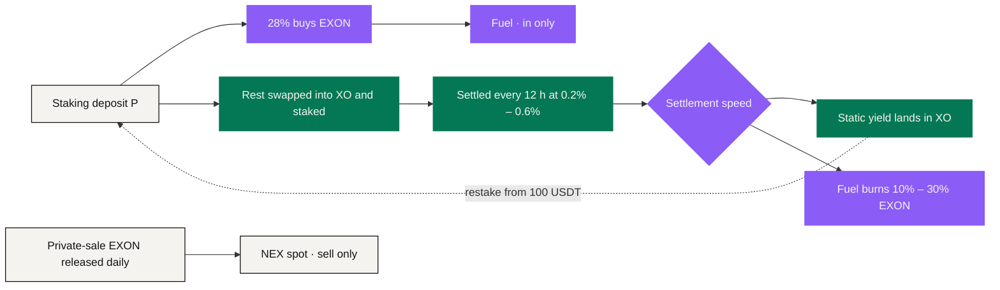

# Value Flows

NEXON's economy has several flows. **Keeping them on separate ledgers is the precondition for reading the mechanism; seen together, they are the engine behind EXON.**

<figure><figcaption>The path of a deposit: from staking to burn, and on to the next order</figcaption></figure>

## Flow ① The deposit split <a href="#flow-1-the-deposit-split" id="flow-1-the-deposit-split"></a>

```text
Fuel  = 0.28 × P   → buys EXON at 1 USDT each → fuel
Stake = the rest   → swapped into XO → staked, settled every 12 hours
```

Deposit 10,000 USDT: 2,800 EXON are held as fuel, the rest is swapped into XO and earns 40 – 120 USDT a day. **Every deposit buys.**

## Flow ② Fuel <a href="#flow-2-the-fuel-wallet" id="flow-2-the-fuel-wallet"></a>

Fuel only ever fills: no withdrawals, no transfers, burned only when static yield is withdrawn. It is a separate ledger from the XO under stake — the first can only be burned, the second earns and pays static yield.

## Flow ③ Time and settlement <a href="#flow-3-time-and-settlement" id="flow-3-time-and-settlement"></a>

The staked XO enters the chosen term of 30 / 90 / 180 / 360 / 540 days, with bonuses of base / +10% / +20% / +30% / +50%. Settlement every 12 hours:

```text
Per settlement = staked amount × (0.2% – 0.6%) × (1 + bonus)
```

Static yield lands in XO and can be withdrawn at any time; rewards can be reinvested as they land — time compounding.

## Flow ④ Linear release <a href="#flow-4-linear-release" id="flow-4-linear-release"></a>

Private-sale EXON is released daily from listing day, over 1,095 days and 2,190 payouts:

```text
D = A ÷ 1,095
R_epoch = A ÷ 2,190
```

Released EXON lands in the spot account, to hold or to sell on NEX — sell only, never buy. The whole private sale releases a fixed 182.6k EXON a day.

## Flow ⑤ Withdrawal and burn <a href="#flow-5-withdrawal-and-burn" id="flow-5-withdrawal-and-burn"></a>

Withdraw rewards `W` and choose a settlement speed:

| Settlement | Burned `b` | Economic action |
|---|---:|---|
| Immediate | 30% | Yield lands at once; fuel burns EXON worth 30% |
| 30-day linear | 20% | Paid daily over 30 days; 20% burns |
| 60-day linear | 10% | Paid daily over 60 days; 10% burns |

```text
Burn = W × b ÷ P_EXON
```

The burn is permanent. **Every withdrawal burns.**

## Flow ⑥ Referral rewards and leadership bonuses <a href="#flow-6-referral-rewards-and-leadership-bonuses" id="flow-6-referral-rewards-and-leadership-bonuses"></a>

Referral rewards are calculated on each downline's daily static output, up to 20 generations and 76% in total; leadership bonuses V1 – V12 are paid on the level differential. Both settle in the same cycle as static rewards, are always paid in EXON, and burn no fuel on withdrawal. Each level buys X Points with EXON daily (V1 and V2 use 0; 1 point = 10 USD of EXON); meet the day's quota to claim the day's platform rewards.

## One flywheel <a href="#one-flywheel" id="one-flywheel"></a>



<figure><figcaption>Buying never stops, burning never stops, the release schedule is fixed, and the float only gets smaller</figcaption></figure>

The more is staked, the more is bought; the more is withdrawn, the more is burned; the release schedule is fixed. From 50 million USDT staked, a year's burn exceeds a year's release; at 100 million, a single day burns up to 360K EXON — 2.0 × the daily release.

## The long-term product loop <a href="#the-long-term-product-loop" id="the-long-term-product-loop"></a>

The wider narrative overlays a second, **user-experience loop**: social discovery → wallet decision → PayFi route → marketplace / card use → data and relationships flowing back under the user's control. EXON's uses in trading, payment and exchange connect as the five entry points go live (Roadmap), and each one that connects adds another way EXON is consumed.

## Six questions reconciliation must answer <a href="#six-questions-reconciliation-must-answer" id="six-questions-reconciliation-must-answer"></a>

At any moment, an audit should be able to answer:

1. Is this asset XO under stake, or fuel EXON?
2. Which parameter version applies?
3. Is this reward pending withdrawal, or already settled?
4. Which settlement speed was chosen, and how much EXON burned?
5. Was this EXON released from the private sale, paid as a dynamic reward, or bought as fuel?
6. Is the real-world leg paid, or fulfilled?

*Previous: [Worked Examples](worked-examples.md) · Next: [Governance](../06-governance/README.md)*
