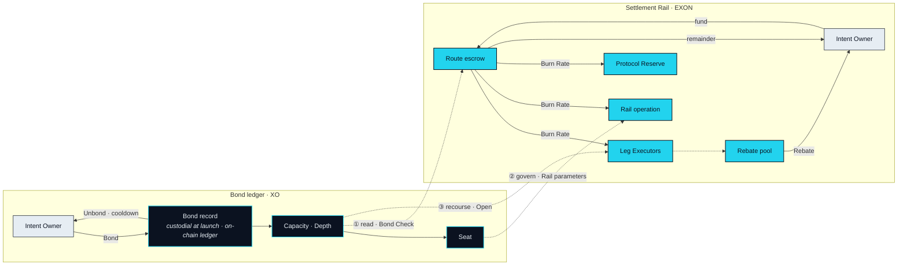

# Value Flows

> Swap "XO" for "EXON" in any sentence. If it still reads true, the sentence is wrong.

The previous pages described each asset on its own ledger and on its own terms. This page puts the two ledgers on one map: who the parties are, which way each asset moves, the three places where the ledgers come into contact, and the six rules that any later version of this paper — including the one that fills in the numbers — must keep.

## Six roles

| Role | What it does | Which ledger it touches |
|---|---|---|
| **Intent Owner** | States an Intent, approves a Route, funds its escrow, receives its Landing Receipt and its Rebate | Both, from opposite sides: bonds on one, spends on the other |
| **Nexus Agent** | Parses, routes, checks, executes and lands, under the Owner's Capacity and approval | Reads the Bond ledger once; instructs the Settlement Rail |
| **Leg Executor** | Executes one leg — a venue, a licensed third party, a supplier — and confirms it | Settlement Rail: is paid from escrow for the leg it executed |
| **Seat holder** | Holds standing reached through Bond; votes on the parameters governance controls | Bond ledger only |
| **Protocol Reserve** | The protocol's treasury: one destination of EXON as it is consumed through the Rail | Settlement Rail only |
| **Settlement Rail** | The unit and the machinery in which every leg is priced, escrowed, consumed and returned | Settlement Rail — it *is* the ledger |

No role appears on both ledgers in the same capacity. The Intent Owner is the only role that touches both, and does so with two different assets in two different verbs.

## Two flows



**Status** · `In development`

EXON moves in a loop that begins and ends with the Intent Owner, and every stop on it is a Route event.

1. The Owner funds a Route; on approval the EXON moves into that Route's escrow.
2. As each leg lands, its Burn Rate is consumed from escrow and settled onward: to the Leg Executor that ran the leg, to the operation of the Rail, and to the Protocol Reserve. The split between them is an Open Parameter ([OP-11](../open-parameters/README.md)).
3. When the Route closes, whatever escrow was not consumed returns to the Owner.
4. After close, a Rebate is credited to the Owner from a pool fed by consumed Burn Rate, on a schedule that is an Open Parameter ([OP-12](../open-parameters/README.md)).

Consumed EXON leaves the Route. It does not leave circulation.



**Status** · `In development`

XO moves once, stays, and moves back. None of its stops is a Route event.

1. The Owner bonds XO. At launch the record is a custodial product within NEX; the on-chain Bond ledger it migrates to is the protocol record ([OP-31](../open-parameters/README.md)).
2. Capacity is derived from the Bond and its Depth. Each approved Route places a Capacity Reservation — a mark on the record, not a movement of XO — and releases it on close.
3. When Capacity and Depth both cross threshold, a Seat is registered.
4. On Unbond, a cooldown runs, Capacity decays, and the XO returns to the Owner.

XO is never paid to a Leg Executor, never enters escrow, and never leaves the Bond record while a Route runs.



**Status** · `In development` · third contact `Open`

The two ledgers come into contact at exactly three points, and each contact is of a different kind.

**Read.** At Bond Check, the Settlement Rail asks the Bond ledger whether the Owner's Capacity covers the Route. The Bond ledger answers. Nothing moves in either direction.

**Govern.** Seat holders — standing reached through the Bond ledger — vote on the Rail's parameters: the Burn Rate table, the Rebate schedule, the fee split. Governance acts on the Rail's rules, never on its balances, and it is `Roadmap` until the Seat vote is in force ([Governance](../06-governance/README.md)).

**Recourse.** When a Route cannot fully unwind, the shortfall is met first from that Route's EXON escrow. Only if escrow is exhausted does it draw on the XO that stood behind that Route's Capacity Reservation, and never beyond it. Whether this second step applies at all is an Open Parameter ([OP-10](../open-parameters/README.md)). This is the one contact in which value could pass from the Bond ledger to the Rail, and it is bounded to a single Route.



One question the map raises is left open on purpose. Whether anything that reaches the Protocol Reserve is ever directed toward the Bond ledger — and if so, in what form — is [OP-12b](../open-parameters/README.md). The v1 design keeps the two ledgers apart at the Reserve as everywhere else, and no sentence in this paper describes EXON reaching a holder of XO on account of the XO held.

## Six invariants


**Any later version of this paper must keep these six.**

**I1.** XO never leaves the Bond record as payment for any leg. It is bonded and it is read.

**I2.** EXON never counts toward Capacity, Depth or a Seat. Spending confers no standing.

**I3.** Bond Check reads the Bond record and writes nothing to it.

**I4.** Burn Rate is consumption, not destruction: EXON that a Route consumes is settled onward and remains in circulation.

**I5.** Governance weight comes from a Seat and from nothing else; no quantity of EXON spent or held moves a vote.

**I6.** Swap "XO" for "EXON" in any sentence. If it still reads true, the sentence is wrong.


The first five are properties of the design. The sixth is a test of the prose, and it is the one that catches drift before a reader does. Every sentence on the two asset pages, and every sentence on this one, has been run through it.


**Scope of this section.** Commits to: six roles, two flows that never merge, three named points of contact, and six invariants binding on every later version. Does not commit to: the fee split, the Rebate schedule, the extent of Bond recourse, or any flow between the Protocol Reserve and the Bond ledger. Open items: [OP-10 · OP-11 · OP-12 · OP-12b · OP-31](../open-parameters/README.md).


*Spine: [The Translator](../02-the-translator/README.md) · Next: [Governance](../06-governance/README.md)*
