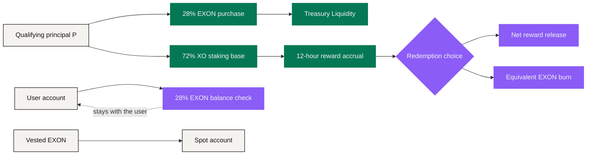

# Value Flows

The NEXON economy contains several flows that are easy to compress into a single story. **Keeping them apart is a precondition for reading the mechanism correctly.**

A principal split is not a fee. A user balance check is not Treasury custody. An accrued reward is not realized cash. A burn is not a price floor. A product loop is not the current token flow.

## Flow ① — qualifying principal

<figure><figcaption>Principal arrives and immediately forks: one path becomes the interest base, the other becomes EXON in Treasury</figcaption></figure>

```text
B = 0.28 × P   → EXON spot purchase → Treasury Liquidity
S = 0.72 × P   → XO staking and reward / PV base
B + S = P
```

`B` executes at the prevailing EXON price, so **the number of tokens acquired is not determined by the U amount alone**. `S` becomes the accounting base for static and dynamic rewards inside the Staking Platform.

## Flow ② — the fuel balance in the user's hands

Opening the order additionally requires:

```text
F = 0.28 × P of EXON value
```

`F` **stays in the user's account**. It is a qualification check, and it is booked separately from the `B` owned by Treasury Liquidity. When EXON's price moves, the quantity needed to satisfy the same U value moves with it. A shortfall stops the order — it does not trigger an automatic sale of another asset.

## Flow ③ — time and reward accrual

The XO staking base enters the chosen 30 / 90 / 180 / 360 / 540-day term, at weights of 1.00 / 1.10 / 1.20 / 1.35 / 1.50. The platform calculates every 12 hours:

```text
Epoch Reward = (S × 200% × w) ÷ (365 × 2)
```

This is an **accounting flow** under the current parameter version. Accrued or pending rewards should not be displayed as though they were already redeemed and liquid.

## Flow ④ — linear release

An EXON allocation `A` releases linearly over 1,095 days and 2,190 epochs:

```text
D = A ÷ 1,095
R_epoch = A ÷ 2,190
```

Released EXON enters the spot account and can be held or traded. **Release expands tradable supply**; it does not guarantee execution at the guide price or at the price assumed in a worked example.

## Flow ⑤ — reward redemption and equivalent burn

For pending reward `W`, the user selects a release speed:

| Choice | Burn rate `b` | Net rate | Economic action |
|---|---:|---:|---|
| T+0 | 30% | 70% | Immediate net release plus equivalent EXON destruction |
| 30D | 15% | 85% | Linear release plus equivalent EXON destruction |
| 60D | 0% | 100% | Linear release with no burn |

```text
Net  = W × (1 − b)
Burn = W × b
```

The burn is permanent. If the user does not hold enough EXON for a burn-bearing choice, the mechanism may require a second spot purchase first.

## Flow ⑥ — later-round participation

Later rounds are issued at a disclosed discount to the prevailing market price and begin releasing T+1. Round size, discount, caps and final timing are unpublished and announced per round.

**Reinvestment is a fresh participation decision under fresh terms** — not an automatic continuation of an earlier outcome.

## The current economic loop



The arrows describe **where capital and tokens go**, not a self-reinforcing circle. Programmatic purchases and burns act alongside vesting release, sales, demand, liquidity and fees — and not always in the same direction.

## The long-term product loop

The broader narrative adds a separate **user-experience loop**: discover in Social → decide in Wallet → route through PayFi → use in Marketplace or Card → data and relationships return under the user's control.

A future EXON payment, fee or consumption use connects to that loop only once product terms are published, and future XO participation or ecosystem rights only once their own rules are. **So the product loop should be modeled independently from today's capital and token flows.**

## Seven questions reconciliation must answer

At any moment, an audit should be able to answer:

1. Who holds this asset?
2. Which ledger records it?
3. Which parameter version applies?
4. Is this value quoted or settled?
5. Is this reward pending or released?
6. Is a burn required?
7. Is the real-world leg paid, or fulfilled?

**If one answer is missing, the route is not fully reconciled.**

*Previous: [Worked Examples](worked-examples.md) · Next: [Governance](../06-governance/README.md)*
