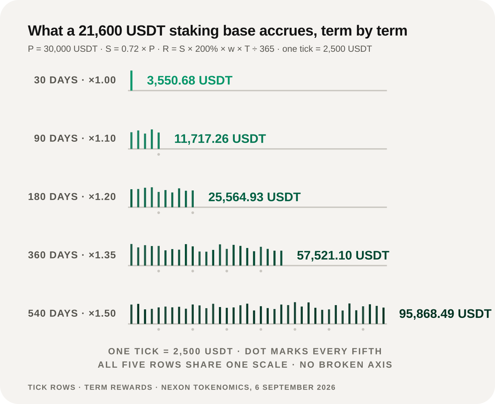

# Worked Examples

These three examples come from the approved economic model, and exist to **show the method of calculation**. Each one is a conditional calculation: every result states the price assumption it rests on, and a result may differ materially once that assumption changes.

## Example A — the release value of early-round EXON

An input of `30,000 U` at the early price of `0.1 U` acquires `300,000 EXON`.

```text
D = 300,000 ÷ 1,095 = 273.97 EXON/day
R_epoch = 273.97 ÷ 2 = 136.99 EXON/epoch
ROI_month = (D × P_market × 30) ÷ P_in × 100%
```

The release rate is fixed: **273.97 tokens a day, 136.99 every 12 hours.** That part rests on no assumption at all.

What it is worth does:

| Assumed market price | Monthly released value | Monthly ROI calculation |
|---:|---:|---:|
| 1.0 U | 8,219.18 U | 27.40% |
| 2.0 U | 16,438.36 U | 54.79% |

Under the `2.0 U` assumption, the static payback arithmetic is `30,000 ÷ 16,438.36 ≈ 1.83 months`.


**Both rows read the same release curve, multiplied by two different assumed prices.** The calculation itself excludes liquidity, slippage, fees, taxes and execution constraints, and it forecasts no price.


## Example B — a 30,000 U staking order

For `P = 30,000 U`: the build is `B = 8,400 U` and the staking base is `S = 21,600 U`. At a build price of `0.1 U`, `B` buys `84,000 EXON`.

<figure><figcaption>One 21,600 U base; across the five terms, the term-total parameter spans a factor of 27</figcaption></figure>

| Term | Weight | Per day | Per epoch | Term total |
|---:|---:|---:|---:|---:|
| 30 days | 1.00 | 118.36 U | 59.18 U | 3,550.68 U |
| 90 days | 1.10 | 130.19 U | 65.10 U | 11,717.26 U |
| 180 days | 1.20 | 142.03 U | 71.01 U | 25,564.93 U |
| 360 days | 1.35 | 159.78 U | 79.89 U | 57,521.10 U |
| 540 days | 1.50 | 177.53 U | 88.77 U | 95,868.49 U |

**Look at the per-day column**: from 118.36 to 177.53, a factor of 1.5 — exactly the spread of the weights. The 27× spread in the term totals comes mostly from time, not from weight.

The 540-day weight corresponds to a **300% effective APY parameter**. An early exit from the 30-day term returns **18,360–19,440 U** of the `21,600 U` principal base after the 15%–10% deduction.

## Example C — redeeming 1,000 U of rewards

<figure><figcaption>Only one variable separates the three lanes: how long you are willing to wait</figcaption></figure>

| Choice | Equivalent EXON permanently burned | Net received |
|---|---:|---:|
| T+0 | 300 U | 700 U |
| 30-day linear | 150 U | 850 U |
| 60-day linear | 0 U | 1,000 U |

The only variable that changes across the three lanes is **waiting time**. `Net = W × (1 − b)`, `Burn = W × b`.

*Previous: [Staking & Returns](staking-and-returns.md) · Next: [Value Flows](value-flows.md)*
