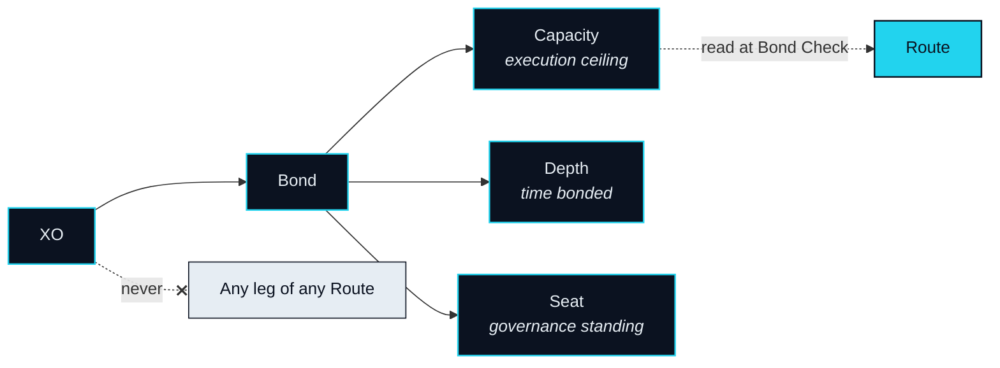

# XO — Collateral, Not Fuel

> XO never takes part in any single transaction. It is the precondition for that transaction to happen at all.

## Bonded, never spent

Before an agent may move money on your behalf, the network needs an answer to one question: on what grounds should it be trusted? NEXON puts that answer on a ledger. You bond XO, the Bond ledger records it, and from that record — and from nothing else — your agent's ceiling is derived. The Bond is not a fee, not a deposit against a specific purchase, and not a balance that a Route draws down. It is the standing condition under which Routes may be proposed at all.

### Where XO is bonded

At launch, XO is bonded through a custodial product within NEX, a licensed digital-asset exchange; the on-chain Bond ledger on BNB Smart Chain (BSC) is the protocol record it migrates to (OP-31). [Trust & Bonding](../03-architecture/trust-and-bonding.md) describes both. Wherever the record is held the rule is the same: XO is bonded, never spent, and any reward attached to the custodial product is the exchange's — floating, not guaranteed, and not a property of XO.

While a Route executes, XO does not move. It is not sent to a venue, not exchanged into another asset, not consumed by a leg. The Route reads the Bond ledger once, at Bond Check, and proceeds or does not. That is the whole of XO's involvement in any single Intent — which is to say, none.

## What a Bond gives

A Bond confers three things, and every later mention of XO in this paper resolves to one of them.



**Capacity** is the ceiling on what your agent may execute for you, conferred by your Bond. It rises with the size of the Bond and with its Depth, and it never falls because a Route ran. The function that maps Bond and Depth to Capacity is monotone in both — more of either never produces less Capacity. Its exact form is an Open Parameter ([OP-07](../open-parameters/README.md)).

When a Route is approved, the Capacity it needs is marked on the Bond ledger as a **Capacity Reservation** for the life of that Route, and released when the Route reaches Landed or Unwound. A Reservation is a mark, not a transfer: the XO stays where it is. It exists so that two Routes cannot lean on the same Capacity at once.

If a Route cannot be fully unwound, the Route's own escrow answers first. Whether, and how far, the XO behind the Reserved Capacity answers after that — Bond recourse — is an Open Parameter ([OP-10](../open-parameters/README.md)).


**Depth** is how long a Bond has been in place. It is the network's way of saying that the longer you are bonded, the better placed you are — and placement is exactly what it means: more Capacity per unit bonded, and earlier qualification for a Seat. The protocol pays nothing out for Depth. It ranks; it does not remit.

Depth is continuous while the Bond stands. Beginning an Unbond starts a cooldown during which Capacity decays toward zero (`Design Target`). The length of that cooldown, and what happens to accumulated Depth if an Unbond is cancelled, is an Open Parameter ([OP-08](../open-parameters/README.md)).


**Seat** is your standing in governance and in the ecosystem's tiers. A Seat is reached when Capacity and Depth are both above threshold — neither alone is enough — and it is the only source of governance weight in the network. Seat thresholds are an Open Parameter ([OP-09](../open-parameters/README.md)). What a Seat decides, and how, is the subject of [Governance](../06-governance/README.md).



A Bond may also confer priority in early participation rounds. Whether it does, and on what terms, is an Open Parameter ([OP-23](../open-parameters/README.md)); this paper states the possibility and nothing further.

## Where the value comes from

XO's source of value is how much trust collateral the network needs. Every Intent executed on someone's behalf must sit under a Capacity, and every Capacity must be backed by a Bond. As more people put agents to work, more Capacity has to be standing behind them. The link between XO and network activity therefore runs through standing, not throughput: XO is needed because it must be bonded, not because it is used.

The closest analogies are a margin deposit and an exchange seat — things you keep in place in order to be allowed to act, and which do nothing on their own. In three words: built to keep.

## Lifecycle

1. **Acquire.** XO is obtained. How supply, allocation and vesting are set is the subject of [Distribution & Emission](distribution.md) (OP-01 · OP-02 · OP-03).
2. **Bond.** XO is bonded — through the custodial product at launch, on the Bond ledger thereafter; Capacity is derived; your agent is activated.
3. **Reserved and released, per Route.** Each approved Route reserves the Capacity it needs and releases it on close. XO does not move.
4. **Depth accrues.** Time in Bond raises your placement.
5. **Seat threshold.** With Capacity and Depth both above threshold, a Seat is registered.
6. **Unbond and cooldown.** Unbonding starts the cooldown; Capacity decays; at its end, XO returns to your control.

## What XO does not do


**XO is not a payment or gas token.** It enters no payment. It offsets no fee — Rebate is an EXON mechanism. It carries no Redemption. It fuels no leg. It is bonded, and it is read.


The only point at which the Bond ledger and the Settlement Rail meet is Bond Check, and there the Bond ledger is only read. No entry on the Rail writes to a Bond. No Route settles in XO.

Depth: why longer is better without promising a return

The phrase "the longer bonded, the better placed" is deliberate. Depth is an input to two things: the Capacity function (OP-07) and Seat qualification (OP-09). Both are positions — where you stand relative to others and to the thresholds — not payments. A Bond of greater Depth may execute more and may govern; it is not remitted anything for the time it has stood. That distinction is what keeps XO on the Bond ledger and out of any sentence about return. Nothing in this paper pays out for Depth, and no sentence in it should be read as if it did.


**Scope of this section.** Commits to: XO is bonded, never spent; a Bond confers Capacity, Depth and Seat and nothing else; XO is read at Bond Check and enters no leg. Does not commit to: the Capacity function, the cooldown length, Seat thresholds, the extent of Bond recourse, or any supply, allocation or vesting figure. Open items: [OP-01 · OP-02 · OP-03 · OP-07 · OP-08 · OP-09 · OP-10 · OP-23 · OP-31](../open-parameters/README.md).


*Spine: [The Translator](../02-the-translator/README.md) · Next: [EXON — Fuel and Unit of Settlement](exon.md)*
