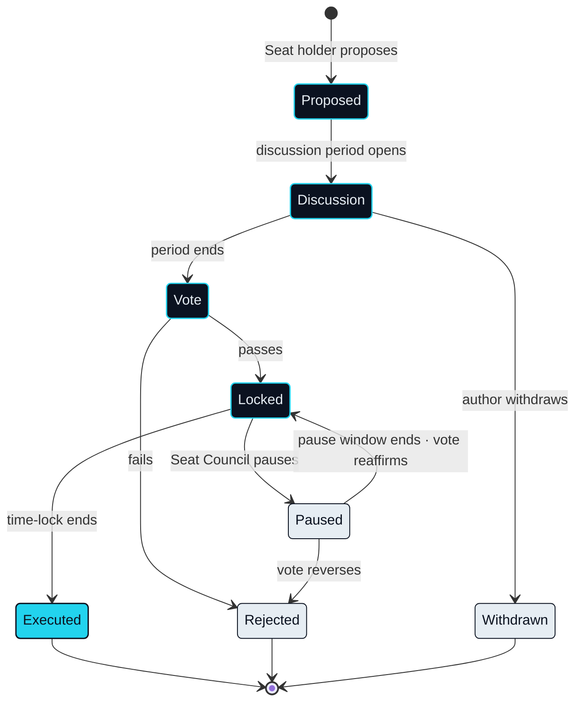
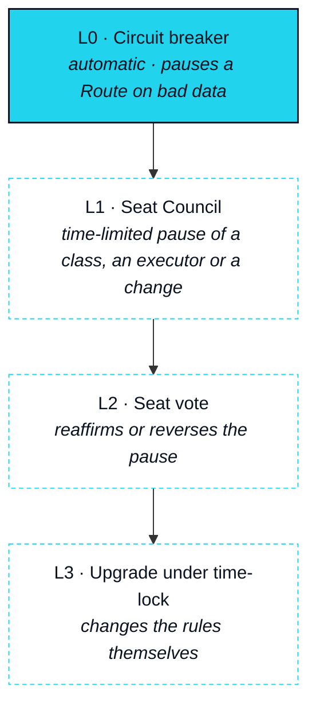

# Governance

> XO is bonded, never spent: it is the collateral that earns your agent its execution capacity, your governance weight and your standing in the ecosystem.

Governance on NEXON is bonded, not bought. The standing to decide comes from the Bond ledger and from nowhere else, which means it is reached the same way an agent's Capacity is reached: by putting collateral up and keeping it there. This section says who decides, what they decide, through what instrument and on what relative timetable. It also says, before anything else, what is true today.


**At this version, governance is designed, not live.** The Seat contracts are `In development`; the Seat vote and the escalation ladder below are `Roadmap`. Until the Seat vote is in force, the parameters that governance will control are set by the NEXON team, every change is announced through official channels, and every such parameter is listed in [Open Parameters](../open-parameters/README.md) with an owner. The handover to Seat holders is a Roadmap phase ([Roadmap](../09-roadmap/README.md)), and this paper does not describe it as having happened.


## Who decides

### Seat holders

**Status** · `In development` (contracts) · `Roadmap` (vote)

A **Seat** is reached when an account's Capacity and Depth both meet threshold ([OP-09](../open-parameters/README.md)); neither alone is enough. Seat holders are the only voters, and a Seat is the only source of governance weight in the network. The four standings from Trust & Bonding are the path to it: unbonded, bonded, deep, seat. No standing is granted, purchased or appointed. EXON confers none of them, however much of it has been spent.

### The Seat Council

**Status** · `Roadmap`

Seat holders elect from among themselves a **Seat Council**: a small group with one time-limited power, to pause. The Council can halt a Route class, a Leg Executor or a parameter change for a fixed window while the full Seat vote considers it. It cannot change a parameter, move a balance or extend its own window. Its composition and term are an Open Parameter ([OP-20](../open-parameters/README.md)).

## What is decided

Governance acts on rules, never on balances. Four classes of decision are in scope; nothing else is.

| Decision class | Examples | Instrument |
|---|---|---|
| Settlement Rail parameters | Burn Rate per leg type ([OP-13](../open-parameters/README.md)), Rebate schedule ([OP-12](../open-parameters/README.md)), fee split ([OP-11](../open-parameters/README.md)) | Seat vote with time-lock |
| Data sources | The set of oracle providers ([OP-16](../open-parameters/README.md)), circuit-breaker thresholds ([OP-17](../open-parameters/README.md)) | Seat vote with time-lock |
| Admitted legs and Leg Executors | Which leg types may run, which venues, licensed parties and suppliers may execute them ([OP-15](../open-parameters/README.md)) | Seat vote; Council may pause |
| Protocol upgrades | Changes to the Bond ledger, Route escrow or revocation registry contracts | Seat vote with the longest time-lock |

What is not in scope is as fixed as what is. Governance does not touch any account's Bond, any Route's escrow, or any Owner's Capacity Reservation. It does not set a reward, a price or a return. It cannot grant a Seat.

## Through what instrument



### Proposal

**Status** · `Roadmap`

Any Seat holder may put a proposal in one of the four classes. A proposal names the parameter, the new value and the effect on open Routes, and it is public from the moment it is made.



### Discussion

**Status** · `Roadmap`

A fixed discussion period follows, during which the proposal may be amended by its author and objected to by anyone. The period's length is a `Design Target` ([OP-19](../open-parameters/README.md)).



### Seat vote

**Status** · `Roadmap`

Seat holders vote. Weight follows Seat standing as the Bond ledger records it at the vote's opening; nothing bonded after that moment counts. The voting period is a `Design Target` ([OP-19](../open-parameters/README.md)).



### Time-lock

**Status** · `Roadmap`

A passed proposal waits. The lock is longest for contract upgrades and shortest for Rail parameters, and during it the Seat Council may pause. The lock lengths are a `Design Target` ([OP-19](../open-parameters/README.md)).



### Execution

**Status** · `Roadmap`

The change takes effect. Routes already Reserved run under the parameters they were approved with; new Routes run under the new ones.



## The escalation ladder

Four levels, each slower and wider than the one below. A problem climbs the ladder; it is never dropped between rungs.

| Level | Who acts | Power | Status |
|---|---|---|---|
| L0 | The circuit breaker in Data & Oracles | Pause one Route on stale, deviating, unavailable or spoofed data | `In development` |
| L1 | Seat Council | Pause a Route class, a Leg Executor or a pending change, for a fixed window | `Roadmap` |
| L2 | Seat vote | Reaffirm or reverse an L1 pause; decide a disputed Partially unwound Route | `Roadmap` |
| L3 | Seat vote under the longest time-lock | Upgrade a protocol contract | `Roadmap` |

Progressive decentralisation is the movement of decisions up this ladder and out of the team's hands. It is scheduled by phase, not by date, and its completion is the closing event of the last Roadmap phase.

Why governance is bonded, not voted by spend

A network in which spending bought votes would hand its rules to whoever ran the most Routes that week, and would tempt every executor to route for influence rather than for the Owner. A network in which votes were sold would hand them to whoever left soonest. Bonding does neither. Standing comes from collateral held over time — the same collateral that backs an agent's Capacity and answers, in bounded recourse, for a Route that cannot unwind. The people who decide the rules are the people with something to lose under them, and they cannot leave without the cooldown that decays their standing first. That is the whole argument, and it is the same argument as Two Assets, Two Jobs.


**Scope of this section.** Commits to: Seat standing as the only source of governance weight; four decision classes acting on rules, never on balances; a five-step instrument with time-lock; a four-level ladder; and the statement that at this version governance is not live. Does not commit to: any period, threshold or Council composition, or any date for the handover. Open items: [OP-09 · OP-19 · OP-20](../open-parameters/README.md).


*Spine: [The Translator](../02-the-translator/README.md) · Next: [Security & Risk](../07-security-and-risk/README.md)*
