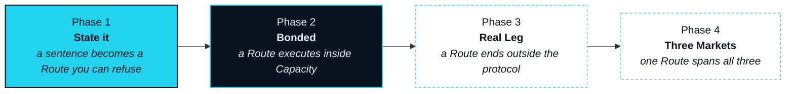

# Roadmap

> We will not describe anything on the roadmap as if it were live.

The order of this roadmap is the order of the five steps. A Route cannot be trusted to execute before it can be stated and refused, cannot land in the real world before its digital legs execute under Bond, and cannot span all three markets before the Real Leg works for one. Each phase is named for the thing it makes true and closed by an event someone outside the team can check — not by a date, and not by an announcement.

Where this page and a capability's own section disagree, this page is authoritative and the section is corrected at the next release (OP-29).

## Four phases



### Phase 1 · State it

**Status** · `In development`

A sentence becomes an Intent, and an Intent becomes a Route you can see and refuse. This phase ships the Circle, Intent capture, and the Route preview — each leg, its quote, its expiry, laid out before anything moves.

**Done when:** a sentence typed in a Circle returns a Route preview with every leg quoted and dated, and refusing it leaves nothing changed anywhere.



### Phase 2 · Bonded

**Status** · `In development`

Execution under collateral. This phase ships the Bond, Capacity and Seat contracts and the Rebate. It also ships digital-asset leg execution, with EXON escrowed and consumed leg by leg. At launch the Bond record is custodial within NEX; the on-chain contracts are this phase's deliverable (OP-31).

**Done when:** a Route is proposed only inside the Capacity of bonded XO. A digital-asset leg executes from EXON escrow, and its Burn Rate is consumed on-chain. A failed leg produces a Rollback record. A Rebate is returned that anyone can verify.



### Phase 3 · Real Leg

**Status** · `Roadmap`

A Route ends outside the protocol. This phase ships the Marketplace and the Landing Receipt with its dispute window (`In development`), then Stablecoin Card access through a licensed issuer and travel redemption through onboarded suppliers (`Roadmap`); it closes only when all four have landed.

**Done when:** a Route closes on a Landing Receipt issued by a Leg Executor outside the protocol, and a Land step delivers a card limit through a licensed issuer.



### Phase 4 · Three Markets

**Status** · `Roadmap`

One Route spans all three markets. This phase ships equity-linked settlement executed by a licensed third party — NEXON never brokers securities — together with Foresight, Patience, Seat governance in full, and the progressive handover of Settlement Rail parameters to Seat holders.

**Done when:** a single Route settles a capital-market leg through a licensed third party, a digital-asset leg, and a Real Leg, under Settlement Rail parameters that were set by Seat vote and executed through time-lock.



## Capability by phase

| Capability | Phase | Status |
|---|---|---|
| Circle · Intent capture · Route preview | 1 · State it | `In development` |
| Bond · Capacity · Seat contracts | 2 · Bonded | `In development` |
| Digital-asset leg execution | 2 · Bonded | `In development` |
| Rebate | 2 · Bonded | `In development` |
| Marketplace · Landing Receipt | 3 · Real Leg | `In development` |
| Stablecoin Card access | 3 · Real Leg | `Roadmap` |
| Travel redemption | 3 · Real Leg | `Roadmap` |
| Equity-linked settlement (licensed third party) | 4 · Three Markets | `Roadmap` |
| Foresight · Patience | 4 · Three Markets | `Roadmap` |
| Seat governance in full · progressive decentralization | 4 · Three Markets | `Roadmap` |


**No dates. No exchange names.** This roadmap is ordered, not scheduled: no phase carries a date, and none will be given before the event that closes it has happened. No exchange is named here or anywhere in this paper; timing and venue, where they exist, come from official channels and nowhere else. Anything circulating to the contrary was not issued by NEXON.



**Scope of this section.** Commits to: four phases in this order, each with a verifiable closing event, and the badges above as the v1 status of each capability. Does not commit to: any date, any exchange, any partner or venue, or any capability being described as shipped before its closing event. Open items: [OP-15 · OP-24 · OP-25 · OP-29](../open-parameters/README.md).


*Spine: [The Translator](../02-the-translator/README.md) · Next: [Glossary](../glossary/README.md)*

*Turning what you mean into what gets settled.*
