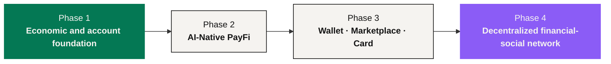

# Roadmap

The NEXON roadmap is organized by **evidence and capability gates**, not by calendar promises or token-price milestones. A phase is complete only when its rules, responsible operators, security controls and public disclosures are verifiable.

## Phase 1 — economic and account foundation

**Goal:** implement the approved economic mechanism and verify it.

The evidence of completion is a versioned rule set that reproduces: the order split into 28% fuel and the rest into XO, the 1,095-day release, settlement every 12 hours at 0.3% – 1.0%, term bonuses, the day-31 exit window, three settlement speeds with fuel-wallet burns, 20 generations of referral rewards and V1 – V12 leadership bonuses.

NEX Main Exchange / CEX and the Staking Platform hold **separable permissions, ledgers and disclosures**. Every order records principal, build, staking base, term, weight and parameter version.

## Phase 2 — AI-Native PayFi

**Goal:** stand up the second focus of the narrative — a controlled route from financial intent to execution evidence.

The gates: a published intent schema, route preview, deterministic policy checks, scoped approval, revocation, executor allowlists, quote expiry, duplicate-execution protection, receipts, failure handling, model-risk controls, privacy terms and security review. **Supported actions, assets, fees, jurisdictions and responsible executors are each named before availability.**

AI does translation and orchestration in this phase. It does not modify the economic mechanism, does not generate return, and does not become the custodian or the regulated executor.

## Phase 3 — Wallet, Marketplace and Stablecoin Card

**Goal:** connect decision state to real-world use.

| Product | Gates |
|---|---|
| Wallet | Custody architecture, permission management, recovery, staking display, clearly separated third-party prediction-market access |
| Marketplace | Supplier onboarding, inventory, payment and refund terms, fulfillment receipts, privacy and disputes |
| Stablecoin Card | Responsible licensed issuer/operator, jurisdiction coverage, accepted funding assets, fees, safeguarding, fraud controls, cardholder support |

Any EXON payment, fee or consumption use, and any XO-based product benefit, requires **explicit product terms**. No universal utility is implied here.

## Phase 4 — decentralized financial-social network

**Goal:** close the user-controlled value loop — discovery, decision, routing, use, and context returning.

The gates: portable identity, community and moderation rules, strategy-content disclosures, privacy-preserving links to financial intent, user-controlled sharing, ecosystem governance specifications, and safe interoperability among the products. **Social information remains upstream context and never silently authorizes execution.**

## Cross-phase gates

Every phase also requires accountable entities, applicable legal review, incident handling, independent security evidence, monitoring, published change notices, and bilingual documentation aligned with the narrative and economic sources of truth.

The following stay [Open](../open-parameters/README.md) until formally approved: contract addresses, the switch to 1:1 pairing after listing, leadership execution rates, product operators, supported jurisdictions, fees and service levels.

*Previous: [Compliance & Legal Posture](../08-compliance/README.md) · Appendix: [Glossary](../glossary/README.md)*
